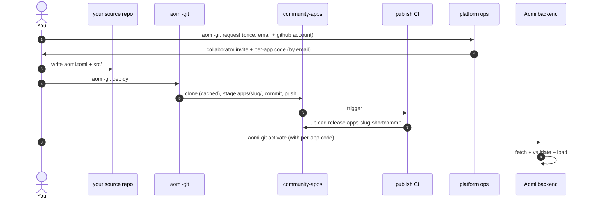

The quickstart gets you to a deployed App on the happy path. This page is the rest of the story: what every deploy field means, what the validation pipeline checks, how to read CI, and how activation actually works when you need more than the happy path.

You write your App in your own repo. One command ships it. The platform's CI builds it and cuts a release. You activate it yourself with a per-app code. The backend loads it without a restart. That is the whole loop, and the rest of this page is the detail behind each step.

## The whole picture

Here is the sequence in plain words.

1. **You get access, once.** The first time you ship to a platform, you run `aomi-git request --email <email> --git-account <github-user>`. Ops invite your GitHub account to the platform repo and email you a per-app activation code. This step runs once, not per deploy.
2. **You author** your App in your own source repo: a Rust `cdylib` crate plus an `aomi.toml`.
3. **You deploy** with `aomi-git deploy`. It copies a snapshot of your source into a clone of the platform repo (`community-apps`), commits, and pushes to the `publish` branch.
4. **CI runs** in the platform repo. It builds your cdylib and cuts a GitHub release tagged `apps-<slug>-<short-commit>`.
5. **You activate** with `aomi-git activate`, setting your per-app code as `AOMI_APP_ACTIVATION_TOKEN`. Your code is scoped to this one App, so it can never touch any other.
6. **The backend hot loads** your release. It fetches the tarball, validates it, and swaps your App into the live catalog. No restart, no downtime.



You activate your own App. The first time you ship to a platform, ops invite your GitHub account and email you a per-app activation code. After that, every release is yours to activate with one command.

## Your `aomi.toml` deploy fields

Your `aomi.toml` is the contract that travels with your App. Every field below feeds the deploy plan and the release. Here is each one.

```toml
[app]
name         = "my-cool-app"
display_name = "My Cool App"
platform     = "community"
git          = "https://github.com/aomi-labs/community-apps"
public       = true
# server_tags = ["staging"]
# access_token = "$MY_GH_TOKEN"   # private platforms only
```

| Field | What it does |
|---|---|
| `name` | Your slug. Use kebab-case. This becomes the release tag `apps-<name>-<short-commit>`. |
| `display_name` | The label shown to people in the backend registry. |
| `platform` | The platform tag. Must be `community` for the community-apps repo. Nothing resolves without it. |
| `git` | The platform repo location. For community apps this is `https://github.com/aomi-labs/community-apps`. If you leave it out, the backend's platform record supplies it. |
| `public` | Whether your App is visible to all backend users. `true` for community apps. |
| `server_tags` | Which backend tiers may load this release. Omit to default to `["staging"]`. Set to `["prod"]` or `["staging", "prod"]` once tested. This is a contract, not advice: ops can narrow your scope but can never widen it. |
| `access_token` | A GitHub token used only by private platform repos. See the note below. |

### About `access_token`

The community-apps repo is **public**. The backend can fetch your release tarball from its GitHub releases page without any credentials. So for a public community App you **omit `access_token` entirely**. You do not need one.

Private platform repos are different. A repo like `krexa-hosted-apps` needs a GitHub token with read access to releases. When you need it, you declare it as a reference to an environment variable, never as the token itself.

```toml
access_token = "$MY_GH_TOKEN"   # env-var reference, resolved at deploy time
access_token = "ghp_xxxxxxx"    # rejected at parse, never commit secrets
```

A literal token is rejected the moment the parser reads it, so a committed config can never leak a secret. When the backend uses the token it passes it once, fetches the tarball once, and never writes it to disk or logs it.

## `aomi-git deploy`

You run `aomi-git deploy` from your **source repo**, the crate that holds your `aomi.toml` and `src/lib.rs`. It never edits your source. It copies a snapshot into a clone of the platform repo and pushes from there.

### Dry run first

Always dry run before a real deploy. A dry run computes the full plan, runs the online checks, writes `.aomi/deployment.json`, and pushes nothing. Point it at staging so it also checks that the backend is reachable.

<Steps>
<Step title="Run the dry run">
```bash
AOMI_BACKEND_URL=https://staging-api.aomi.dev \
  aomi-git deploy --dry-run
```
</Step>
<Step title="Read the four stages">
You should see all four pipeline stages pass.

```text
Preflight
  [ok]   workspace git_clean
  [ok]   manifest  platform_declared, git_declared  |  defaulted=true server_tags=[staging]
  [ok]   platform  backend_reachable, platform_resolved, branch_matches_contract, git_url_matches_platform  |  deployment_branch=publish github_repo=aomi-labs/community-apps name=community
  [ok]   backend   server_tags_subset
```

The same plan also lands in `.aomi/deployment.json` next to your `aomi.toml`. Read that file when you want detail a machine can parse or want to see the resolved facts.
</Step>
</Steps>

If any stage fails, fix the underlying issue, usually a field in your `aomi.toml`, before you run the real deploy. A `[warn]` line is advisory and does not block. The common one is `git_url_matches_platform` when you deploy from a fork.

### The real deploy

When the dry run is clean, deploy for real.

```bash
aomi-git deploy
```

The output ends with your next steps:

```text
Next steps:
  1. Track the build and release:
       aomi-git status --path .
     This polls CI and tells you when the release is ready to activate.

  2. Activate the release once CI is green (with your per-app code):
       aomi-git activate --path .
     Set AOMI_APP_ACTIVATION_TOKEN (or pass --activation-token) to the
     per-app code platform ops issued you.

     First time? Request activation before deploying:
       aomi-git request --email <you@example.com> --git-account <github-user>
```

What this does, in order:

1. Snapshots your source tree into the clone under `apps/<slug>/`.
2. Writes `apps/<slug>/.aomi/deployment.json`, the build contract CI reads.
3. Commits and pushes to the `publish` branch.
4. The community-apps CI fires automatically: it validates the staged source against `deployment.json`, runs `cargo build --release` for the cdylib, and uploads a release tarball under the tag `apps-<slug>-<short-commit>`.

### The managed transit cache vs the escape hatch

By default `aomi-git` manages a clone of `community-apps` for you under `~/.aomi/transit/aomi-labs-community-apps/`. You never touch it. On the first deploy it clones; on later deploys it fetches and resets. Auth flows through your normal `git` credential helper, so if `gh auth login` works, this works.

If you need to manage the clone yourself, for CI with no network, custom auth, or to inspect the staged tree before it pushes, pass your own directory with `--platform-dir`.

```bash
aomi-git deploy --platform-dir /path/to/your/community-apps-clone
```

This skips the transit cache. You are then responsible for keeping that clone in sync with `origin/publish`. Most contributors never need this.

### Other useful flags

| Flag | What it does |
|---|---|
| `--dry-run` | Plan plus online checks. No staging, no push, no activation. Refreshes `.aomi/deployment.json`. |
| `--allow-dirty` | Permit an uncommitted working tree in the plan and during staging. Use it only when you know why your tree is dirty. |
| `--platform-dir <DIR>` | Stage and push from a clone you manage yourself, skipping the transit cache. |
| `--json` | Print the plan or outcome as JSON instead of the human summary. Useful in scripts. |
| `--platform <NAME>` | Override the platform tag. Defaults to your `aomi.toml` value, then `community`. |

### The validation pipeline, stage by stage

Every deploy, including a dry run, runs a validation pipeline and records the result in `.aomi/deployment.json`. The pipeline has four ordered stages. Each stage is a precondition for the next, so a failing gate stops the rest and the downstream stages are recorded as `skipped`.

```text
1. workspace   ->   2. manifest   ->   3. platform   ->   4. backend
   (local git)        (aomi.toml)        (resolve repo       (server tags
                                          + branch)            + acceptance)

   offline ------------------           ---------- online (needs backend) ----------
```

Stages 1 and 2 are **offline**. They are computed from your local git and your `aomi.toml`, so they run even with no network. Stages 3 and 4 are **online**. They run only when a backend URL is available, which is why you point the dry run at staging.

In short: stages 1 and 2 check that your files are ready, and stages 3 and 4 check that the platform will accept them. If every line reads `[ok]`, you are good to deploy. The accordion below has the detail when you need it.

<Accordion title="What each stage checks">
**Stage 1, workspace.** Asks: is the local tree shippable? It runs one check, `git_clean`, which fails if you have uncommitted changes. A failure means commit or stash first. CI builds from a clean source commit, so a dirty tree is a hard stop unless you pass `--allow-dirty`.

**Stage 2, manifest.** Asks: does `aomi.toml` declare what we need? It runs `platform_declared`, a check at error severity that fails if `[app].platform` is missing, since nothing resolves without it. It also runs `git_declared`, a check at warn severity for `[app].git`; a missing git URL only skips the later `git_url_matches_platform` check, so it does not block you. This stage also resolves your `server_tags` and records whether you set them or the default `["staging"]` filled in.

**Stage 3, platform.** Asks: can we resolve the declared platform repo and its deploy branch? It runs `backend_reachable` (the gate that opens stages 3 and 4, passing when `GET /api/control/platforms` succeeds), `platform_resolved` (your platform is registered with the backend), and `branch_matches_contract` (your target branch equals the platform's contractual `deployment_branch`, which is `publish`). A `branch_matches_contract` failure means your push would not deploy on its own. It also runs `git_url_matches_platform` as a warn, so a fork passes with an advisory note.

**Stage 4, backend.** Asks: will the backend actually accept this release? It runs `server_tags_subset`, which fails if your `server_tags` are not a subset of the backend's `AOMI_SERVER_TAGS`. A failure here becomes a 409 error at activate time, so it is worth catching now. Match your declared tags to the backend you plan to activate against.

The backend runs one more check of its own at activation time, `sdk_version_matches_host`. It rejects a bundle whose pinned `aomi-sdk` does not equal the backend's `required_sdk_version`. The deploy preflight cannot see this, since the version lives in the built release, so pin `aomi-sdk` to the platform's `required_sdk_version` (see `platform.json`) before you deploy.

Each check carries a severity. An **error** check is a gate: if it fails, the stage fails and the deploy is blocked. A **warn** check is advisory: if it fails, the stage is downgraded to `warning` but you are not blocked. A stage that never runs because an upstream gate failed, or because it had no backend URL, is recorded as `skipped`.
</Accordion>

## `aomi-git status`

After a deploy, run `aomi-git status` from your source repo to see when CI finishes, when the release asset exists, and whether the backend has loaded your App. It reads your `.aomi/deployment.json` and polls GitHub for you, rolling both signals into one report.

```bash
aomi-git status
```

Expected output while CI is still running:

```text
Publication status
  repo              : aomi-labs/community-apps
  app_release_tag   : apps-my-bot-abc1234
  branch            : publish
  local state       : pushed=true deployed=true activated=false
  ci            : [running] running - Publish Aomi Apps
                  https://github.com/aomi-labs/community-apps/actions/runs/...
  release       : pending (not built yet)
```

When CI finishes, the `ci` line turns to `[ok] green - Publish Aomi Apps` and `release` shows it is published and ready to activate.

You are ready to activate when `ci` shows green and `release` shows it is published and ready to activate. Pass a specific tag with `aomi-git status apps-<slug>-<commit>` to check one release; otherwise it uses the latest deploy's tag.

You can still watch the raw pages if you prefer: the [Actions tab](https://github.com/aomi-labs/community-apps/actions) for CI and the release tag page for the asset. `aomi-git status` simply rolls both up.

## Activation

You activate your own App. You hold a per-app activation code, scoped to this one App, so you run `aomi-git activate` yourself for every release. There is no per-release handoff to ops.

### Get access the first time

The first time you ship to a platform, run `aomi-git request` to ask for access. This runs once, not per deploy.

```bash
aomi-git request --email you@example.com --git-account your-github-user
```

This posts a request to the Aomi apps Discord, carrying your GitHub account, email, and App. Ops then do two things: they invite your GitHub account to the platform repo as a collaborator (so your `deploy` push is allowed), and they email you a per-app activation code. The code arrives by email out of band; it is never part of the request and never travels over Discord.

Preview the exact message first without posting:

```bash
aomi-git request --email you@example.com --git-account your-github-user --dry-run
```

<Note>
This `request` step is community tier only. B2B partners deploy through a server-side proxy and do not get direct repo access, so they do not use `request`.
</Note>

### Activate the release

Once CI is green and you hold your per-app code, activate the release yourself. Run `aomi-git activate` from your source repo. It reads `.aomi/deployment.json` and pulls the release tag, platform, source repo, display name, visibility, and target tags from it, so you pass almost nothing. Set your code as `AOMI_APP_ACTIVATION_TOKEN`.

```bash
AOMI_APP_ACTIVATION_TOKEN=<your per-app code> \
AOMI_BACKEND_URL=https://staging-api.aomi.dev \
  aomi-git activate
```

The backend fetches your release tarball, validates it, and loads it. Because your code is pinned to this one App, even a leaked code could not touch any other App. Confirm your App is live at `https://staging-api.aomi.dev/api/control/apps/status`.

Preview the request without sending any HTTP:

```bash
aomi-git activate --dry-run
```

For a release whose `deployment.json` is not on hand, such as turning an older tag back on from a fresh machine, pass every field explicitly.

```bash
aomi-git activate apps-<slug>-<short-commit> \
  --backend https://staging-api.aomi.dev \
  --platform community \
  --source-repo aomi-labs/community-apps \
  --target-tag staging \
  --visibility public
```

### Public and private platforms use the same flow

The flow is the same whether you ship to a public platform like `community` or a private partner platform like `krexa`. You request access once, you deploy, you activate with your per-app code. The only difference is the platform repo behind the scenes and, for private repos, the `access_token` field described above.

## Iterating

To ship a change, edit your code, commit, and run `aomi-git deploy` again. Each deploy produces a fresh release tagged with the new short-commit. The previous release stays on GitHub, so you always have a tag you know works to roll back to by turning it back on.

Promoting from staging to prod means you deploy again. Edit `server_tags` in `aomi.toml` to `["prod"]` or `["staging", "prod"]`, run `aomi-git deploy` to cut a new release carrying the wider scope, then run `aomi-git activate` again against the prod backend. A release can only be activated to the tiers its own build declared, so widening to prod requires you to deploy again first. That is by design.

## Troubleshooting

| Error | Cause | Fix |
|---|---|---|
| `aomi-git: command not found` | The binary is not installed or not on your PATH. | Run `cargo install --git https://github.com/aomi-labs/aomi-sdk --features cli,dev-runtime aomi-sdk`, then confirm `~/.cargo/bin` is on your PATH. |
| `aomi.toml [app].access_token must be \`$ENV_VAR_NAME\`` | You put a literal token in `aomi.toml`. | Use an env-var reference: `access_token = "$YOUR_VAR_NAME"`. Never commit secrets. For public community apps, omit the field. |
| `git tree is dirty` | Uncommitted files in your source repo, often `.aomi/deployment.json` from a previous dry run. | Commit your changes, or add `.aomi/`, `target/`, and `Cargo.lock` to `.gitignore`. Use `--allow-dirty` only when intentional. |
| `sdk_version mismatch` | Your `aomi-sdk` dependency does not match `platform.json`'s `required_sdk_version`. | Pin the exact version: `aomi-sdk = "=0.1.20"`. Check `platform.json` in community-apps for the current value. |
| `Cargo.toml must set [lib].crate-type = ["cdylib"]` | Your crate is missing the cdylib library type. | Add a `[lib]` section with `crate-type = ["cdylib"]`. |
| `aomi_create returned null` (CI) | Your `dyn_aomi_app!` macro is missing or malformed. | Compare your `src/lib.rs` against a working app such as `apps/fanforge`. |
| `activation endpoint returned 502` | The release tarball does not exist yet, a CI race, or the backend cannot reach GitHub. | Wait for CI to finish and the release to publish, then retry. |
| `activation endpoint returned 409` | Your target tags are not a subset of the backend's `AOMI_SERVER_TAGS`. | Match your `server_tags` to the backend you are activating against. |
| `git clone ... exited 128` | `aomi-git` could not fetch the platform repo into its transit cache, an auth or network issue. | Run `gh auth login`. If still stuck, `rm -rf ~/.aomi/transit/aomi-labs-community-apps/` and retry. |

## Next

<CardGroup cols={2}>
<Card title="The CLI toolchain" href="/reference/cli-toolchain">
The full reference for the three Rust binaries: `aomi-build`, `aomi-run`, and `aomi-git`.
</Card>
<Card title="Test with the CLI" href="/guides/cli-usage">
Check your App's behavior locally before you ship, with no backend.
</Card>
<Card title="Common errors" href="/build/common-errors">
The errors you are most likely to hit, each with its fix.
</Card>
</CardGroup>
