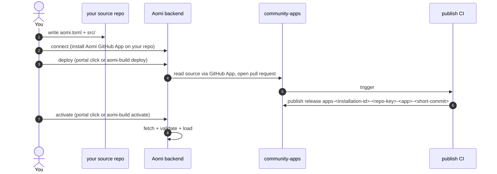

The quickstart gets you to a deployed App on the happy path. This page is the rest of the story: the two ways to deploy, what every deploy field means, what the validation pipeline checks, and how activation actually works.

There are two deploy paths, and they do the same thing:

- **The portal.** A no-code path in your browser. Click Preflight, Deploy, Activate. This is the recommended path for your first deploy.
- **The CLI.** `aomi-build connect`, then `aomi-build deploy`, then `aomi-build activate`. This is the scriptable path once you know the flow.

Either way the model is the same. You write your App in your own repo. You connect that repo to Aomi once. A deploy request goes to the backend. The backend reads your source through the connected Aomi GitHub App, opens a pull request, and CI builds your cdylib and cuts a release. You activate the release, and the backend loads it without a restart.



The CLI never clones the platform repo or pushes branches. The backend owns that, through the Aomi GitHub App you connect once.

## Deploy from the portal

The portal is the no-code path and the recommended way to ship your first App. Three buttons carry you from your repo to a live agent: **Preflight**, then **Deploy**, then **Activate**. Each screen is shown below. These steps are verified working: Preflight, Deploy, and CI all succeed.

<Steps>
  <Step title="Open the Deploy settings">
    Go to `https://chat.aomi.dev/settings` and open the **Deploy** tab. You land on "Deploy an example agent".

    <Frame caption="chat.aomi.dev/settings, the Deploy tab, signed out">
      
    </Frame>
  </Step>
  <Step title="Sign in with GitHub">
    Click **Sign in with GitHub** and authorize the Aomi Build GitHub App on the repository that holds your App. This is what lets the backend read your source and build it for you. You do this once per repo, not per deploy.
  </Step>
  <Step title="Find your repository">
    After sign in, your repo appears under **Source Repositories** with its installation id and three actions: **Preflight**, **Deploy**, and **Activate**. Every repo the Aomi Build app is installed on shows up here.

    <Frame caption="Your connected repos, each with Preflight, Deploy, and Activate">
      
    </Frame>
  </Step>
  <Step title="Preflight">
    Click **Preflight**. This previews the exact deployment manifest and runs the preflight checks. It changes nothing on the platform. The card fills in the **Source** commit, the **Build** target, and the **Release** tag your App will publish under. When it reads "Preflight is ready", the checks passed and you can deploy.

    <Frame caption="Preflight ready: the manifest previewed and the checks passed">
      
    </Frame>
  </Step>
  <Step title="Deploy">
    Click **Deploy**. The backend opens a pull request against `community-apps`, and CI compiles your App to a cdylib and cuts a release. The card shows a live build bar plus **Open CI** and **Open PR** links so you can watch it happen. This step takes a couple of minutes.

    <Frame caption="Deploy in progress: CI building your App into a release">
      
    </Frame>
  </Step>
  <Step title="Activate">
    When the build finishes you see **"Build is ready for activation"** and the **Activate** button turns on. Click it to load your App into the live runtime. This is the final step, and it is what makes your App selectable in the chat.

    <Frame caption="Build ready: CI passed, and Activate is now enabled">
      
    </Frame>
  </Step>
</Steps>

<Note>
Activation is the final gate. Your App must pass the platform's checks first, including the SDK version pin (`aomi-sdk` must equal the platform's `required_sdk_version`). Once it passes and you activate, your App is live.
</Note>

<Tip>
If Deploy gets stuck on "Waiting for platform CI", refresh the page (the deployment id is in the URL, so you keep your place). If the build is done, Activate turns on. If a deploy fails with a version error, your `aomi-sdk` pin does not match the platform, see the SDK row in [Troubleshooting](#troubleshooting).
</Tip>

## Deploy from the CLI

The CLI path runs the same three actions as the portal: `connect` once, then `deploy`, then `activate`. Run them from your **source repo**, the crate that holds your `aomi.toml` and `src/lib.rs`.

<Steps>
  <Step title="Connect your repo (first time only)">
    `aomi-build connect` installs the Aomi GitHub App on your source repo and saves your activation token. Run it once, not per deploy.

    ```bash
    AOMI_BACKEND_URL=https://staging-api.aomi.dev aomi-build connect
    ```

    It prints a browser URL to install the Aomi GitHub App. Install it, then paste back the `installation_id` GitHub shows you.
  </Step>
  <Step title="Dry run">
    ```bash
    AOMI_BACKEND_URL=https://staging-api.aomi.dev aomi-build deploy --dry-run
    ```

    This previews the deployment manifest and runs the preflight checks. It deploys nothing. Fix anything it flags, then run it again. `--dry-run` is an alias of `--preflight`.
  </Step>
  <Step title="Deploy">
    ```bash
    AOMI_BACKEND_URL=https://staging-api.aomi.dev aomi-build deploy
    ```

    This POSTs a deploy request to the backend. The backend reads your source through the connected GitHub App, opens a pull request, and CI builds your cdylib and cuts a release tagged `apps-<installation-id>-<repo-key>-<app>-<short-commit>`.
  </Step>
  <Step title="Activate">
    ```bash
    AOMI_APP_ACTIVATION_TOKEN=<your-activation-token> \
    AOMI_BACKEND_URL=https://staging-api.aomi.dev \
      aomi-build activate
    ```

    The backend fetches your release, validates it, and loads it. It reads the release tags from `.aomi/deployment.json`, so you usually pass nothing else.
  </Step>
</Steps>

## Your `aomi.toml` deploy fields

Your `aomi.toml` is the contract that travels with your App. Every field below feeds the deploy plan and the release. Here is each one.

```toml
[app]
name         = "my-cool-app"
display_name = "My Cool App"
platform     = "community"
git          = "https://github.com/aomi-labs/community-apps"
public       = true
# server_tags = ["staging"]
# access_token = "$MY_GH_TOKEN"   # private platforms only
```

| Field | What it does |
|---|---|
| `name` | Your slug. Use kebab-case. This becomes the release tag `apps-<name>-<short-commit>`. |
| `display_name` | The label shown to people in the backend registry. |
| `platform` | The platform tag. Must be `community` for the community-apps repo. Nothing resolves without it. |
| `git` | The platform repo location. For community apps this is `https://github.com/aomi-labs/community-apps`. If you leave it out, the backend's platform record supplies it. |
| `public` | Whether your App is visible to all backend users. `true` for community apps. |
| `server_tags` | Which backend tiers may load this release. Omit to default to `["staging"]`. Set to `["prod"]` or `["staging", "prod"]` once tested. This is a contract, not advice: ops can narrow your scope but can never widen it. |
| `access_token` | A GitHub token used only by private platform repos. See the note below. |

### About `access_token`

The community-apps repo is **public**. The backend can fetch your release tarball from its GitHub releases page without any credentials. So for a public community App you **omit `access_token` entirely**. You do not need one.

Private platform repos are different. A repo like `krexa-hosted-apps` needs a GitHub token with read access to releases. When you need it, you declare it as a reference to an environment variable, never as the token itself.

```toml
access_token = "$MY_GH_TOKEN"   # env-var reference, resolved at deploy time
access_token = "ghp_xxxxxxx"    # rejected at parse, never commit secrets
```

A literal token is rejected the moment the parser reads it, so a committed config can never leak a secret. When the backend uses the token it passes it once, fetches the tarball once, and never writes it to disk or logs it.

## How a deploy works behind the scenes

Whether you click Deploy in the portal or run `aomi-build deploy`, the same thing happens. The CLI is a thin relay: it POSTs a deploy request to the backend. It never holds a GitHub token, clones the platform repo, pushes branches, or mints release tags. The backend owns all of that through the Aomi GitHub App you connected.

In order:

1. The backend receives the deploy request, identified by your `app_source_id` (the connected GitHub App install).
2. It reads your source from your repo through the GitHub App.
3. It opens a pull request against the `community-apps` publish branch, staging your App under `apps/<installation-id>/<repo-key>/<app>/`.
4. CI builds your cdylib with `cargo build --release` and publishes a GitHub release tagged `apps-<installation-id>-<repo-key>-<app>-<short-commit>`.
5. The backend writes `.aomi/deployment.json` back to your source repo, recording the release tags `activate` reads later.

### Dry run first

Always dry run before a real deploy. A dry run previews the deployment manifest and runs the preflight checks. It deploys nothing. Point it at staging so it also checks that the backend is reachable.

```bash
AOMI_BACKEND_URL=https://staging-api.aomi.dev aomi-build deploy --dry-run
```

`--dry-run` is an alias of `--preflight`. If a check fails, fix the underlying issue, usually a field in your `aomi.toml`, before you run the real deploy. A `[warn]` line is advisory and does not block.

### Deploy flags

| Flag | What it does |
|---|---|
| `--dry-run` (alias `--preflight`) | Preview the manifest and run the checks. No deploy. |
| `--app-source-id <ID>` | Connected GitHub App install id for this repo. Defaults to `AOMI_APP_SOURCE_ID`, else resolved from the connected repo. |
| `--backend <URL>` | Backend base URL. Defaults to `AOMI_BACKEND_URL`. |
| `--json` | Print the plan or outcome as JSON instead of the human summary. Useful in scripts. |

### The validation pipeline, stage by stage

Every deploy, including a dry run, runs a validation pipeline and records the result in `.aomi/deployment.json`. The pipeline has four ordered stages. Each stage is a precondition for the next, so a failing gate stops the rest and the downstream stages are recorded as `skipped`.

```text
1. workspace   ->   2. manifest   ->   3. platform   ->   4. backend
   (local git)        (aomi.toml)        (resolve repo       (server tags
                                          + branch)            + acceptance)

   offline ------------------           ---------- online (needs backend) ----------
```

Stages 1 and 2 are **offline**. They are computed from your local git and your `aomi.toml`, so they run even with no network. Stages 3 and 4 are **online**. They run only when a backend URL is available, which is why you point the dry run at staging.

In short: stages 1 and 2 check that your files are ready, and stages 3 and 4 check that the platform will accept them. If every line reads `[ok]`, you are good to deploy. The accordion below has the detail when you need it.

<Accordion title="What each stage checks">
**Stage 1, workspace.** Asks: is the local tree shippable? It runs one check, `git_clean`, which fails if you have uncommitted changes. A failure means commit or stash first. The backend builds from a clean source commit, so commit your work before you deploy.

**Stage 2, manifest.** Asks: does `aomi.toml` declare what we need? It runs `platform_declared`, a check at error severity that fails if `[app].platform` is missing, since nothing resolves without it. It also runs `git_declared`, a check at warn severity for `[app].git`; a missing git URL only skips the later `git_url_matches_platform` check, so it does not block you. This stage also resolves your `server_tags` and records whether you set them or the default `["staging"]` filled in.

**Stage 3, platform.** Asks: can we resolve the declared platform repo and its deploy branch? It runs `backend_reachable` (the gate that opens stages 3 and 4, passing when `GET /api/control/platforms` succeeds), `platform_resolved` (your platform is registered with the backend), and `branch_matches_contract` (your target branch equals the platform's contractual `deployment_branch`, which is `publish`). A `branch_matches_contract` failure means your push would not deploy on its own. It also runs `git_url_matches_platform` as a warn, so a fork passes with an advisory note.

**Stage 4, backend.** Asks: will the backend actually accept this release? It runs `server_tags_subset`, which fails if your `server_tags` are not a subset of the backend's `AOMI_SERVER_TAGS`. A failure here becomes a 409 error at activate time, so it is worth catching now. Match your declared tags to the backend you plan to activate against.

The backend runs one more check of its own at activation time, `sdk_version_matches_host`. It rejects a bundle whose pinned `aomi-sdk` does not equal the backend's `required_sdk_version`. The deploy preflight cannot see this, since the version lives in the built release, so pin `aomi-sdk` to the platform's `required_sdk_version` (see `platform.json`) before you deploy.

Each check carries a severity. An **error** check is a gate: if it fails, the stage fails and the deploy is blocked. A **warn** check is advisory: if it fails, the stage is downgraded to `warning` but you are not blocked. A stage that never runs because an upstream gate failed, or because it had no backend URL, is recorded as `skipped`.
</Accordion>

## Check status

After a deploy, run `aomi-build status` from your source repo to see when CI finishes and whether the backend has loaded your App. It reads your `.aomi/deployment.json` and checks the backend, rolling both signals into one report.

```bash
aomi-build status
```

You are ready to activate when the release is built and shown as ready. You can also watch the raw [Actions tab](https://github.com/aomi-labs/community-apps/actions) for CI and the release tag page for the asset. In the portal, the same state shows as "Build is ready for activation".

## Activation

You activate your own App. You hold an activation token, saved when you ran `connect`, so you run `aomi-build activate` yourself for every release. There is no per-release handoff to ops.

### Connect the first time

The first time you ship, run `aomi-build connect` to install the Aomi GitHub App on your source repo and save your activation token. This runs once, not per deploy.

```bash
AOMI_BACKEND_URL=https://staging-api.aomi.dev aomi-build connect
```

It prints a browser URL to install the Aomi GitHub App on the repo that holds your App. Install it, then paste back the `installation_id` GitHub shows you. The backend reads your source through this install on every deploy.

<Note>
The legacy `aomi-build request` path asked platform ops for onboarding details by hand. It is superseded by `connect`. Use `connect`.
</Note>

### Activate the release

Once CI is green and you hold your activation token, activate the release yourself. Run `aomi-build activate` from your source repo. It reads the release tags from `.aomi/deployment.json`, so you usually pass nothing else. Set your token as `AOMI_APP_ACTIVATION_TOKEN`.

```bash
AOMI_APP_ACTIVATION_TOKEN=<your-activation-token> \
AOMI_BACKEND_URL=https://staging-api.aomi.dev \
  aomi-build activate
```

The backend fetches your release, validates it, and loads it. Confirm your App is live at `https://staging-api.aomi.dev/api/control/apps/status`.

To activate one explicit release tag, for example to turn an older release back on:

```bash
aomi-build activate --release-tag apps-<installation-id>-<repo-key>-<app>-<short-commit>
```

### Public and private platforms use the same flow

The flow is the same whether you ship to a public platform like `community` or a private partner platform like `krexa`. You connect once, you deploy, you activate with your activation token. The only difference is the platform repo behind the scenes and, for private repos, the `access_token` field described above.

## Iterating

To ship a change, edit your code, commit, push, and run `aomi-build deploy` again. Each deploy produces a fresh release tagged with the new short-commit. The previous release stays on GitHub, so you always have a tag you know works to roll back to by turning it back on.

Promoting from staging to prod means you deploy again. Edit `server_tags` in `aomi.toml` to `["prod"]` or `["staging", "prod"]`, run `aomi-build deploy` to cut a new release carrying the wider scope, then run `aomi-build activate` again against the prod backend. A release can only be activated to the tiers its own build declared, so widening to prod requires you to deploy again first. That is by design.

## Troubleshooting

| Error | Cause | Fix |
|---|---|---|
| `aomi-build: command not found` | The binary is not installed or not on your PATH. | Run `cargo install --git https://github.com/aomi-labs/aomi-sdk --features cli,dev-runtime aomi-sdk`, then confirm `~/.cargo/bin` is on your PATH. |
| `aomi.toml [app].access_token must be \`$ENV_VAR_NAME\`` | You put a literal token in `aomi.toml`. | Use an env-var reference: `access_token = "$YOUR_VAR_NAME"`. Never commit secrets. For public community apps, omit the field. |
| `git tree is dirty` | Uncommitted files in your source repo, often `.aomi/deployment.json` from a previous deploy. | Commit your changes, or add `.aomi/`, `target/`, and `Cargo.lock` to `.gitignore`. |
| `sdk_version mismatch` | Your `aomi-sdk` dependency does not match `platform.json`'s `required_sdk_version`. | Pin the platform requirement, not the crate's own version: `aomi-sdk = "=3.0.0"`. The crate ships at `3.0.1`, but the platform requires `=3.0.0`. Check `platform.json` in community-apps for the current value. |
| `Cargo.toml must set [lib].crate-type = ["cdylib"]` | Your crate is missing the cdylib library type. | Add a `[lib]` section with `crate-type = ["cdylib"]`. |
| `aomi_create returned null` (CI) | Your `dyn_aomi_app!` macro is missing or malformed. | Compare your `src/lib.rs` against a working app such as `apps/fanforge`. |
| `activation endpoint returned 502` | The release does not exist yet, a CI race, or the backend cannot reach GitHub. | Wait for CI to finish and the release to publish, then retry. |
| `activation endpoint returned 409` | Your target tags are not a subset of the backend's `AOMI_SERVER_TAGS`. | Match your `server_tags` to the backend you are activating against. |
| No source repository in the portal | The Aomi GitHub App is not installed on your repo. | Run `aomi-build connect`, or in the portal sign in with GitHub and grant the Aomi Build app access to your repository. |

## Find and test your App

Once your App is active it shows up as a selectable agent in the Aomi chat. Here is how to open it and put it through its paces, using Goal Digger, a World Cup betting agent, as the example.

<Steps>
  <Step title="Open the chat">
    Go to `https://chat.aomi.dev` and sign in.

    <Frame caption="chat.aomi.dev, where your deployed App runs">
      
    </Frame>
  </Step>
  <Step title="Pick your App from the agent picker">
    At the bottom of the chat is the agent picker, the dropdown showing the current agent's name. Open it and select your App. In the example that is Goal Digger.
  </Step>
  <Step title="Put it to work">
    Ask it what it can do, then give it a real task. For Goal Digger:

    - `list your tools` shows the full tool surface.
    - `simulate Spain vs Germany` runs its 50,000-simulation match engine.
    - `who wins the World Cup?` returns tournament odds.
    - `best World Cup bet on Polymarket right now?` finds the biggest edge versus the live market price.

    <Frame caption="Goal Digger listing its tools in the chat">
      
    </Frame>
  </Step>
</Steps>

That is the whole loop: you wrote an App, deployed it from the portal, activated it, and now anyone can select it in the chat and use it.

## Next

Your App is live on the backend. The natural next step is the frontend: give people a way to chat with it.

<CardGroup cols={2}>
<Card title="Add the chat widget" href="/guides/widget-installation">
Drop the React widget into a frontend so people can chat with your deployed App.
</Card>
<Card title="The builder toolchain" href="/reference/cli-toolchain">
The full reference for the two Rust binaries: `aomi-build` and `aomi-run`.
</Card>
<Card title="Common errors" href="/build/common-errors">
The errors you are most likely to hit, each with its fix.
</Card>
</CardGroup>
