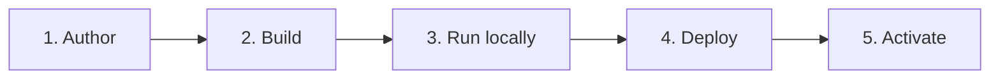

An Aomi App turns your API into tools an AI agent can call inside a real chat. By the end of this path you will have one of those tools running, and the agent will call it for you on demand.

## What is an Aomi App?

An App is a small Rust plugin. You compile it to a `cdylib` (a shared library the runtime can load at runtime). Inside it, you wrap your API as a set of tools the AI can call. The Aomi runtime hot loads your plugin, which means it picks up your tools while it is running, with no restart.

You write the tools. The platform gives you the hard parts for free:

- **non-custodial wallets.** Your users keep their own keys. Your App never holds them.
- **simulate first.** Every transaction is simulated before anyone signs it, so the agent shows the real outcome before it commits.

You declare your App with one macro, `dyn_aomi_app!`, and a config file, `aomi.toml`. That is the whole contract.

## The five steps from idea to live

1. **Author.** Write a Rust `cdylib` crate: an `aomi.toml` plus `src/lib.rs` that registers your tools through the `dyn_aomi_app!` macro.
2. **Build.** Compile your crate with `cargo build --release`. You get a `.so` (or `.dylib` on macOS) that the runtime can load.
3. **Run locally.** Chat with your App against a real LLM using `aomi-run <plugin>`. No backend needed. This is where you confirm the agent calls your tools the way you expect.
4. **Deploy.** Ship your source with `aomi-git deploy`. It stages your code into the `community-apps` platform repo and pushes to `publish`. CI builds the plugin and cuts a GitHub release tagged `apps-<slug>-<short-commit>`.
5. **Activate.** Run `aomi-git activate --request`. It posts your App and release tag to the ops Discord channel and pings ops. Ops mint a release-scoped token and load your App. You never need an activation token yourself.

<Note>
Two CLI binaries carry most of the flow: `aomi-run` chats with your App locally, and `aomi-git` deploys it and requests activation. A third, `aomi-build`, scaffolds an App from an existing API spec when you want a head start. Install all of them at once with `cargo install --git https://github.com/aomi-labs/aomi-sdk --features cli aomi-sdk`.
</Note>

## What you have at the end

A live tool the agent can call in a real chat. Once ops activate your App, your tools join the agent's tool catalog. A user asks for what your App does, and the agent calls your tool to get it done.

## Start here

Walk these pages in order. The first gets you to a live App on the happy path. The rest fill in the anatomy when you want to go past the template.

<CardGroup cols={2}>
  <Card title="Quickstart" href="/build/quickstart">
    Ship your first App on the happy path, start to finish.
  </Card>
  <Card title="Building an App" href="/reference/building-apps">
    The anatomy of an App: the macro, the tools, and `aomi.toml`.
  </Card>
  <Card title="The SDK" href="/reference/sdk-api">
    The Rust plugin SDK you build your tools against.
  </Card>
  <Card title="The CLI toolchain" href="/reference/cli-toolchain">
    Reference for the three binaries: `aomi-build`, `aomi-run`, `aomi-git`.
  </Card>
  <Card title="Deploy and activate" href="/build/deploy">
    The full shipping process when the quickstart is not enough.
  </Card>
  <Card title="Test with the CLI" href="/guides/cli-usage">
    Chat with your App locally and check its behavior before you ship.
  </Card>
</CardGroup>
