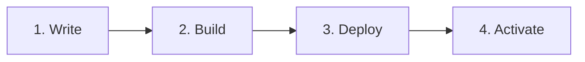

An Aomi App turns your API into tools an AI agent can call inside a real chat. Follow this section and you will ship one, with the agent calling your tool on demand.

## What is an Aomi App?

An App is a small Rust plugin. You wrap your API as a set of tools, compile it to a shared library, and the Aomi runtime loads it while it is running. No restart.

You write the tools. The platform handles the hard parts:

- **non-custodial wallets.** Your users keep their own keys. Your App never holds them.
- **simulate first.** Every transaction is simulated before anyone signs, so the agent shows the real outcome before it commits.

You declare the App with one macro, `dyn_aomi_app!`, and one config file, `aomi.toml`. That is the whole contract.

## From idea to live in four steps

1. **Write** your tools in a Rust crate with `aomi.toml` and `src/lib.rs`.
2. **Build** it with `cargo build --release`.
3. **Deploy** with `aomi-git deploy`. CI builds your plugin and cuts a release.
4. **Activate** with `aomi-git activate`, using the per-app code ops issued you. Your App loads onto the live runtime.

The [Quickstart](/build/quickstart) walks all four end to end in about ten minutes.

## Start here

<CardGroup cols={2}>
  <Card title="Quickstart" href="/build/quickstart">
    Ship your first App, start to finish.
  </Card>
  <Card title="Building an App" href="/reference/building-apps">
    The anatomy: the macro, the tools, and `aomi.toml`.
  </Card>
  <Card title="The SDK" href="/reference/sdk-api">
    The Rust plugin SDK you build your tools against.
  </Card>
  <Card title="The builder toolchain" href="/reference/cli-toolchain">
    The three binaries: `aomi-build`, `aomi-run`, `aomi-git`.
  </Card>
  <Card title="Deploy and activate" href="/build/deploy">
    The full shipping process when the quickstart is not enough.
  </Card>
  <Card title="Use the client CLI" href="/reference/cli">
    Chat with your App from the terminal.
  </Card>
</CardGroup>
