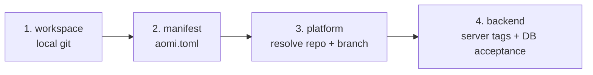

[`aomi-build`](https://github.com/aomi-labs/aomi-sdk/tree/main/sdk/bin/build) scaffolds, compiles, deploys, and activates a plugin. It ships as a binary from the [`aomi-sdk` crate on crates.io](https://crates.io/crates/aomi-sdk). A deployed plugin combines its tools and system prompt on the runtime. Aomi calls this deployed unit an **App**, which is the term used in CLI output, `aomi.toml`, and the Developer Platform.

This page takes a plugin from your own GitHub repo to live on Aomi. You work in your own repo the whole time. You never open a PR against `aomi-labs/community-apps`, and you never need write access to it. The backend does that part for you through the Aomi GitHub App. The walkthrough comes first; the [complete command reference](#command-reference) follows it.

<Info>
**Verified 2026-07-14** against a live community deploy on `https://api.aomi.dev`. Command output on this page is real, not illustrative. Version numbers move: always trust `aomi-build sdk check` over any number written here.
</Info>

<Note>
Prefer a browser? The [Developer Platform](/build/developer-platform) at `build.aomi.dev` supports connect, deploy, activate, and status. It also manages secrets, model provider keys, bots, and usage. The CLI and platform use the same backend, so you can move between them.
</Note>

The whole flow is four commands:

```text
connect  →  deploy  →  activate  →  status
```

`aomi-build deploy` runs the middle of that chain in one shot. Learn each step anyway, because when something fails you fix one step, not the whole flow.

## What you need

- Rust and cargo installed.
- A GitHub repo that holds your plugin with `Cargo.toml` and `aomi.toml` at the repo root.
- An activation token issued by the Aomi team. Ask in Discord if you do not have one. Deploying to the `prod` tier needs a platform token; see [Tokens](#tokens).

That is the full list. No GitHub personal access token. No database access. No admin key.

## Step 1: install the CLI

```bash
cargo install --git https://github.com/aomi-labs/aomi-sdk --features cli aomi-sdk
```

Confirm it is there:

```bash
aomi-build deploy --help
```

The binary has no `--version` flag; `--help` is how you confirm the install. The `cli` feature builds `aomi-build`; add `dev-runtime` (`--features cli,dev-runtime`) to also get [aomi-run](/build/toolchain/aomi-run), the local dev runtime for chatting with your plugin before you ship. There is no `aomi-build` on crates.io or npm: it is a binary built from the `aomi-sdk` crate, which is why the install command points at that crate.

<Note>
Installed it before July 2026? Run the command again to update. Older builds are missing the `--activation-token` flag and a fix that lets `deploy` finish on its own after CI passes. Without them you will get stuck.
</Note>

<Note>
You can also run it without installing: prefix with `cargo run -p aomi-sdk --features cli --bin aomi-build --`. The install is just a convenience.
</Note>

## Step 2: lay out your repo

Your plugin is a normal Rust cdylib. Put `Cargo.toml`, `aomi.toml`, and `src/` at the **root** of the repo:

```text
my-app/
|-- aomi.toml
|-- Cargo.toml
|-- src/
|   `-- lib.rs
`-- .gitignore
```

<Warning>
The CLI builds the plugin from the git repo root. It does not deploy a plugin that lives in a subdirectory such as `app/` or `apps/my-app/`. If your plugin sits in a subfolder today, move `Cargo.toml`, `aomi.toml`, and `src/` up to the repo root before you deploy. You can keep other folders, a `ui/` frontend for example, alongside them.
</Warning>

Your `aomi.toml`:

```toml
[app]
name         = "my-app"
display_name = "My App"
platform     = "community"
git          = "https://github.com/you/my-app"
public       = true
server_tags  = ["prod"]
```

The settings that matter:

- `name` is the App slug. It must match the `name` in your `dyn_aomi_app!` macro.
- `platform` is `community`.
- `git` is your own source repo, the one you deploy from.
- `public = true` lists your App in the community catalog. Set `false` to keep it private to you.
- `server_tags` picks the tier your release loads on. `["prod"]` goes live on production. Omit it and it defaults to `["staging"]`, which loads only on staging backends. Test on `staging`, then switch to `prod` to go live.

## Step 3: match the SDK version

The platform requires a specific `aomi-sdk` version. Check your pin against the backend:

```bash
aomi-build sdk check --backend https://api.aomi.dev
```

When your pin matches, you see:

```text
Required aomi-sdk: 3.0.3
Manifest: /path/to/my-app/Cargo.toml
Dependency: exact 3.0.3
Lockfile: matches 3.0.3
SDK check passed.
```

When it is stale, it tells you exactly what is wrong and stops:

```text
  - Cargo.toml pins aomi-sdk 3.0.2, but this backend requires 3.0.3.
  - Cargo.lock resolves aomi-sdk 3.0.2, but this backend requires 3.0.3.

Fix: aomi-build sdk fix --path /path/to/my-app/Cargo.toml
Error: SDK check failed
```

Let the CLI rewrite the pin for you:

```bash
aomi-build sdk fix --backend https://api.aomi.dev
```

```text
    Updating crates.io index
    Updating aomi-sdk v3.0.2 -> v3.0.3
Required aomi-sdk: 3.0.3
Manifest: /path/to/my-app/Cargo.toml
Dependency: exact 3.0.3
Lockfile: matches 3.0.3
SDK check passed.
```

Do not skip this. A version mismatch fails the platform build, not your local one, so it is easy to miss until the deploy dies.

<Warning>
The version numbers above are only an example of the output shape. **The required version moves often**, sometimes more than once a week. Never hardcode it and never copy a number out of this page: run `aomi-build sdk check` and use whatever it reports. See [When the platform bumps the SDK](#when-the-platform-bumps-the-sdk) for what happens to an App that is already live when the number moves.
</Warning>

## Step 4: commit and push

```bash
cargo test
git add aomi.toml Cargo.toml Cargo.lock src
git commit -m "Prepare Aomi deploy"
git push
```

The backend deploys the commit you pushed to GitHub. Local changes you did not push do not exist as far as the deploy is concerned. If a deploy ever picks up old code, this is why.

## Step 5: connect your repo

```bash
aomi-build connect --platform community --repo you/my-app
```

This opens the install page for the Aomi Build GitHub App. In GitHub:

1. Pick the account or org that owns your repo.
2. Choose **Only select repositories** and select your plugin repo.
3. Click **Install**.

After you click install, GitHub sends you to a page that can look unrelated, even a 404. Ignore what the page shows. It is a callback, nothing more. The value you need is in the address bar: the URL ends in `/installations/<number>`. That number is your installation id.

Back in the terminal, paste the installation id when the CLI asks, then paste your activation token. The CLI saves the backend URL, platform, and token to local config so later commands can drop those flags.

If the browser cannot open from your terminal, print the URL instead:

```bash
aomi-build connect --platform community --repo you/my-app --no-browser
```

## Step 6: deploy

From the root of your repo:

```bash
aomi-build deploy \
  --repo you/my-app \
  --backend https://api.aomi.dev \
  --activation-token <your-token> \
  --target-tag prod
```

Prefer env vars for repeat runs? Export once, then the short command works every time:

```bash
export AOMI_BACKEND_URL=https://api.aomi.dev
export AOMI_APP_ACTIVATION_TOKEN=<your-token>
aomi-build deploy --repo you/my-app --target-tag prod
```

One command runs the whole lifecycle:

```text
sdk check → preflight → deploy run → wait for ready → activate → verify loaded
```

It opens a PR on the platform repo for you, waits for the platform build, activates the release, and verifies the runtime loaded it. A full run looks like this:

```text
Resolved source `you/my-app` to app_source_id 1554.
Preflight passed for platform `community`.
  source_commit : 7601d95b9abd37ccbd7047509782331171e844b3
  - my-app -> apps-144438915-r0ed7523bdf-my-app-7601d95b9abd
Deployment started.
  id            : dep_144438915_r0ed7523bdf_7601d95b9abd
  pr            : https://github.com/aomi-labs/community-apps/pull/85
  deployment    : /path/to/my-app/.aomi/deployment.json
Waiting for release readiness...
  build         : building
  build         : ready
Release is ready.
  - my-app : active=true artifact_ready=true loaded=true
Deployment verified: all activated apps are active, artifact-ready, and loaded.
```

The `Waiting for release readiness` step can sit for a few minutes while the platform build runs; that is normal. You are done when you see `active=true artifact_ready=true loaded=true` and the final `Deployment verified` line. The `pr` link is the platform PR the backend opened for your release; you can watch the build there. If it stops partway, do not rerun the whole thing blindly. Go to the step that failed; see [When something goes wrong](#when-something-goes-wrong).

## Step 7: check status and see it live

```bash
aomi-build deploy status
```

```text
Deployment status
  platform      : community
  deployment_id : dep_144438915_r0ed7523bdf_7601d95b9abd
  pr            : https://github.com/aomi-labs/community-apps/pull/85
  deploy_branch : publish
  local state   : deployed=true activated=true
  backend       : https://api.aomi.dev
  deploy state  : ready
  - my-app (apps-144438915-r0ed7523bdf-my-app-7601d95b9abd)
      local     : activated=true
      backend   : active=true artifact_ready=true loaded
```

Add `--json` for machine readable output. You want `active`, `artifact_ready`, and `loaded` all true.

Open [chat.aomi.dev](https://chat.aomi.dev), find your App, and talk to it. If you deployed an update to an existing App, the new version replaces the old one. You will not see a duplicate.

## Step 8: ship an update

Updates are the same loop, shorter:

```bash
cargo test
git add -A && git commit -m "Update my app" && git push
aomi-build deploy --repo you/my-app --target-tag prod
```

The CLI remembers your backend, token, and source from the first run.

## When the platform bumps the SDK

This is the most common reason a working App stops working, and it happens without you touching anything.

The platform pins a required `aomi-sdk` version. When that requirement moves, every release built against the old version **stops being loadable**. Your App disappears from the App picker in chat with no warning and no error message.

The tell is in `aomi-build deploy status`:

```text
  - my-app (apps-...-my-app-...)
      backend   : active=true artifact_ready=false not loaded
```

`active=true` still looks healthy, which is what makes this easy to miss. The signal is **`artifact_ready=false`** and **`not loaded`**. Confirm it with:

```bash
aomi-build sdk check --backend https://api.aomi.dev
```

If it reports a required version higher than your pin, that is the cause.

The fix is a normal redeploy against the new version:

```bash
aomi-build sdk fix --backend https://api.aomi.dev
cargo build --release
git add Cargo.toml Cargo.lock && git commit -m "Bump aomi-sdk" && git push
aomi-build deploy --repo you/my-app --target-tag prod
```

Your App is back once you see `active=true artifact_ready=true loaded=true`.

<Note>
This applies to every deployed App, not just yours. If you deployed once and walked away, check `aomi-build deploy status` before assuming your App is still live.
</Note>

## Activate by hand

`aomi-build deploy` activates for you. You only run activate yourself if you stopped after the build, or you are activating a specific release:

```bash
aomi-build deploy activate \
  --backend https://api.aomi.dev \
  --activation-token <your-token> \
  --target-tag prod
```

It reads the release tag from `.aomi/deployment.json`, so run it from the repo root. Success prints `release is ready`. An App that built but never activated shows `activate: false` in status and never appears in chat.

## Tokens

Your activation token authorizes the deploy. There are two kinds:

- An **app token** is scoped to one App. It works for building and app level actions.
- A **platform token** authorizes platform level actions, including activation onto the `prod` tier.

<Note>
Activation is a platform level action. If you activate with an app token you will see `app token is not authorized for platform-level actions`. Ask the Aomi team for a platform token and use that. The same platform token works across every App on the platform, so you do not need a new one per App.
</Note>

## Secrets: API keys your plugin needs

If your plugin calls an outside API, declare the key in your plugin code, not on the platform. In `src/lib.rs`:

```rust
const API_FOOTBALL_KEY: Secret = Secret::new(
    "API_FOOTBALL_KEY",
    "API-FOOTBALL key for live fixtures. Optional: the app still runs without it.",
    false,
);

dyn_aomi_app!(
    app = tool::MyApp,
    // ...
    secrets = [API_FOOTBALL_KEY],
    namespaces = ["evm-core"]
);
```

The third argument marks whether the key is required. Use `false` when the plugin still loads and does useful work without it. The Binance App in aomi-sdk is the reference for this pattern.

Read the value at tool call time with `resolve_secret_value`, which checks three sources in order:

```rust
let key = resolve_secret_value(ctx, arg_value, "API_FOOTBALL_KEY", "no key set")?;
// order: explicit tool argument → host secret vault → API_FOOTBALL_KEY env var
```

That order is why the same code path works locally, where the value comes from an env var, and deployed, where it comes from the host vault. For a key you own and are comfortable shipping in a public App, a fourth option is to add a default in code as the final fallback, so every user gets live data without setting anything.

<Warning>
Only bundle a key in code if you are fine with it being public. A public App's source and its built release are readable. Never hardcode a credential you would not put in a public repo.
</Warning>

## Find and test your App

Once your App is active it shows up as a selectable agent in the Aomi chat. Here is how to open it and put it through its paces, using Goal Digger, a World Cup betting agent, as the example.

<Steps>
  <Step title="Open the chat">
    Go to `https://chat.aomi.dev` and sign in.

    <Frame caption="chat.aomi.dev, where your deployed App runs">
      
    </Frame>
  </Step>
  <Step title="Pick your App from the agent picker">
    At the bottom of the chat is the agent picker, the dropdown showing the current agent's name. Open it and select your App. In the example that is Goal Digger.
  </Step>
  <Step title="Put it to work">
    Ask it what it can do, then give it a real task. For Goal Digger:

    - `list your tools` shows the full tool surface.
    - `simulate Spain vs Germany` runs its 50,000-simulation match engine.
    - `who wins the World Cup?` returns tournament odds.
    - `best World Cup bet on Polymarket right now?` finds the biggest edge versus the live market price.

    <Frame caption="Goal Digger listing its tools in the chat">
      
    </Frame>
  </Step>
</Steps>

That is the whole loop: you wrote a plugin, deployed it, activated it, and now anyone can select it in the chat and use it.

## When something goes wrong

| You see | It means | Do this |
|---|---|---|
| `deploy needs an activation token` | The CLI has no token. | Pass `--activation-token <token>`, export `AOMI_APP_ACTIVATION_TOKEN`, or rerun `aomi-build connect`. |
| `app token is not authorized for platform-level actions` | Your token is app scoped; activation needs platform scope. | Ask the Aomi team for a platform token and use it. See [Tokens](#tokens). |
| `no Cargo.toml found at <repo>/Cargo.toml` | Your plugin is in a subdirectory. | Move `Cargo.toml`, `aomi.toml`, and `src/` to the repo root and push again. See [Step 2](#step-2-lay-out-your-repo). |
| SDK mismatch | Your pin differs from the platform. | Run `aomi-build sdk fix --backend https://api.aomi.dev`, commit, deploy again. Or pass `--fix-sdk` on deploy. |
| Deploy hangs at "waiting" after CI is green | Old CLI without the CI fallback. | Reinstall the CLI (Step 1). As a one off, kill the process and run `aomi-build deploy activate` by hand. |
| `deploy needs an app source id` | The backend cannot find your connected repo. | Pass `--repo you/my-app`, or run `aomi-build connect` to reconnect. |
| Status shows `activate: false` | Activate never ran or failed. | Run [Activate by hand](#activate-by-hand). |
| App vanished from the picker; status shows `artifact_ready=false not loaded` while `active=true` | The platform bumped the required SDK, so your release no longer loads. | Redeploy against the new version. See [When the platform bumps the SDK](#when-the-platform-bumps-the-sdk). |
| Deploy endpoint returns `502 Bad Gateway` | The deploy call failed while resolving your source inline. | Pass `--repo you/my-app` on deploy, or run `aomi-build connect` to reconnect. |
| Deploy uses old code | You did not push your latest commit. | `git push`, deploy again. |
| Everything true except `loaded` | The runtime did not load the plugin. | Run `aomi-build deploy status --json` and share the deployment id and release tag with the team. |

## Reporting a failed deploy

When you ask for help, send three clean blocks, each a command plus its output: the connect step, the deploy step, and the activate step. Leave out help text, compile logs, and doc excerpts. Isolated commands and their exact output are what let us reproduce your problem fast.

---

## Command reference

<Info>Reference verified against aomi-sdk@08b21f9 on 2026-06-29 and updated against current source. `deploy status` and `deploy activate` are the canonical forms. Bare `aomi-build status` and `aomi-build activate` remain aliases for one release cycle. Prefer the `deploy`-prefixed forms.</Info>

Beyond deploying, `aomi-build` scaffolds, compiles, and end to end tests a plugin. The full path from "external API docs" to "tested plugin" is a six stage pipeline. Every stage runs on its own, and `new-app` is the one shot orchestrator for the first stages plus the compile.

```
gen-specs ──▶ gen-client ──▶ gen-tool ──▶ curate ──▶ cargo build ──▶ test.json + e2e runner
   (1)          (2)            (3)         (4)          (5)              (6)
```

Stages 1 through 3 and 5 are pure CLI. Stage 4 (curate) and the `test.json` authoring in stage 6 are done with the authoring skills, not the binary.

### Subcommands

Running `aomi-build` with no subcommand launches an interactive wizard that walks `connect` then `deploy` then `activate`.

**Build and scaffold:**

| Subcommand | What it does |
|---|---|
| `compile` | Build every app plugin into `plugins/`. The everyday build command. |
| `init <name>` | Scaffold a bare app skeleton. Use when you are not driving from an OpenAPI spec. |
| `new-app <p>` | Orchestrator: `gen-specs` then `gen-client` then `gen-tool` then `cargo build`. |
| `gen-specs <p>` | Discover or fetch an OpenAPI spec and write the YAML. |
| `gen-client <p>` | Turn the OpenAPI YAML into a typed Rust client via progenitor. |
| `gen-tool <p>` | Scaffold the app crate and write one stub tool per `operationId`. |
| `tighten-spec <p>` | Sharpen loose `additionalProperties: true` schemas from real captured samples. |
| `test-schema <p>` | Validate the spec against the live API with schemathesis. |

**Deploy and activate:**

| Subcommand | What it does |
|---|---|
| `connect` | Install the Aomi GitHub App on your source repo and save your activation token. Run once, before your first deploy. |
| `deploy` | Send a deploy request to the backend. The backend reads your source through the connected GitHub App, opens a pull request, and CI builds the cdylib and cuts a release. |
| `status` | Read `.aomi/deployment.json` and the backend, and report whether the release is built and loaded. |
| `activate` | Tell a backend to fetch a published release by tag, validate it, and load it. Run with your activation token. |
| `token` | Mint, list, or revoke platform or app activation tokens. |
| `apps` | List a platform's apps. |
| `request` | Legacy. Ask platform ops for onboarding details. Superseded by `connect`. |

Here `<p>` is the platform slug, for example `petstore` or `khalani`.

### Flags

| Flag | Applies to | Meaning |
|---|---|---|
| `--app <name>` | `compile` | Build a single app instead of all of them. |
| `--release` | `compile` | Build in release mode. |
| `--target <triple>` | `compile` | Cross compile for a target triple, for example `aarch64-apple-darwin`. |
| `--from-url <URL>` | `gen-specs`, `new-app` | Direct spec URL when discovery does not find one. |
| `--shared` | stages 1 through 3, `new-app` | Treat artifacts as shared under `ext/` instead of app local under `apps/`. |
| `--no-tool` | `new-app` | Stop after `gen-client`; skip tool scaffolding. |
| `--force` | `gen-client` | Regenerate even when output already exists. |
| `--base-url <URL>` | `test-schema` | Live API base URL to validate against. |

<Note>
Spec generation stages default to **app local**: every artifact lives under `apps/<p>/`. Pass `--shared` only when several plugins wrap the same upstream (say, multiple Apps over one exchange) and should reuse one client under `ext/`.
</Note>

### Scaffold and compile a new plugin

<Tabs>
  <Tab title="From an OpenAPI spec">
    ```bash
    # One shot: gen-specs -> gen-client -> gen-tool -> cargo build
    aomi-build new-app petstore

    # Point at the spec when discovery misses it
    aomi-build new-app petstore --from-url https://example.com/openapi.json

    # Stop after the client; skip tool scaffolding
    aomi-build new-app petstore --no-tool
    ```
  </Tab>
  <Tab title="Bare skeleton">
    ```bash
    # No spec; hand author the tools
    aomi-build init my-app
    ```
  </Tab>
  <Tab title="Compile existing apps">
    ```bash
    aomi-build compile                 # all apps into plugins/
    aomi-build compile --app x         # one app
    aomi-build compile --release       # release build
    aomi-build compile --target aarch64-apple-darwin
    ```
  </Tab>
</Tabs>

After `new-app` finishes, the plugin compiles but its tools are mechanical, one per endpoint, with machine names. You make it useful by curating the tool layer (stage 4) with the authoring skills, then rebuilding.

<Note>
`aomi-build compile` builds the apps inside an aomi-sdk style workspace and writes them into `plugins/`. If you are building a single standalone plugin crate, the kind you publish to `community-apps`, you do not need `aomi-build`. Build it with `cargo build --release` and find the plugin in `target/release/`.
</Note>

### Sharpen and validate the spec

```bash
# Infer concrete response types from real captured JSON.
# Samples go directly in <platform>.samples/ named <operationId>.<status>.json
mkdir -p ext/specs/khalani.samples
curl ... > ext/specs/khalani.samples/getQuote.200.json
aomi-build tighten-spec khalani              # prints the diff only
aomi-build tighten-spec khalani --in-place   # writes the tightened spec back
aomi-build gen-client khalani --shared --force   # regenerate with tighter types

# Catch schema drift against the live API
aomi-build test-schema khalani --base-url https://api.hyperstream.dev
```

### The end to end test

Each plugin carries one canonical e2e spec at `apps/<platform>/test.json`. It describes a real LLM run: an optional wallet seed, a list of user prompts, the tools expected per turn, optional wallet callbacks, and a final state assertion. The runner lives in the backend repo, not here. You point it at your compiled plugin with an env var:

```bash
cd apps/khalani && cargo build

AOMI_E2E_APP_PATH=.../apps/khalani/target/debug/libkhalani.dylib \
  cargo test -p aomi-runtime --test local-app-e2e app_e2e_specs -- --nocapture
```

| Env var | Required | Purpose |
|---|---|---|
| `AOMI_E2E_APP_PATH` | yes | Absolute path to the compiled dylib (or a manifest bundle directory). |
| `ANTHROPIC_API_KEY` | yes | Provider key for the real LLM call. |
| `AOMI_E2E_SPEC` | no | Override `test.json` discovery and run one explicit spec file. |

<Accordion title="test.json shape (abridged)">
The spec runs turn by turn. `expected_tools` checks `must_call` (all listed) or `any_of` (at least one). `final_assertion` checks the user state, tool responses, and turn cap.

```json
{
  "user_story": "Plain English description shown in the test banner",
  "wallet_seed": {
    "address": "0xd8dA6BF26964aF9D7eEd9e03E53415D37aA96045",
    "chain_id": 1,
    "is_connected": true
  },
  "turns": [
    {
      "prompt": "Swap 100 USDC from Ethereum to ETH on Optimism via X.",
      "expected_tools": { "must_call": ["x_quote", "x_build_deposit"] }
    }
  ],
  "final_assertion": {
    "user_state": { "pending_txs": { "min_count": 1 } },
    "no_errors": true,
    "max_turns": 30
  }
}
```

Two limits worth knowing. Host tools (`stage_tx`, `simulate_batch`, `commit_txs`) carry a model set `topic` arg, so listing them in `must_call` will not match; the runtime fires them internally during routed enforcement. And a terminal `wallet:tx_complete` callback consumes `pending_txs`, so assert `max_count: 0` after a callback rather than `min_count: 1`.
</Accordion>

### Deploy and activate reference

The deploy half of `aomi-build` publishes your plugin source through the backend, then activates the resulting release. The CLI never clones a platform repo or pushes branches. It is a thin relay: `deploy` POSTs to the backend, and the backend reads your source through the connected Aomi GitHub App, opens a pull request, and lets CI build the cdylib and cut the release.

Run these from your **source repo**, the crate that holds `aomi.toml` and `src/lib.rs`.

<Note>
The backend identifies your source through the GitHub App install, recorded as `app_source_id`. The deployed App lands at `apps/<installation-id>/<repo-key>/<app>/` on the `community-apps` publish branch, and CI publishes a release tagged `apps-<installation-id>-<repo-key>-<app>-<short-commit>`.
</Note>

#### connect

The first step for a new contributor. `connect` installs the Aomi GitHub App on your source repo and saves the activation token you use to activate releases. Run it once, before your first deploy.

```bash
AOMI_BACKEND_URL=https://api.aomi.dev aomi-build connect
```

It prints a browser URL to install the Aomi GitHub App. Install it on the repo that holds your plugin, then paste back the `installation_id` GitHub shows you. After that, every deploy reads your source through this install.

| Flag | Meaning |
|---|---|
| `--platform <NAME>` | Platform to connect for. Scopes the install and the token check. |
| `--installation-id <ID>` | Connected GitHub App installation id. Prompted if omitted. |
| `--backend <URL>` | Backend base URL. Defaults to `AOMI_BACKEND_URL`, then saved config. |
| `--activation-token <TOKEN>` | Activation token to store, issued by your Aomi admin. Prompted if omitted. |
| `--no-browser` | Print the install URL instead of opening a browser. |

#### deploy

```bash
# Preview the plan and run the preflight checks. Changes nothing.
AOMI_BACKEND_URL=https://api.aomi.dev aomi-build deploy --dry-run

# Real deploy.
AOMI_BACKEND_URL=https://api.aomi.dev aomi-build deploy
```

`deploy` sends `POST /api/platforms/:platform/deploy` carrying your `app_source_id`. The backend reads your source through the GitHub App, opens a pull request, and CI builds and publishes the release. A successful deploy writes `.aomi/deployment.json` with the backend's deployment record, including the release tags `activate` reads later.

| Flag | Meaning |
|---|---|
| `--repo <OWNER/REPO>` | Source repository used to resolve its existing Project. |
| `--backend <URL>` | Backend base URL. Defaults to `AOMI_BACKEND_URL`. |
| `--dry-run` (alias of `--preflight`) | Preview the deployment manifest and run the preflight checks. No deploy. |
| `--json` | Print the plan or outcome as JSON. |
| `--fix-sdk` | Rewrite Cargo.toml/Cargo.lock to the backend-required aomi-sdk version before deploying when a mismatch is detected. |

<Note>
`--dry-run` is an alias of `--preflight`. Both preview the plan and run the checks without deploying.
</Note>

#### deploy status

```bash
aomi-build deploy status --path /path/to/app
```

`deploy status` reads `.aomi/deployment.json` and, when a backend URL is configured, reports the backend load state for each release tag.

| Flag | Meaning |
|---|---|
| `[APP_RELEASE_TAG]` | Release to check. Falls back to deployment.json. |
| `--backend <URL>` | Backend base URL. Pass `--backend ''` to skip. |
| `--path <DIR>` | Source repo for the deployment.json fallback. Default: `.` |
| `--json` | Print the status report as JSON. |

#### deploy activate

Run by the app author with the activation token saved during `connect`. It tells the backend to fetch a release by tag, validate it, and load it. Run it from your source repo and it reads the release tags from `.aomi/deployment.json`, so usually you set only `AOMI_APP_ACTIVATION_TOKEN` and `AOMI_BACKEND_URL` and run `aomi-build deploy activate`.

```bash
# Activate every app from deployment.json.
AOMI_APP_ACTIVATION_TOKEN=<your-activation-token> \
AOMI_BACKEND_URL=https://api.aomi.dev \
  aomi-build deploy activate

# Activate a named subset.
aomi-build deploy activate foo bar

# Activate an explicit release tag.
aomi-build deploy activate --release-tag apps-1-myrepo-foo-abc1234
```

`deploy activate` sends `POST /api/platforms/:platform/apps/activate`. By default it uses the release tags recorded in `.aomi/deployment.json`.

| Flag | Meaning |
|---|---|
| `[APPS]...` | Apps to activate. Defaults to every app from `.aomi/deployment.json`. |
| `--release-tag <TAG>` | Activate this release tag. Repeat for multi-app activation. |
| `--platform <NAME>` | Platform tag. Falls back to deployment.json, then `community`. |
| `--backend <URL>` | Backend base URL. Defaults to `AOMI_BACKEND_URL`. **Required.** |
| `--activation-token <T>` | Your activation token. Defaults to `AOMI_APP_ACTIVATION_TOKEN`. **Required.** |
| `--target-tag <TAG>` | Backend server tag the release may load on. Repeatable. |
| `--path <DIR>` | Source repo for the deployment.json fallback. Default: `.` |

<Note>
When you pass app names with `--release-tag`, their count must match the tag count, and the backend verifies each app name matches its release tag.
</Note>

#### The validation pipeline

Every `deploy`, including `--dry-run`, runs a validation pipeline and records the result in `.aomi/deployment.json`. It runs in four ordered stages. Each stage is a precondition for the next, so a failing gate short circuits the rest and downstream stages are recorded as `skipped`.



Stages 1 and 2 are **offline**, computed from local git and `aomi.toml`. Stages 3 and 4 are **online**: they only run when a backend URL is available, and otherwise stay `skipped`.

| Stage | Question it answers |
|---|---|
| `workspace` | Is the local tree shippable? (`git_clean`) |
| `manifest` | Does `aomi.toml` declare what we need? (`platform_declared`, `git_declared`) |
| `platform` | Can we resolve the platform repo and deploy branch? (`backend_reachable`, `platform_resolved`, `branch_matches_contract`, `git_url_matches_platform`) |
| `backend` | Will the backend actually accept this release? (`server_tags_subset`) |

Each check is `error` (a gate that fails the stage and should block the deploy) or `warn` (advisory; downgrades the stage to `warning` but does not block). The two `warn` checks are `git_declared` and `git_url_matches_platform`, since a backend lookup can supply the repo and forks are tolerated. The big one to watch is `branch_matches_contract`: if your target branch is not the platform's contractual `deployment_branch`, the push will not auto deploy.

<Accordion title="What a passing preflight looks like">
The human summary prints one line per stage:

```
Preflight
  [ok]   workspace git_clean
  [ok]   manifest  platform_declared, git_declared  |  defaulted=true server_tags=[staging]
  [ok]   platform  backend_reachable, platform_resolved, branch_matches_contract, git_url_matches_platform  |  deployment_branch=publish github_repo=aomi-labs/community-apps name=community
  [ok]   backend   server_tags_subset
```

A stage rolls up to `passed` (all checks passed), `failed` (an `error` check failed, blocked here), `warning` (only `warn` checks failed), or `skipped` (an upstream gate failed or inputs were absent, such as no backend URL).
</Accordion>

#### The deployment.json artifact

`.aomi/deployment.json` is the deployment record the backend writes back next to your `aomi.toml` after a successful deploy. It carries the resolved plan, the release tags, and independent `state` flags:

- `deployed`: the backend accepted the deploy and opened the pull request that CI builds.
- `activated`: the backend wrote the app row with `is_active = true`.

A `--dry-run` deploy previews the plan and runs the checks but does not record a deploy. `activate` reads this file for its defaults, including the release tags, so running it from the same directory as a prior `deploy` lets you drop most flags.

<Warning>
Add `.aomi/` to your `.gitignore`. It is a local artifact, and committing it tends to dirty your tree and trip `git_clean` on the next deploy.
</Warning>

## Next

<CardGroup cols={3}>
  <Card title="aomi-run" icon="terminal" href="/build/toolchain/aomi-run">
    Chat with your compiled plugin locally against a real LLM before you ship.
  </Card>
  <Card title="Add the chat widget" icon="window" href="/guides/widget/installation">
    Drop the React widget into a frontend so people can chat with your deployed App.
  </Card>
  <Card title="Aomi App" icon="book" href="/build/plugins/aomi-app">
    The full authoring walkthrough, from spec to curated tools to test.
  </Card>
  <Card title="Rust SDK" icon="cube" href="/build/plugins/rust-sdk">
    The plugin SDK that your plugin compiles against.
  </Card>
  <Card title="Common errors" icon="triangle-exclamation" href="/build/common-errors">
    The errors you are most likely to hit, each with its fix.
  </Card>
  <Card title="Client CLI" icon="npm" href="/reference/client-cli">
    The npm `aomi` command for chatting with and driving a deployed App from your terminal.
  </Card>
</CardGroup>
