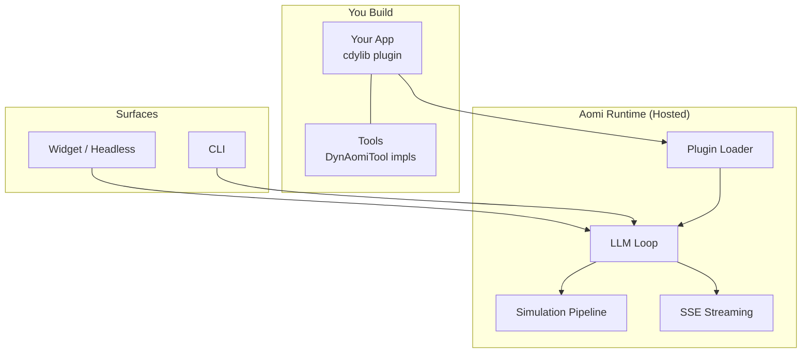
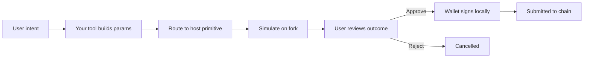

This page covers how an Aomi App fits together with the hosted runtime: what you build, what the runtime provides, and how a request flows from a user message to a signed transaction.

<Info>
  Looking for the higher-level pipeline (your APIs → tools → deployed App)? See [How It Works](/concepts/how-it-works). Choosing between widget, headless, and Telegram? See the [Integration Guide](/guides/integration).
</Info>

## The Public Model

You build an **App**. The runtime hosts it. An App is a Rust plugin compiled to a `cdylib` (a dynamic library) that you build against the public [`aomi-sdk`](https://github.com/aomi-labs/aomi-sdk) crate. The Aomi runtime hot-loads that plugin and exposes its tools to the model.

The runtime itself is hosted infrastructure: session management, the LLM loop, the simulation pipeline, and the streaming layer. You do not run it or wire it up. You ship a plugin and the runtime does the rest.



## How You Build an App

An App is built from three pieces in the public SDK:

- A **tool** is a Rust type that implements the `DynAomiTool` trait. Each tool sets a `NAME`, a `DESCRIPTION`, a typed `Args` struct (deserialized from the model's JSON), and a `run` function. Long-running tools set `IS_ASYNC = true` and implement `run_async` instead.
- The **`dyn_aomi_app!` macro** registers the set. It declares the app name, version, preamble, the list of tools, the host namespaces the plugin needs, and the secrets it reads. The macro generates the manifest, the tool router, and the C ABI the runtime calls.
- The crate is compiled as a `cdylib`. The runtime loads it and calls a small set of exported functions: `aomi_create`, `aomi_manifest`, `aomi_destroy`, `aomi_free_string`, and `aomi_sdk_version`. The version export is the compatibility gate. The host and the plugin must be built against the same `aomi-sdk` version.

```rust
impl DynAomiTool for GetTokenPrice {
    type App = MyApp;
    type Args = PriceArgs;
    const NAME: &'static str = "get_token_price";
    const DESCRIPTION: &'static str = "Look up the current price of a token.";

    fn run(_app: &MyApp, args: PriceArgs, _ctx: DynToolCallCtx) -> Result<Value, String> {
        // call your API, return JSON
    }
}

aomi_sdk::dyn_aomi_app!(
    app = MyApp,
    name = "mycoindex",
    version = "0.1.0",
    preamble = "You are the MyCoinDex trading assistant.",
    tools = [GetTokenPrice],
    namespaces = ["evm-core"],
);
```

## Namespaces and the Host Surface

A plugin declares which host **namespaces** it needs. The host injects that namespace's tools alongside your own. The default is `["evm-core"]`, which gives a plugin the EVM read and write primitives: read on-chain state, stage and simulate transactions, and request a wallet signature. The public write surface is EVM: Ethereum, Base, Arbitrum, Optimism, Polygon, and Linea.

Your tool never holds a private key and never signs. When a tool needs an on-chain action, it returns a route step that points at a host primitive (for example, the host's commit-transaction or commit-message tool). The host runs the simulation and then asks the user's wallet to sign.

## Simulate Before Sign

Every transaction is simulated on a fork of the live network before it reaches the user's wallet. The user reviews exact token changes, gas, and contract calls, then approves or rejects. Aomi never custodies keys; signing happens locally in the user's wallet.



For the full safety properties, see [Security](/concepts/security). For the simulation internals, see the [Simulation Reference](/reference/simulation).

## Next Steps

- [How It Works](/concepts/how-it-works) — end-to-end example with MyCoinDex
- [Runtime Reference](/reference/runtime) — session management and streaming internals
- [Simulation Reference](/reference/simulation) — transaction simulation pipeline
- [API Reference](/reference/api-reference) — HTTP endpoints