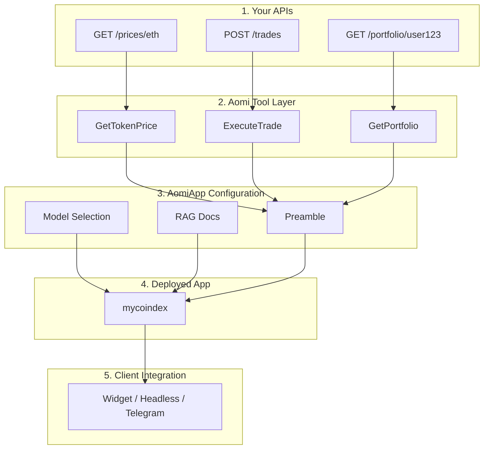
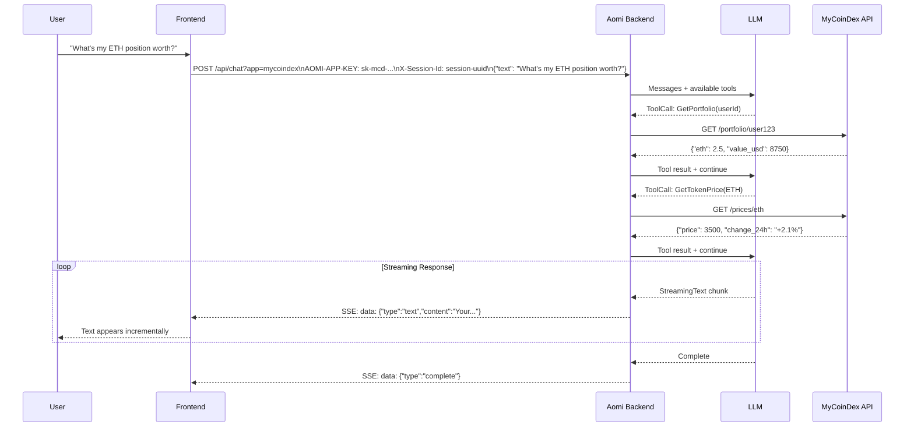

This page walks through the full lifecycle of an Aomi-powered assistant, from your existing APIs to a deployed product your users can talk to. **MyCoinDex**, a fictional crypto exchange, is the running example.

## The Pipeline



## 1. Your APIs

MyCoinDex exposes standard HTTP endpoints. Aomi does not modify them.

| Endpoint | Method | Description |
| --- | --- | --- |
| `/prices/{symbol}` | GET | Current token price |
| `/trades` | POST | Execute a trade |
| `/portfolio/{userId}` | GET | User portfolio and P&L |
| `/markets` | GET | Available trading pairs |
| `/orderbook/{pair}` | GET | Order book depth |

## 2. APIs Become AI Tools

Aomi wraps each endpoint as a **tool**, a typed function the LLM can invoke. Each tool has a name, description, and typed parameters.

When a user asks "What's ETH trading at?", the model calls `GetTokenPrice` with `{ symbol: "ETH" }`. The tool hits `/prices/eth`, returns the result, and the model composes a response. Tools can execute concurrently.

## 3. Configuring the Assistant

### Preamble

The system prompt that shapes personality and rules:

```
You are the MyCoinDex trading assistant. You help users check
prices, manage portfolios, and execute trades.

Always confirm with the user before executing a trade.
Show prices in USD unless the user requests otherwise.
```

### Model Selection

| Provider | Models |
| --- | --- |
| Anthropic | Claude Sonnet, Claude Haiku |
| OpenAI | GPT-4o, GPT-4o Mini |
| OpenRouter | 100+ models |

Models can be changed at runtime. No redeployment needed.

### RAG Document Store (Optional)

If MyCoinDex has documentation, FAQs, or knowledge base articles, Aomi ingests them into a vector store for the assistant to search.

## 4. Deployed as an App

```
App:        "mycoindex"
Endpoint:   POST /api/chat?app=mycoindex
Tools:      GetTokenPrice, ExecuteTrade, GetPortfolio, ListMarkets
Preamble:   MyCoinDex trading assistant
Model:      Claude Sonnet (default, switchable)
```

Each app is fully isolated.

## 5. API Key and Authentication

MyCoinDex receives an API key scoped to their app:

```
AOMI-APP-KEY: sk-mcd-a1b2c3d4e5f6
X-Session-Id: 550e8400-e29b-41d4-a716-446655440000
```

## 6. The Request Flow



### Step by Step

1. User sends a message via the widget or headless integration.
2. Frontend sends HTTP POST to `/api/chat?app=mycoindex` with the API key.
3. Backend validates the API key and loads the session.
4. Backend sends message + history + tools to the selected LLM.
5. LLM decides to call tools and requests `GetPortfolio` and `GetTokenPrice`.
6. Backend executes tool calls against MyCoinDex's APIs.
7. Tool results go back to the LLM for interpretation.
8. LLM streams its response, and each text chunk forwards as an SSE event.
9. Frontend renders incrementally.
10. Complete event signals the response is finished.

## SSE Stream Format

```
data: {"type":"text","content":"Your ETH "}
data: {"type":"text","content":"position is worth "}
data: {"type":"text","content":"$8,750"}
data: {"type":"tool_call","name":"GetPortfolio","args":{"userId":"user123"}}
data: {"type":"tool_result","name":"GetPortfolio","result":{"eth":2.5,"value_usd":8750}}
data: {"type":"complete"}
```

| Event Type | Purpose |
| --- | --- |
| `text` | Incremental text chunk from the LLM |
| `tool_call` | The model is invoking a tool |
| `tool_result` | Result returned from a tool execution |
| `complete` | Response finished |

## What You Get

| Capability | Details | Managed By |
| --- | --- | --- |
| **AI assistant** | Understands your product, calls your APIs | Aomi |
| **Streaming chat** | Real time responses via SSE | Aomi |
| **Tool execution** | LLM calls your APIs as needed during conversations | Aomi |
| **Session management** | Persistent threads, history, and state | Aomi |
| **Multi-model support** | Switch between Claude, GPT-4o, and others at runtime | Aomi |
| **Wallet integration** | Optional Web3 wallet connect for onchain actions | Aomi |
| **Scaling and availability** | Hosted infrastructure, no GPUs or LLM keys to manage | Aomi |
| **Your API endpoints** | Standard HTTP, no modifications required | You |
| **Frontend integration** | Widget, headless, or Telegram | You |
| **API key security** | Store securely, never expose client-side | You |

## Next Steps

- [Reference / Apps & Auth](/reference/apps-auth): how API keys, apps, and sessions fit together.
- [API Reference](/reference/api-reference): full HTTP endpoint documentation.
- [Sessions](/reference/sessions): how chat sessions are created and managed.
