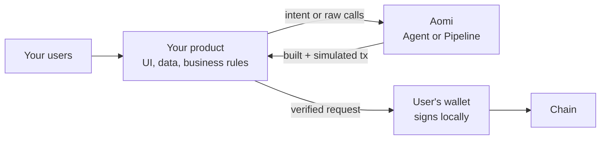
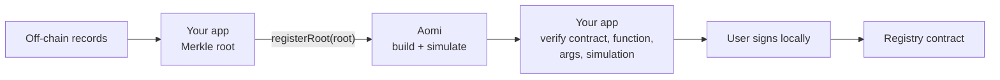
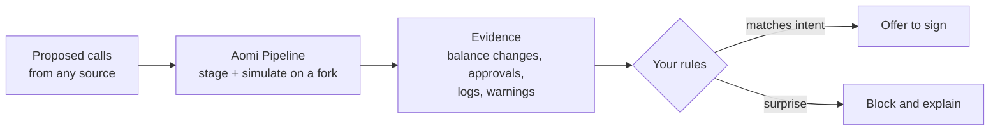
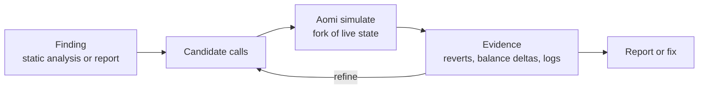
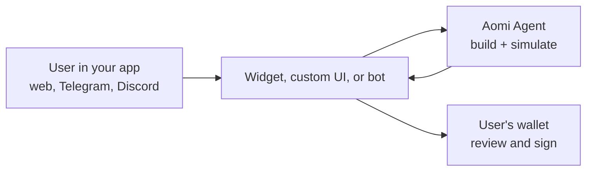
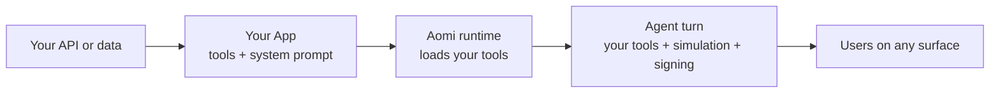

Trading in chat is the most visible use of Aomi, but it is one pattern among several. Underneath, Aomi is an **execution layer**: it turns intent or raw calls into transactions, simulates them on a fork of live chain state, and hands them to a wallet that the user controls. Your product can own the interface, the data, and the decision. Aomi handles building, simulation, and the signing handoff.

Every pattern below uses the same pipeline: **build → simulate → verify → sign locally → broadcast**. The wallet never leaves your user's control.

## Execution layer behind your product

Your application decides *what* should happen on chain. Aomi turns that decision into a simulated, reviewable transaction.

Use the [client SDK](/integrate/client-sdk) from your server or UI. Use [Pipeline](/integrate/pipeline) when you already know the calls, and the [Agent](/integrate/agent) when users describe the outcome in natural language.

## On-chain anchoring and attestation

Commit a fingerprint of off-chain records to a contract so anyone can later prove the records existed and were not changed. Your app batches the records into a Merkle root. Aomi builds and simulates the registration call. Your app checks the call against its ABI before the user signs.

See the [Provenance anchoring case study](/examples/guardrail) and [Verify before you sign](/integrate/actions-and-signing#verify-before-you-sign).

## Simulation oracle

Ask "does this transaction do what I think it does?" before anyone signs. Stage arbitrary calls, then read balance changes, approvals, logs, guard results, and warnings from the simulation. Treat a failed or unexpected simulation as a reason to stop.

This fits wallets, multisig review tools, CI checks for protocol deployments, and agents that should not act without evidence. See [Pipeline](/integrate/pipeline) and [Transaction safety](/security/transaction-safety).

## Exploit and repro harness on a fork

Reproduce a reported bug or a static-analysis finding against real chain state without touching mainnet. Build the attack or repro sequence as calls, simulate it on a fork, and read the resulting balance changes and logs as evidence.

Simulation is a rehearsal. Nothing is signed or broadcast unless you choose to commit.

## User-approved transactions in any app

Add on-chain actions to a product that is not a crypto app: a game, a marketplace, a membership site, or a bot. Users describe what they want or click a button. Aomi builds the transaction, and the user approves it in their own wallet.

Start with the [widget](/guides/widget/quickstart) for a web app, or a [channel](/build/telegram) for chat platforms.

## Build your own App and tools

When the Agent needs your own off-chain APIs, data, or domain rules, package them as an Aomi App. The runtime loads your tools next to its own, so the Agent can call your API and then build and simulate the resulting transaction in one turn.

See [Build on Aomi](/build) and [Choose a surface](/integrate/choose-surface) to decide how users reach it.

## Next steps

<CardGroup cols={3}>
  <Card title="Choose a surface" icon="signs-post" href="/integrate/choose-surface">
    Portal, widget, SDK, or your own App.
  </Card>
  <Card title="Provenance anchoring" icon="fingerprint" href="/examples/guardrail">
    A worked case study of the anchoring pattern.
  </Card>
  <Card title="Hackathon fast start" icon="bolt" href="/guides/hackathon">
    Idea prompts by track and a five-minute path.
  </Card>
</CardGroup>
