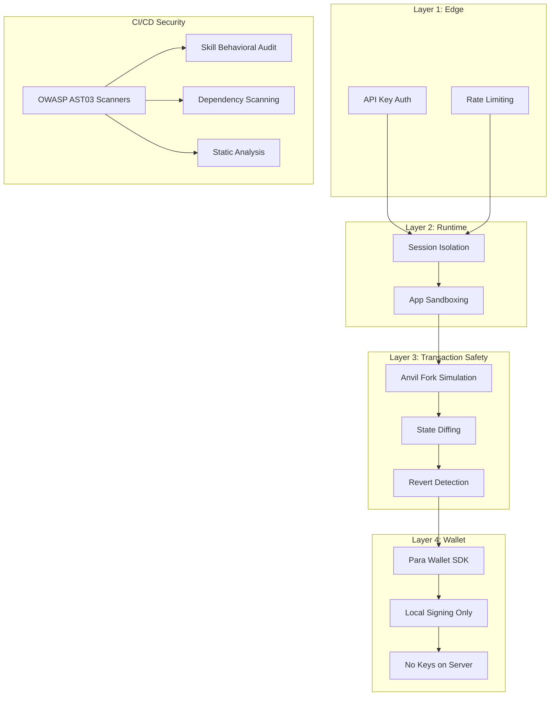
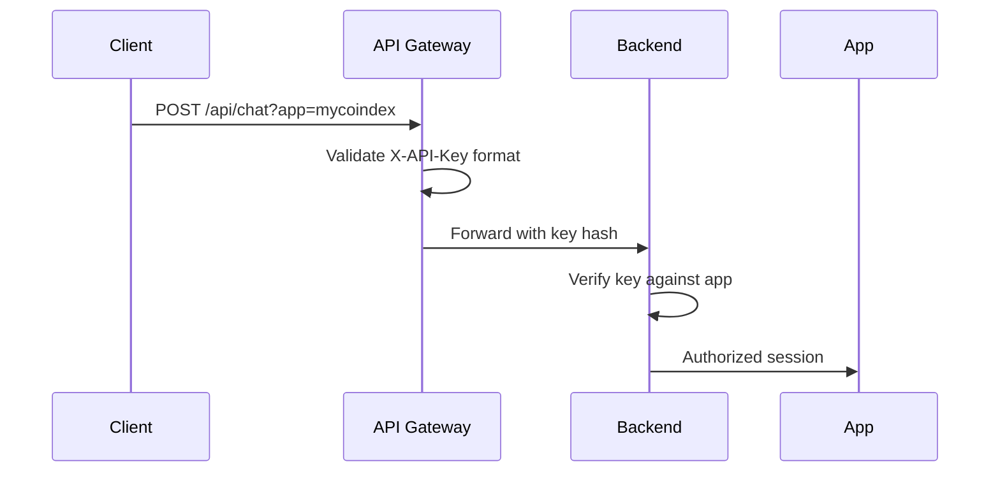
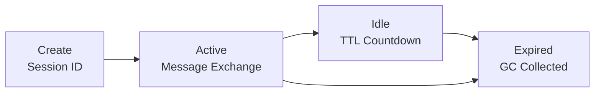
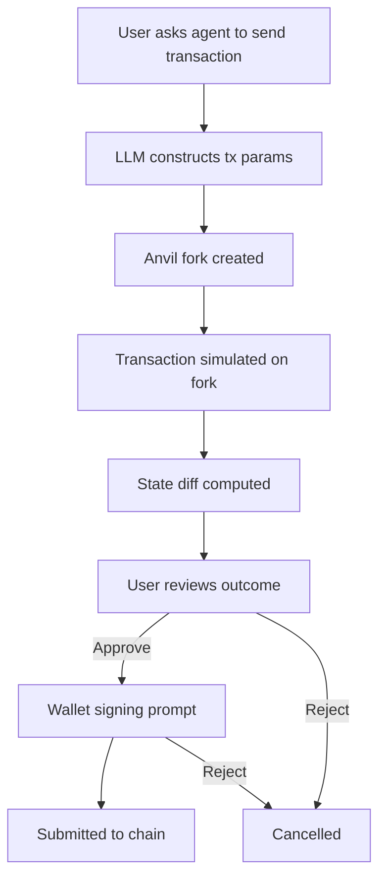
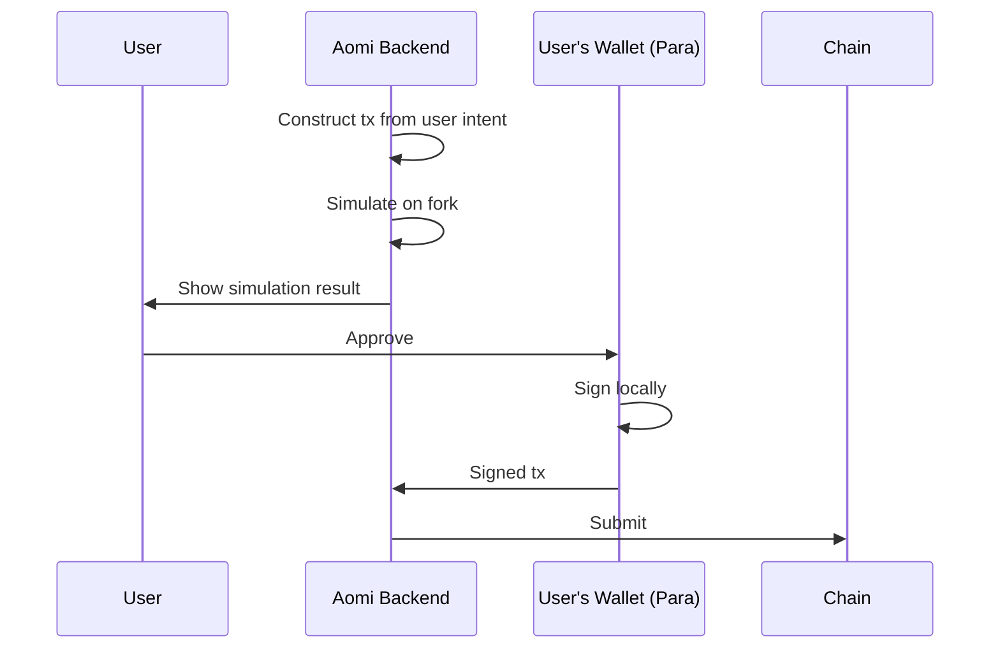
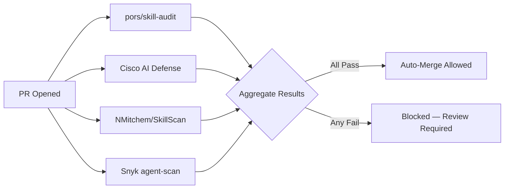

Aomi's security model is built on four layers: **API authentication** at the edge, **session isolation** at the runtime layer, **simulation-first transaction execution** as the core safety mechanism, and **non-custodial wallet architecture** that never holds private keys.

## Security Architecture



---

## Layer 1: API Authentication

Every request to the Aomi backend is authenticated with a scoped API key. Keys are issued per app and can be rotated independently.

### Key Format

```
sk-{app-name}-{random-hex-string}
```

### Authentication Flow



### Security Properties

| Property | Detail |
|----------|--------|
| **Key scope** | Scoped to a single app — a compromised key for `app-a` cannot access `app-b` |
| **No client-side exposure** | Keys are used server-side only; frontends route through a proxy or use session tokens |
| **Rotation** | Keys can be rotated without downtime — old and new keys are accepted during a configurable overlap window |
| **Rate limiting** | Per-key and per-IP rate limits enforced at the edge |

### Best Practices

```
Store API keys in environment variables, not in code or client bundles.
Use a backend proxy to attach the API key — never expose it in frontend code.
Rotate keys on a regular schedule or immediately after a suspected leak.
```

---

## Layer 2: Session Isolation

Each chat session runs in an isolated context. Sessions are identified by `X-Session-Id` and maintain their own history, tool execution state, and event queue.

### What Session Isolation Protects Against

| Threat | Prevention |
|--------|-----------|
| Session hijacking | Session IDs are UUIDs — not sequential or predictable |
| Cross-session data leak | Each session has its own history and tool state — no shared memory |
| Session replay | Sessions expire after configurable TTL; expired sessions return 401 |

### Session Lifecycle



---

## Layer 3: Simulation-First Transactions

The simulation pipeline is the core safety mechanism. Before any transaction reaches the user's wallet, it is executed against a forked copy of the current network state.

<Info>
  This section covers the security properties of simulation. For the full technical deep-dive — fork lifecycle, state diffing, tool API — see the [Simulation Reference](/reference/simulation).
</Info>

### The Safety Pipeline



### What Simulation Catches

| Scenario | Simulation Catches It? |
|----------|----------------------|
| Wrong recipient address | Yes — user sees destination before signing |
| Incorrect token amount | Yes — exact amounts shown in diff |
| Unexpected contract call | Yes — all called contracts listed |
| Transaction would revert | Yes — revert detected before gas spent |
| Malicious transaction params | Yes — user reviews full tx before signing |
| Gas estimation failure | Yes — gas estimate included in output |

### Fork Isolation

Simulation forks are:

- **Ephemeral** — created per-simulation, destroyed after result is delivered
- **Isolated** — each fork runs independently, no cross-fork state leakage
- **State-faithful** — forked from the real network state at the current block

```rust
// Simplified fork lifecycle
let fork = AnvilInstance::fork(network_rpc, block_number).await?;
let result = fork.simulate(transaction).await?;

// result.token_changes    → what tokens moved
// result.gas_estimate     → expected gas cost
// result.contract_calls   → which contracts were invoked
// result.will_revert      → whether the tx would fail

drop(fork); // Fork destroyed — no persistent state
```

---

## Layer 4: Non-Custodial Wallet Model

Aomi never holds private keys. All signing happens locally in the user's wallet via the Para Wallet SDK and wagmi provider tree.

<Info>
  See [Non-Custodial Wallets](/concepts/non-custodial-wallets) for the full wallet architecture, chain support, and integration setup.
</Info>

### What This Means

| Principle | Detail |
|-----------|--------|
| **No key custody** | Aomi's backend has no access to private keys, seed phrases, or signing material |
| **Local signing** | All transactions are signed in the user's browser or Telegram client |
| **Per-transaction approval** | Every transaction requires explicit wallet confirmation — no blanket approvals |
| **No custodial fallback** | Aomi cannot sign or send transactions without user approval |

### Key Material Flow



---

## OWASP AST03 Compliance

Skills published under `aomi-labs/skills` are security-audited against the [OWASP AST03](https://owasp.org/www-project-ai-security/) framework. Every pull request runs four automated scanners in CI:

### Scanner Pipeline

| Scanner | Type | What It Checks |
|---------|------|----------------|
| `pors/skill-audit` | Behavioral | Skill-specific behavior patterns — verifies tools stay within their declared scope |
| Cisco AI Defense | Offline | Offline behavioral analysis — detects prompt injection and tool misuse |
| NMitchem/SkillScan | Static | Static skill analysis — validates markdown structure, no hidden commands |
| Snyk agent-scan | Dependency | Dependency and configuration scanning — flags vulnerable or malicious packages |

### CI Flow



### What Gets Scanned

- Skill markdown definitions (command definitions, tool patterns)
- Reference files linked from skill definitions
- Docker images referenced in skill configurations
- Dependency manifests (`package.json`, `Cargo.toml`, `requirements.txt`)

---

## Threat Model

### In Scope: What Aomi Protects Against

| Threat | Mitigation |
|--------|-----------|
| **LLM-generated incorrect tx parameters** | Simulation catches wrong amounts, addresses, contracts before signing |
| **Unauthorized tool invocation** | Tools are scoped per app; session isolation prevents cross-app tool calls |
| **Session hijacking** | UUID-based session IDs, configurable TTL, no sequential IDs |
| **API key leakage** | Per-app key scoping limits blast radius; rotation support enables fast recovery |
| **Malicious skill definitions** | 4 OWASP AST03 scanners run on every skill PR — blocked if any fail |
| **Replay attacks** | Sessions expire; nonce-based tx ordering prevents tx replay |

### Out of Scope: User Responsibility

| Area | Responsibility |
|------|---------------|
| **API key storage** | Store keys securely in environment variables or secret managers — never in client bundles |
| **Preamble quality** | A well-written preamble prevents the LLM from overstepping its bounds |
| **Wallet seed phrase custody** | Aomi cannot recover lost seed phrases — users must back them up |
| **Frontend deployment** | Users control their frontend deployment — CSP headers, input sanitization, etc. |
| **RAG document content** | Documents ingested for RAG should be reviewed for sensitive information |

---

## Security Best Practices

### Preamble Constraints

The system prompt is your first line of defense. Constrain the LLM's behavior explicitly:

```
You are a trading assistant. You can:
- Check token prices
- Show portfolio balances
- Simulate transactions

You must NOT:
- Execute trades without explicit user confirmation
- Modify user preferences without asking
- Share transaction details with third parties

Always confirm amounts and addresses before proceeding.
```

### Tool Permission Scoping

Tools inherit the permissions of the API key used to register them. Follow least-privilege:

```
# Good: read-only price tool
GetTokenPrice → GET /prices/{symbol}

# Good: scoped write tool with confirmation
ExecuteTrade → POST /trades (requires user confirmation in preamble)

# Avoid: unbounded write access
AdminTool → DELETE /users/{id} (no preamble constraint, no confirmation)
```

### API Key Management

```
- One key per app (not shared across environments)
- Rotate keys every 90 days
- Use environment variables, not config files
- Monitor key usage in dashboard for anomalous patterns
- Revoke compromised keys immediately — rotation window limits exposure
```

### Session Best Practices

```
- Set reasonable session TTL (15-30 minutes for interactive, shorter for sensitive actions)
- Regenerate session IDs on privilege escalation (if applicable)
- Log session creation and destruction for audit trails
```

### RAG Document Security

Documents ingested for RAG should be reviewed for:

- **Sensitive data** — no passwords, API keys, or internal URLs
- **Outdated information** — stale docs lead to incorrect tool usage
- **Conflicting instructions** — multiple docs with contradictory guidance confuse the LLM

---

## Security Checklist

Use this when deploying an Aomi App to production:

- [ ] API key stored in environment variable (not in code or client bundle)
- [ ] API key scoped to a single app
- [ ] Session TTL configured
- [ ] Preamble includes behavioral constraints and confirmation requirements
- [ ] Tools registered with least-privilege permissions
- [ ] RAG documents reviewed for sensitive content
- [ ] Simulation enabled for all transaction-producing tools
- [ ] Wallet configured for local signing only
- [ ] Rate limiting enabled at edge
- [ ] Key rotation schedule established

## Next Steps

- [Simulation Reference](/reference/simulation) — technical deep-dive on the simulation pipeline
- [Non-Custodial Wallets](/concepts/non-custodial-wallets) — wallet security model and integration
- [Execution Guide](/guides/execution) — transaction lifecycle from simulation to settlement
- [Skills](/concepts/skills) — OWASP-scanned skill definitions
