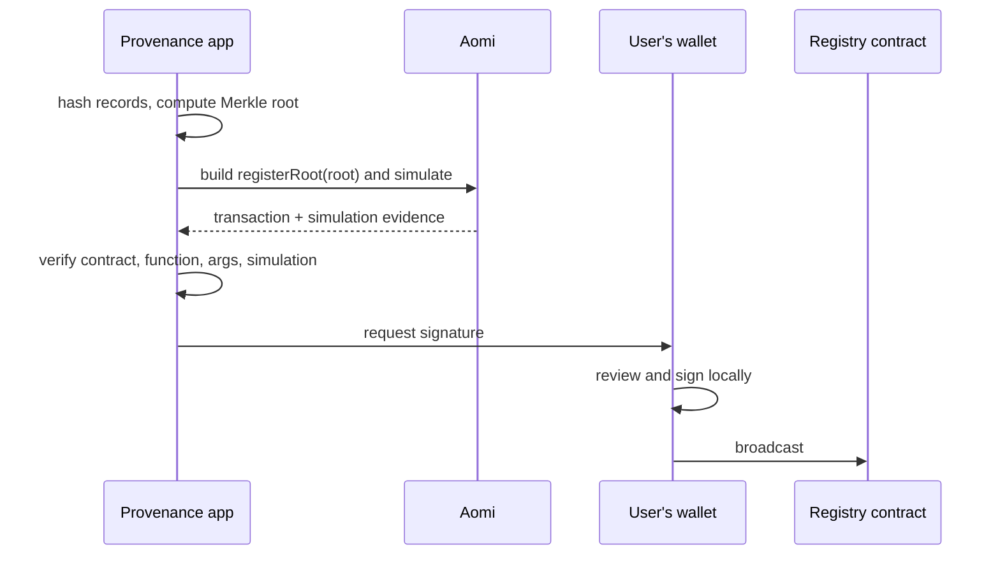

This reference pattern shows a provenance service for off-chain records. The product needs to prove, later and to anyone, that a batch of records existed at a point in time and has not changed since. It uses Aomi as the **execution layer**: the app owns the data and the rules, and Aomi builds and simulates the on-chain registration.

## What it does

- Collects off-chain records, such as logs, reports, or documents, and hashes each one.
- Batches the hashes into a Merkle tree and computes one 32-byte root per batch.
- Registers the root on a registry contract with a single `registerRoot(bytes32)` call.
- Lets anyone later prove that a record belongs to a registered batch with its Merkle proof.

## How it uses Aomi

1. **Build.** The app encodes `registerRoot(root)` with its ABI and stages the call. It could also ask the Agent to prepare the registration; both paths produce the same transaction request.
2. **Simulate.** Aomi runs the call on a fork of live chain state and returns the simulation status, logs, and balance changes.
3. **Verify.** Before showing a wallet prompt, the app checks that the transaction targets the registry address, that the calldata decodes to `registerRoot` with the expected root, that it sends no native value, and that the simulation `passed`. Any mismatch stops the flow.
4. **Sign locally.** Only then does the user's wallet sign. Aomi never holds the key.

The verification step binds the wallet prompt to the app's stated intent. A passed simulation is evidence from the simulated state, not a guarantee about later chain state. The ABI check confirms that the prepared calldata matches the contract call the app meant to make. The code for this check is in [Verify before you sign](/integrate/actions-and-signing#verify-before-you-sign).

## Why it is a useful example

- **Aomi did not need a custom App.** The registry is a plain contract. Pipeline stages raw calls, so the team wrote calldata with Viem and used Aomi for simulation and the signing handoff.
- **The app keeps the decision.** The app chooses what to anchor and enforces its own rules. Aomi supplies the build, the evidence, and a safe path to the user's wallet.
- **The same shape fits other records.** Audit logs, AI model outputs, dataset snapshots, credentials, and supply-chain events can all be anchored the same way.

## Build your own

<CardGroup cols={2}>
  <Card title="Where Aomi fits" icon="diagram-project" href="/concepts/patterns">
    The anchoring pattern and other non-trading integrations.
  </Card>
  <Card title="Pipeline" icon="diagram-next" href="/integrate/pipeline">
    Stage, simulate, and commit raw calls to your own contract.
  </Card>
</CardGroup>
