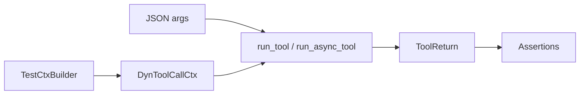

The `aomi_sdk::testing` module lets you unit-test your tools without loading the full FFI plugin. You build a tool call context, invoke the tool with typed arguments, and assert on what it returns. Tests run as ordinary `cargo test` cases, so they fit straight into your CI.

## Overview



## Building a Test Context

`TestCtxBuilder` constructs the `DynToolCallCtx` the host normally passes into a tool. It uses generated defaults for the session and call IDs, and lets you override them or inject state attributes and resolved secrets:

```rust
use aomi_sdk::testing::TestCtxBuilder;

// Minimal context — defaults for session_id and call_id
let ctx = TestCtxBuilder::new("get_token_price").build();

// With overrides, a state attribute, and a resolved secret
let ctx = TestCtxBuilder::new("get_token_price")
    .session_id("session-123")
    .call_id("call-1")
    .attribute("user", serde_json::json!({ "org_id": 42 }))
    .secret("API_KEY", "sk-test-...")
    .build();
```

The `secret` value simulates what the host injects from the per-app vault before each call, so you can test code paths that read secrets through `resolve_secret_value`.

## Running a Synchronous Tool

`run_tool` deserializes your JSON args into the tool's `Args` type, invokes the tool, and returns a `ToolReturn`. The `ToolReturn` carries the tool's `value` plus any routes it emitted:

```rust
use aomi_sdk::testing::{TestCtxBuilder, run_tool};
use serde_json::json;

#[test]
fn get_price_returns_a_value() {
    let ctx = TestCtxBuilder::new("get_token_price").build();
    let result = run_tool::<GetPrice>(&MyApp, json!({ "symbol": "ETH" }), ctx);

    let output = result.expect("tool should succeed");
    assert_eq!(output.value["symbol"], "ETH");
    assert!(output.routes.is_empty());
}
```

Tests that only care about the payload can read `output.value`. Tests that exercise multistep routing can assert on `output.routes`.

## Running an Async Tool

`run_async_tool` drives a tool that sets `IS_ASYNC = true`. It returns a tuple: every intermediate `sink.emit(...)` value in order, plus the terminal `sink.complete(...)` payload as a `ToolReturn`:

```rust
use aomi_sdk::testing::{TestCtxBuilder, run_async_tool};
use serde_json::json;

#[test]
fn stream_prices_emits_then_completes() {
    let ctx = TestCtxBuilder::new("stream_prices").build();
    let (updates, terminal) =
        run_async_tool::<StreamPrices>(&MyApp, json!({ "symbol": "ETH" }), ctx)
            .expect("async tool should finish");

    assert_eq!(updates.len(), 1);
    assert_eq!(terminal.value["price"], 42.0);
}
```

Intermediate updates are always bare values. When the tool completes with a routed `ToolReturn`, `terminal.routes` is populated; otherwise `terminal.value` holds the raw completion value and `terminal.routes` is empty.

## Running the Tests

These are plain Rust tests in your app crate. Run them with `cargo test`:

```bash
# Run every test in the crate
cargo test

# Run a single test
cargo test get_price_returns_a_value

# Show println output
cargo test -- --nocapture
```

## Best Practices

| Practice | Why |
| --- | --- |
| Test each tool in isolation | A failing tool test points straight at the tool |
| Cover the error path | Assert that bad input returns an `Err`, not a panic |
| Use `TestCtxBuilder::secret` | Exercise secret-reading code without a live vault |
| Assert on `routes` for multistep tools | Confirm the tool hands off the right follow-up step |

## Next Steps

- [Custom Tools](/guides/custom-tools): define tools with `DynAomiTool`
- [Building Apps](/reference/building-apps): full app lifecycle and host tool contract
- [SDK Reference](/reference/sdk-api): full Rust SDK documentation
