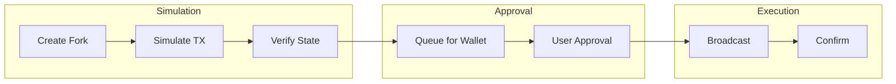
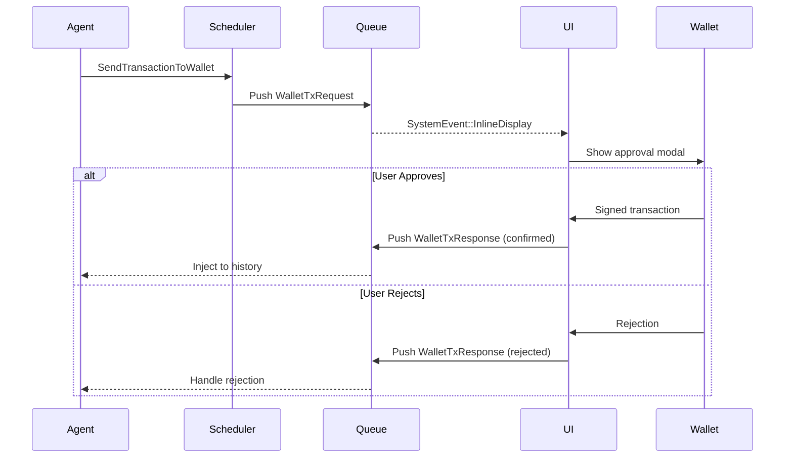

Transaction execution covers the full lifecycle from simulation to on-chain settlement. All transactions are simulated on Anvil forks before being sent to user wallets for approval.

## Overview



## Fork Management

### ForkProvider

The `aomi-anvil` crate manages Anvil forks for transaction simulation. Two provider types:

| Provider | Description |
| --- | --- |
| `Anvil` | Managed Anvil subprocess (spawn, kill, snapshot, reset) |
| `External` | Existing RPC endpoint (no process management, snapshot via state override) |

### Initialization

```rust
use aomi_anvil::{
    init_fork_provider, fork_endpoint, ForkProvider,
    AnvilParams, ForksConfig,
};

let params = AnvilParams {
    fork_url: "https://eth-mainnet.g.alchemy.com/v2/YOUR_KEY".into(),
    fork_block_number: Some(18_500_000),
    chain_id: Some(1),
    port: Some(8545),
};
init_fork_provider(params).await?;
let rpc_url = fork_endpoint()?;
```

## Snapshots

```rust
use aomi_anvil::{fork_snapshot, ForkSnapshot};

let snapshot: ForkSnapshot = fork_snapshot()?;
execute_test_transactions().await?;
shutdown_and_reinit_all().await?; // Revert to snapshot
```

## Transaction Simulation

### SimulateContractCall Tool

```rust
use aomi_tools::cast::SimulateContractCall;

#[tool(description = "Simulate a contract call without broadcasting")]
pub async fn simulate_contract_call(
    params: SimulateParams,
) -> Result<SimulationResult, ToolError> {
    let client = external_clients().await.cast_client(&params.network)?;
    let result = client.simulate(
        &params.from, &params.to,
        &params.data, &params.value,
    ).await?;
    Ok(SimulationResult {
        success: result.success,
        return_data: result.output,
        gas_used: result.gas_used,
        logs: result.logs,
    })
}
```

### Batch Simulation

```rust
let fork_url = fork_endpoint()?;
let provider = ProviderBuilder::new().on_http(fork_url.parse()?);

let mut results = Vec::new();
for tx in transactions {
    provider.anvil_impersonate_account(tx.from).await?;
    let result = provider.send_transaction(tx.clone()).await?;
    let receipt = result.get_receipt().await?;
    results.push(SimulationResult {
        tx_hash: receipt.transaction_hash,
        success: receipt.status(),
        gas_used: receipt.gas_used,
    });
}
shutdown_and_reinit_all().await?;
```

## Wallet Integration

### Transaction Flow



### SendTransactionToWallet Tool

```rust
#[tool(description = "Queue a transaction for wallet approval")]
pub async fn send_transaction_to_wallet(
    params: SendTxParams,
) -> Result<String, ToolError> {
    let tx_request = TransactionRequest {
        to: params.to.parse()?,
        value: parse_ether(&params.value)?,
        data: params.data.parse()?,
        chain_id: network_to_chain_id(&params.network),
    };
    let request_id = queue_wallet_request(tx_request, &params.description).await?;
    Ok(format!("Transaction queued (request_id: {})", request_id))
}
```

## Cast Client

```rust
use aomi_tools::clients::{CastClient, external_clients};

let clients = external_clients().await;
let cast = clients.cast_client("ethereum")?;

// Call view function
let balance = cast.call(token_address, "balanceOf(address)", &[wallet_address]).await?;
// Estimate gas
let gas = cast.estimate_gas(from_address, to_address, calldata, value).await?;
```

### CallViewFunction Tool

```rust
#[tool(description = "Call a view/pure function on a contract")]
pub async fn call_view_function(params: CallViewParams) -> Result<String, ToolError> {
    let cast = external_clients().await.cast_client(&params.network)?;
    let result = cast.call(&params.contract, &params.function, &params.args).await?;
    Ok(result)
}
```

## Multi-Network Support

```yaml
networks:
  ethereum:
    rpc_url: "https://eth-mainnet.g.alchemy.com/v2/${ALCHEMY_KEY}"
    chain_id: 1
  base:
    rpc_url: "https://base-mainnet.g.alchemy.com/v2/${ALCHEMY_KEY}"
    chain_id: 8453
  arbitrum:
    rpc_url: "https://arb-mainnet.g.alchemy.com/v2/${ALCHEMY_KEY}"
    chain_id: 42161
```

## Error Handling

| Error | Cause | Resolution |
| --- | --- | --- |
| `ForkNotInitialized` | `init_fork_provider` not called | Initialize before use |
| `SimulationReverted` | Transaction would fail | Check calldata and state |
| `InsufficientFunds` | Not enough ETH/tokens | Fund the account |
| `GasEstimationFailed` | Complex transaction | Provide manual gas limit |

## Best Practices

| Practice | Description |
| --- | --- |
| **Always simulate** | Never skip the simulation step |
| **Show state changes** | Display balance deltas clearly |
| **Require confirmation** | Never auto-execute transactions |
| **Validate addresses** | Check checksums and formats |
| **Warn on high value** | Alert for large transfers |

## Next Steps

- [Script Generation](/guides/script-generation) — automate Foundry/Forge script creation
- [Simulation Reference](/reference/simulation) — deep dive into simulation internals
- [SDK Reference](/reference/sdk-api) — Rust SDK for building agentic applications
