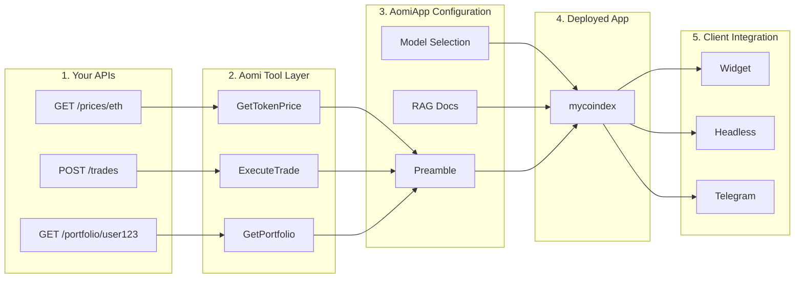

This guide walks through the full-stack integration process — from your existing APIs to a deployed Aomi App that your users can interact with across web, Telegram, and other channels.

To work with us on an integration, [contact us](https://aomi.dev/contact).

## The Pipeline



Each tool wraps one or more of your API endpoints. A one-to-one mapping is not required — you can aggregate multiple endpoints into a single tool so the LLM's context stays clean and semantically coherent.

### 1. Your APIs

Aomi does not modify your APIs. The only requirement is that they are reachable over HTTP. Your backend owns all user state — the Aomi App retains conversation history but nothing about your users, balances, or sessions.

| Endpoint | Method | Description |
| --- | --- | --- |
| `/prices/{symbol}` | GET | Current token price |
| `/trades` | POST | Execute a trade |
| `/portfolio/{userId}` | GET | User portfolio and P&L |
| `/markets` | GET | Available trading pairs |
| `/orderbook/{pair}` | GET | Order book depth |

### 2. Aomi Tool Layer

Aomi wraps your endpoints as **tools** — typed functions the LLM can invoke during a conversation. Each tool has a name, description, and typed input parameters. Tools can execute concurrently.

### 3. AomiApp Configuration

Three settings define the App's behavior:

**Preamble** — the system prompt that shapes the AI's personality, constraints, and rules. A well-written preamble keeps the AI on-task and prevents overstepping.

```text
You are the MyCoinDex trading agent. You help users check
prices, manage portfolios, and execute trades.

Always confirm with the user before executing a trade.
Show prices in USD unless the user requests otherwise.
Never provide financial advice or price predictions.
```

**Model Selection** — different models for different needs:

| Provider | Models |
| --- | --- |
| Anthropic | Claude Sonnet, Claude Haiku |
| OpenAI | GPT-4o, GPT-4o Mini |
| OpenRouter | Access to 100\+ models |

**RAG Document Store** — if you have documentation, FAQs, or knowledge base articles, Aomi sets up RAG ingestion. The AI searches these documents when answering questions beyond what tools provide.

### 4. Deployed App

Aomi compiles and deploys the configured App as an isolated app on the hosted platform. Each app gets a scoped API key and a dedicated chat endpoint.

```text
App:        "mycoindex"
Endpoint:   POST /api/chat?app=mycoindex
Tools:      GetTokenPrice, ExecuteTrade, GetPortfolio, ListMarkets
Preamble:   MyCoinDex trading agent
Model:      Claude Sonnet (default, switchable)
```

### 5. Client Integration

| Path | Install | Best For |
| --- | --- | --- |
| Widget (shadcn) | `npx shadcn add https://aomi.dev/r/aomi-frame.json` | Quick integration, standard chat UI |
| Headless Library | `npm install @aomi-labs/react` | Custom designs, maximum control |
| Telegram Bot | Managed by Aomi | Reaching users without frontend deployment |

## Next Steps

- [Agentic Application](/concepts/what-is-aomi) — how Apps and API keys fit together
- [API Reference](/reference/api-reference) — full HTTP endpoint documentation
- [Sessions](/reference/sessions) — how chat sessions are created and managed