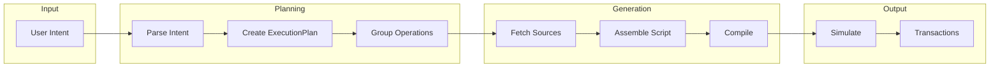

Aomi can generate and execute Forge scripts from natural language intents. The `ForgeExecutor` orchestrates compilation, dependency resolution, and execution.

## Overview



## ForgeExecutor

The `ForgeExecutor` orchestrates script generation with dependency-aware execution.

```rust
use aomi_scripts::{ForgeExecutor, OperationGroup};

let groups = vec![
    OperationGroup {
        id: "deploy_token".into(),
        description: "Deploy ERC20 token".into(),
        contracts: vec![],
        depends_on: vec![],
    },
    OperationGroup {
        id: "add_liquidity".into(),
        description: "Add liquidity to Uniswap".into(),
        contracts: vec![("ethereum".into(), "0x...".into(), "UniswapV2Router".into())],
        depends_on: vec!["deploy_token".into()],
    },
];

let executor = ForgeExecutor::new(groups).await?;
```

## Execution Plan

Operations are organized into groups with dependencies:

```rust
impl ExecutionPlan {
    pub fn next_ready_batch(&self) -> Vec<usize> {
        self.groups.iter().enumerate()
            .filter(|(_, g)| {
                self.status[&g.id] == GroupStatus::Pending
                    && g.depends_on.iter().all(|dep| self.status[dep] == GroupStatus::Complete)
            })
            .map(|(i, _)| i)
            .collect()
    }
}
```

## Source Fetching

The `SourceFetcher` fetches contract sources from Etherscan in the background:

```rust
use aomi_scripts::SourceFetcher;

let fetcher = Arc::new(SourceFetcher::new());
fetcher.request_fetch(vec![
    ("ethereum".into(), "0xUSDC...".into(), "USDC".into()),
    ("ethereum".into(), "0xRouter...".into(), "UniswapV2Router".into()),
]);

if fetcher.are_contracts_ready(&groups).await {
    let sources = fetcher.get_sources(&groups).await;
}
```

## Script Assembly

The `ScriptAssembler` generates Forge scripts using structured AI output:

```rust
use aomi_scripts::{ScriptAssembler, AssemblyConfig, FundingRequirement};

let config = AssemblyConfig {
    network: "ethereum".into(),
    sender: "0xYourAddress...".into(),
    funding: FundingRequirement {
        eth_amount: "1.0".into(),
        tokens: vec![],
    },
};

let assembler = ScriptAssembler::new(config);
let script = assembler.assemble(&group, &contract_sources, &contract_abis).await?;
```

### Generated Script

```solidity
contract GeneratedScript is Script {
    function run() external {
        vm.startBroadcast();
        MyToken token = new MyToken("MyToken", "MTK", 1_000_000 ether);
        token.approve(UNISWAP_ROUTER, type(uint256).max);
        IUniswapV2Router(UNISWAP_ROUTER).addLiquidityETH{value: 1 ether}(
            address(token), 500_000 ether, 0, 0, msg.sender, block.timestamp + 1 hours
        );
        vm.stopBroadcast();
    }
}
```

## Complete Pipeline

```rust
use aomi_scripts::{ForgeExecutor, GroupResult, GroupResultInner};

let mut executor = ForgeExecutor::new(groups).await?;

loop {
    let results: Vec<GroupResult> = executor.next_groups().await?;
    if results.is_empty() { break; }

    for result in results {
        match result.inner {
            GroupResultInner::Success { transactions } => {
                println!("Group {} complete: {} txs", result.group_id, transactions.len());
            }
            GroupResultInner::Failed { error } => {
                println!("Group {} failed: {}", result.group_id, error);
            }
        }
    }
}
```

## Error Handling

| Error | Cause | Resolution |
| --- | --- | --- |
| `SourceFetchTimeout` | Etherscan rate limited | Retry with backoff |
| `CompilationFailed` | Invalid Solidity | Check generated script |
| `SimulationReverted` | Transaction would fail | Review parameters |
| `DependencyNotMet` | Group executed out of order | Check depends_on |

## Next Steps

- [Execution](/guides/execution) — transaction lifecycle from simulation to settlement
- [Custom Tools](/guides/custom-tools) — build your own tools with the Rust SDK
- [SDK Reference](/reference/sdk-api) — full Rust SDK API
