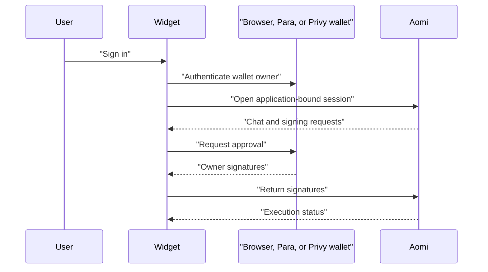

## Overview

`AomiWidget` is the fastest way to add Aomi to a React application. It includes chat, threads, wallet connection, transaction approval, and status updates.

You provide an Aomi Application ID and choose browser-wallet, Para, or Privy authentication. Aomi controls the App's execution and sponsorship policy on the server.

## Live demo

  <iframe
    src="https://chat.aomi.dev"
    title="Aomi widget live demo"
    width="100%"
    height="720"
    loading="lazy"
    allow="clipboard-write"
    style={{ display: "block", border: 0 }}
  />

<Note>
  Wallet popups may open outside the embedded frame. [Open the demo in a new tab](https://chat.aomi.dev).
</Note>

## Choose an integration

| Use | When |
| --- | --- |
| `AomiWidget` | You want the complete cross-origin product |
| `AomiFrame` | You want Aomi's UI and will provide the surrounding account integration |
| Headless library | You need a completely custom interface |
| shadcn source | You want to own and maintain every component |

## How it works

<CardGroup cols={2}>
  <Card title="Install the widget" href="/guides/widget/installation">
    Mount `AomiWidget` with browser, Para, or Privy authentication.
  </Card>
  <Card title="Customize the widget" href="/guides/widget/customization">
    Start with props and themes, or build a completely headless interface.
  </Card>
</CardGroup>
