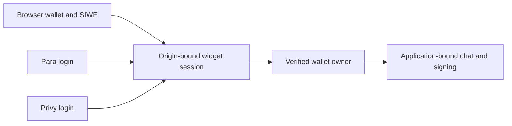

Install `AomiWidget` to add application-bound chat, wallet authentication, and transaction approval to your React app. Your frontend selects the App and sign-in method. Aomi controls execution, fees, sponsorship, and broadcast on the server.

## Prerequisites

Before you start, you need:

- An activated Aomi App and its numeric Application ID.
- The exact partner origin registered for the App, including its scheme, host, and port.
- React 18 or 19 running in the browser.
- A decision between browser-wallet, Para, or Privy authentication.

<Note>
  In Next.js, mount the widget from a client component. The widget uses browser wallet APIs and cannot render as a server-only component.
</Note>

## Install

```bash
npm install @aomi-labs/widget-lib
```

Provider integrations are separate entry points. Import only the provider your application uses so unrelated provider code stays out of the bundle.

## File structure

The widget needs one client component and one environment file. It does not require a custom API route or transaction broadcaster.

<Tabs>
  <Tab title="Next.js">
    ```text
    your-app/
    ├── app/
    │   └── assistant/
    │       └── page.tsx       # Client component that mounts AomiWidget
    ├── .env.local             # Public widget configuration
    └── package.json
    ```
  </Tab>
  <Tab title="Vite">
    ```text
    your-app/
    ├── src/
    │   ├── App.tsx            # Mounts AomiWidget
    │   └── main.tsx
    ├── vite.config.ts         # Maps provider browser identifiers
    ├── .env.local             # Public widget configuration
    └── package.json
    ```
  </Tab>
</Tabs>

## Environment variables

<Tabs>
  <Tab title="Next.js">
    ```bash
    NEXT_PUBLIC_AOMI_API_URL=https://chat.aomi.dev
    NEXT_PUBLIC_AOMI_APPLICATION_ID=123

    # Add only the values required by your wallet mode
    NEXT_PUBLIC_PARA_API_KEY=your_public_para_api_key
    NEXT_PUBLIC_PRIVY_APP_ID=your_public_privy_app_id
    NEXT_PUBLIC_WALLETCONNECT_PROJECT_ID=your_public_walletconnect_project_id
    ```
  </Tab>
  <Tab title="Vite">
    ```bash
    VITE_AOMI_API_URL=https://chat.aomi.dev
    VITE_AOMI_APPLICATION_ID=123

    # Add only the values required by your wallet mode
    VITE_PARA_API_KEY=your_public_para_api_key
    VITE_PRIVY_APP_ID=your_public_privy_app_id
    VITE_WALLETCONNECT_PROJECT_ID=your_public_walletconnect_project_id
    ```
  </Tab>
</Tabs>

| Variable | Purpose |
| --- | --- |
| `AOMI_API_URL` | The Aomi origin that serves widget sessions, chat, and account APIs |
| `AOMI_APPLICATION_ID` | The deployed App and its server-owned execution policy |
| `PARA_API_KEY` | Para's public browser identifier; required for Para mode |
| `PRIVY_APP_ID` | Privy's public browser identifier; required for Privy mode |
| `WALLETCONNECT_PROJECT_ID` | Public WalletConnect project identifier; required only when WalletConnect is enabled |

These are public browser identifiers, not provider secrets. Aomi still verifies the provider tenant and token server-side. Restart the development server after changing them.

<Accordion title="Map provider variables in Vite">
  The provider entry points use the same public identifiers as the Next.js build. Map your `VITE_*` values in `vite.config.ts`:

  ```ts
  import { defineConfig, loadEnv } from "vite";
  import react from "@vitejs/plugin-react";

  export default defineConfig(({ mode }) => {
    const env = loadEnv(mode, process.cwd(), "");

    return {
      plugins: [react()],
      define: {
        "process.env.NEXT_PUBLIC_PARA_API_KEY": JSON.stringify(
          env.VITE_PARA_API_KEY,
        ),
        "process.env.NEXT_PUBLIC_PRIVY_APP_ID": JSON.stringify(
          env.VITE_PRIVY_APP_ID,
        ),
        "process.env.NEXT_PUBLIC_WALLETCONNECT_PROJECT_ID": JSON.stringify(
          env.VITE_WALLETCONNECT_PROJECT_ID,
        ),
      },
    };
  });
  ```
</Accordion>

<Warning>
  Never put an App key, provider secret, paymaster URL, gas-policy credential, treasury address, or fee configuration in browser code.
</Warning>

## Choose authentication

Authentication establishes the user session. Wallet ownership establishes which address may approve transactions. Aomi verifies these separately.

| Mode | Use it when | User experience |
| --- | --- | --- |
| Browser wallet | Users already have MetaMask, Rabby, Coinbase Wallet, or another compatible wallet | Connect a wallet and sign a SIWE message |
| Para | You want Para social login and embedded wallets | Sign in with Para, then use the active embedded or connected wallet |
| Privy | You want Privy login and embedded wallets | Sign in with Privy, then use the active embedded wallet |

<Tabs>
  <Tab title="Browser wallet">
    Browser mode authenticates an existing EOA. It does not require a Para or Privy provider import.

    ```tsx
    "use client";

    import { AomiWidget } from "@aomi-labs/widget-lib";
    import "@aomi-labs/widget-lib/styles.css";

    export default function AssistantPage() {
      return (
        <AomiWidget
          applicationId={process.env.NEXT_PUBLIC_AOMI_APPLICATION_ID!}
          apiUrl={process.env.NEXT_PUBLIC_AOMI_API_URL!}
          auth={{ kind: "browser_wallet" }}
          height="calc(100dvh - 32px)"
        />
      );
    }
    ```
  </Tab>
  <Tab title="Para">
    Importing the Para entry point registers Para authentication and its wallet signer.

    ```tsx
    "use client";

    import { AomiWidget } from "@aomi-labs/widget-lib";
    import "@aomi-labs/widget-lib/providers/para";
    import "@aomi-labs/widget-lib/styles.css";

    export default function AssistantPage() {
      return (
        <AomiWidget
          applicationId={process.env.NEXT_PUBLIC_AOMI_APPLICATION_ID!}
          apiUrl={process.env.NEXT_PUBLIC_AOMI_API_URL!}
          auth={{
            kind: "embedded_wallet",
            provider: "para",
            environment: "PROD",
          }}
          height="calc(100dvh - 32px)"
        />
      );
    }
    ```
  </Tab>
  <Tab title="Privy">
    Importing the Privy entry point registers Privy authentication and its wallet signer.

    ```tsx
    "use client";

    import { AomiWidget } from "@aomi-labs/widget-lib";
    import "@aomi-labs/widget-lib/providers/privy";
    import "@aomi-labs/widget-lib/styles.css";

    export default function AssistantPage() {
      return (
        <AomiWidget
          applicationId={process.env.NEXT_PUBLIC_AOMI_APPLICATION_ID!}
          apiUrl={process.env.NEXT_PUBLIC_AOMI_API_URL!}
          auth={{
            kind: "embedded_wallet",
            provider: "privy",
            environment: "production",
          }}
          height="calc(100dvh - 32px)"
        />
      );
    }
    ```
  </Tab>
</Tabs>

For Vite, use `import.meta.env.VITE_AOMI_APPLICATION_ID` and `import.meta.env.VITE_AOMI_API_URL` in the same component.

## Cross-origin authentication

The widget runs on the partner page while Aomi owns the authenticated backend session.



The widget uses a short-lived session bound to the registered partner origin. It sends explicit authorization and does not depend on ambient cross-site cookies.

Para or Privy login proves the provider identity. Wallet binding separately proves control of the active wallet. This gives browser and embedded wallets the same transaction-approval contract.

Switching wallets or networks clears signing readiness until Aomi resolves the new active owner. Existing account links remain available, but a pending request cannot be signed by a different owner or on a different network.

## What happens after mounting

1. The user authenticates with the selected method.
2. Aomi creates an origin-bound widget session.
3. The active wallet is verified as the transaction owner.
4. If the App requires account abstraction, Aomi resolves or provisions its execution account.
5. The user can chat and review transaction requests in the widget.
6. The wallet signs approved requests; Aomi handles sponsored broadcast and confirmation.

<Info>
  Notice that `AomiWidget` receives no paymaster URL, gas policy, fee rate, treasury, or executor address. Aomi resolves those settings from the Application ID.
</Info>

## Verify the setup

1. Open the page from the registered origin.
2. Sign in and connect or create a wallet.
3. Confirm the thread list and composer load without an App-key prompt.
4. Send a message and confirm a response appears.
5. Switch wallets or networks and confirm the widget updates the active owner.
6. For a transaction-enabled App, confirm the approval dialog shows the calls, fees, owner, executor, and network before signing.

If setup fails, see [Widget Troubleshooting](/guides/widget/troubleshooting).
