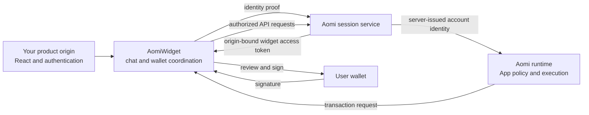
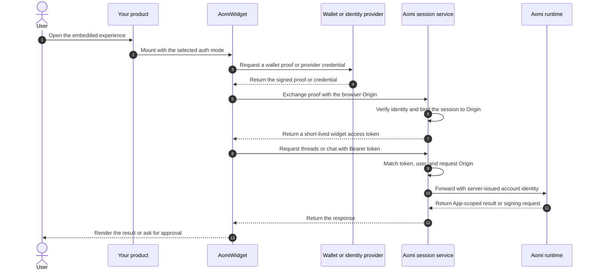

`AomiWidget` runs inside your React application and connects your product to
Aomi's hosted chat and execution services. It provides threads, wallet
connection, transaction review, and status updates without asking your server
to proxy every interaction.

The design keeps four decisions separate: who the user is, which browser origin
is making the request, which App should handle the conversation, and which
wallet may sign. Keeping these boundaries independent lets you embed Aomi
without sharing Aomi cookies, backend credentials, or private execution
configuration with your frontend.

## Responsibilities

Your product, the widget, and Aomi each own a different part of the experience.
The widget coordinates them, but it does not collapse their security boundaries
into one browser session.

| Layer | Responsibility |
| --- | --- |
| Your product | Hosts the React component, selects the App, and provides the configured sign-in or wallet experience. |
| `AomiWidget` | Renders chat, manages the active wallet, obtains cross-origin authorization, and presents signing requests. |
| Aomi | Resolves the canonical account, applies the App's server-owned configuration, simulates transactions, and manages execution. |
| User wallet | Proves wallet ownership and signs only the requests allowed by its current policy. |

## Cross-origin access

The widget usually runs on a different origin from Aomi. Browser cookies are a
poor trust mechanism across that boundary because their availability depends on
browser policy and they do not prove which customer origin is using them. The
widget therefore sends explicit authorization and sets cross-origin requests to
omit ambient credentials.

Aomi observes the request's exact `Origin`, including its scheme, host, and
port. Production widget origins must use HTTPS. Local HTTP origins are accepted
only for development. The authorization response permits the validated origin
instead of opening the API to every site.

## Widget access token

After Aomi verifies the user's proof, it issues an opaque widget access token.
The token is short-lived and bound to both the canonical Aomi account and the
origin that completed the exchange. The widget sends it as an explicit bearer
on subsequent account, thread, chat, and event requests.

Every request must still carry the same browser origin. A token issued to
`https://app.example.com` is rejected when another site tries to use it. This
origin check limits where the session can be exercised even if its value is
copied out of the original page.

<Note>
  A widget access token is not an App key and is not a wallet signing grant. It
  authenticates one user from one browser origin. App authorization and wallet
  signing policy are evaluated separately.
</Note>

## How a session starts

The widget can establish the same origin-bound session from a wallet signature
or a supported identity provider. Both paths finish with the same widget access
token, so the rest of the chat and execution client does not need a
provider-specific authorization path.

<Tabs>
  <Tab title="Browser wallet">
    Aomi creates a short-lived challenge for the observed origin. An EVM wallet
    signs a SIWE message, while a Solana wallet signs a SIWS message. The signed
    message includes the origin, nonce, chain, issue time, and expiry so it
    cannot be replayed for another site or a later session.

    Aomi verifies the message and signature before resolving the canonical
    account. The nonce is consumed once. A repeated, expired, or origin-mismatched
    proof does not produce a widget access token.
  </Tab>
  <Tab title="Identity provider">
    The widget obtains a credential from the configured provider and sends it
    to Aomi without storing it as the long-term Aomi session. Aomi verifies the
    provider, environment, token, and subject before resolving or creating the
    canonical account.

    Aomi then exchanges that verified identity for its own origin-bound widget
    access token. The provider credential proves the login; the Aomi token
    authorizes subsequent requests to the widget API.
  </Tab>
</Tabs>

## From widget identity to backend identity

The normal widget flow sends its access token to Aomi's browser-facing API, not
directly to the execution runtime. Aomi validates the token and origin, resolves
the canonical user, and creates the backend account bearer on the server. The
browser does not need the signing key or configuration used to create that
backend identity.

This translation keeps the public cross-origin credential narrow. Aomi can
revoke the widget session without changing the user's account, and the runtime
continues to receive the same account identity contract used by first-party
Aomi clients.

## The App boundary

Authentication answers who is using the widget and where the request came from.
The Application ID answers which deployed App should receive the conversation.
It also selects the App's tools and server-owned execution configuration.

The widget access token does not contain paymaster credentials, gas policy,
treasury settings, tool prices, or signing permissions. Aomi resolves those
settings after it receives the App context. The active wallet must still pass
its own binding and signing-policy checks before any transaction can be signed.

| Question | Control |
| --- | --- |
| Who is making the request? | Wallet proof or verified provider identity |
| Which website may use the session? | Origin-bound widget access token |
| Which App handles the conversation? | Application ID and server-side App state |
| Which wallet may sign? | Linked-wallet ownership and current signing policy |
| What may execute? | App tools, guards, simulation, and server-owned execution settings |

## Session lifecycle

A widget access token lasts 30 minutes. The client caches it against the current
identity and begins renewal shortly before expiry. Provider-based sessions can
exchange a fresh provider credential, while wallet-based sessions require a new
wallet signature because the browser has no offline credential to refresh with.

Changing the provider account, wallet address, or wallet network changes the
client's identity fingerprint and starts a new exchange. The old cached session
is discarded and revoked. Sign-out also revokes the active token, and a late
exchange from a previous identity is rejected instead of replacing the current
session.

## Live demo

The demo shows the complete widget surface, including threads, wallet controls,
and transaction requests. Wallet popups may open outside the embedded frame.

  <iframe
    src="https://chat.aomi.dev"
    title="Aomi widget live demo"
    width="100%"
    height="720"
    loading="lazy"
    allow="clipboard-write"
    style={{ display: "block", border: 0 }}
  />

<Note>
  [Open the demo in a new tab](https://chat.aomi.dev) if your browser blocks a
  wallet popup from the embedded frame.
</Note>

## Choose an integration

Use `AomiWidget` when you want the complete cross-origin product described on
this page. Choose a lower-level option only when your product needs to own more
of the surrounding interface or component implementation.

| Use | When |
| --- | --- |
| `AomiWidget` | You want the complete chat, account, wallet, and transaction interface. |
| `AomiFrame` | You want Aomi's chat interface and will provide the surrounding account integration. |
| Headless library | You need a completely custom interface while retaining Aomi's client state and actions. |
| shadcn source | You want to own and maintain every component in your application. |

<CardGroup cols={2}>
  <Card title="Install the widget" href="/guides/widget/installation">
    Add the package, environment variables, provider integration, and mounted
    component to your application.
  </Card>
  <Card title="Customize the widget" href="/guides/widget/customization">
    Configure the supplied interface or move to the headless library for a
    custom product experience.
  </Card>
</CardGroup>
