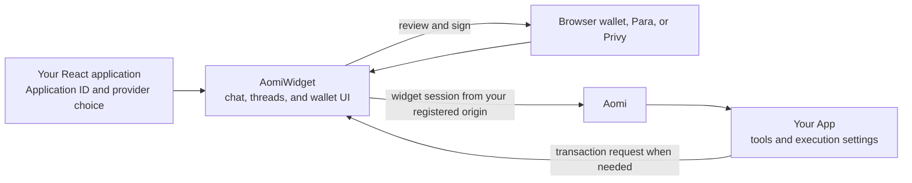

`AomiWidget` adds Aomi chat, threads, wallet connection, and transaction approval
to your React application. Your application chooses the App and the user-facing
wallet provider. Aomi resolves the App's tools and execution settings from the
Application ID.

The widget runs on your application's origin. It does not reuse cookies from
`chat.aomi.dev`. Instead, it creates a widget session for the signed-in user and
binds that session to your registered origin.

## Understand the boundary

Your host application and Aomi have distinct responsibilities:

| Owner | What it controls |
| --- | --- |
| Your application | The Application ID, browser wallet or embedded-wallet provider, public provider identifier, initial thread, and widget presentation |
| `AomiWidget` | Sign-in, wallet connection, threads, chat, transaction review, and signing requests |
| Aomi | Origin validation, the user's Aomi account, and the App configuration selected by the Application ID |
| User wallet | Wallet ownership proof and any signature required by the active signing policy |



<Note>
  Provider choice belongs to your application. Switching from browser wallets
  to Para or Privy changes how users sign in and access wallets. It does not
  change which Aomi App handles the conversation.
</Note>

## Before you start

You need:

- An activated Aomi App and its numeric Application ID.
- The exact origin that will host the widget registered for the App. Include the
  scheme, host, and port, such as `https://app.example.com`.
- React 18 or 19 running in the browser.
- A browser-wallet, Para, or Privy integration choice.

Hosted integrations must use HTTPS. A local HTTP origin works only with an Aomi
service running in development mode. If you use Para or Privy, also allow your
host origin in that provider's project settings when the provider requires it.

## 1. Install the widget

```bash
npm install @aomi-labs/widget-lib
```

Import the default stylesheet once in your client application:

```tsx
import "@aomi-labs/widget-lib/styles.css";
```

## 2. Add public configuration

Keep the Application ID and provider's public browser identifier in your host
application. Add only the provider you use.

<Tabs>
  <Tab title="Next.js">
    ```bash
    NEXT_PUBLIC_AOMI_API_URL=https://chat.aomi.dev
    NEXT_PUBLIC_AOMI_APPLICATION_ID=123

    # Add one only when you use that provider
    NEXT_PUBLIC_PARA_API_KEY=your_public_para_api_key
    NEXT_PUBLIC_PRIVY_APP_ID=your_public_privy_app_id
    ```
  </Tab>
  <Tab title="Vite">
    ```bash
    VITE_AOMI_API_URL=https://chat.aomi.dev
    VITE_AOMI_APPLICATION_ID=123

    # Add one only when you use that provider
    VITE_PARA_API_KEY=your_public_para_api_key
    VITE_PRIVY_APP_ID=your_public_privy_app_id
    ```
  </Tab>
</Tabs>

These values are safe to expose to the browser. Do not add an App key, provider
secret, paymaster credential, gas-policy credential, treasury configuration, or
private key to frontend code.

## 3. Mount AomiWidget

Choose one authentication mode. Import the matching provider entry point for
Para or Privy so the widget can register that provider.

<Tabs>
  <Tab title="Browser wallet">
    Use this mode when users connect an existing wallet.

    ```tsx
    "use client";

    import { AomiWidget } from "@aomi-labs/widget-lib";
    import "@aomi-labs/widget-lib/styles.css";

    export default function AssistantPage() {
      return (
        <AomiWidget
          applicationId={process.env.NEXT_PUBLIC_AOMI_APPLICATION_ID!}
          apiUrl={process.env.NEXT_PUBLIC_AOMI_API_URL!}
          auth={{ kind: "browser_wallet" }}
          height="calc(100dvh - 32px)"
        />
      );
    }
    ```
  </Tab>
  <Tab title="Para">
    Use this mode when Para owns the sign-in and embedded-wallet experience.

    ```tsx
    "use client";

    import { AomiWidget } from "@aomi-labs/widget-lib";
    import "@aomi-labs/widget-lib/providers/para";
    import "@aomi-labs/widget-lib/styles.css";

    export default function AssistantPage() {
      return (
        <AomiWidget
          applicationId={process.env.NEXT_PUBLIC_AOMI_APPLICATION_ID!}
          apiUrl={process.env.NEXT_PUBLIC_AOMI_API_URL!}
          auth={{
            kind: "embedded_wallet",
            provider: "para",
            environment: "PROD",
            apiKey: process.env.NEXT_PUBLIC_PARA_API_KEY!,
          }}
          height="calc(100dvh - 32px)"
        />
      );
    }
    ```
  </Tab>
  <Tab title="Privy">
    Use this mode when Privy owns the sign-in and embedded-wallet experience.

    ```tsx
    "use client";

    import { AomiWidget } from "@aomi-labs/widget-lib";
    import "@aomi-labs/widget-lib/providers/privy";
    import "@aomi-labs/widget-lib/styles.css";

    export default function AssistantPage() {
      return (
        <AomiWidget
          applicationId={process.env.NEXT_PUBLIC_AOMI_APPLICATION_ID!}
          apiUrl={process.env.NEXT_PUBLIC_AOMI_API_URL!}
          auth={{
            kind: "embedded_wallet",
            provider: "privy",
            appId: process.env.NEXT_PUBLIC_PRIVY_APP_ID!,
          }}
          height="calc(100dvh - 32px)"
        />
      );
    }
    ```
  </Tab>
</Tabs>

For Vite, replace each `process.env.NEXT_PUBLIC_*` read with the matching
`import.meta.env.VITE_*` value.

## 4. Pass optional host state

You can keep thread selection and wallet presentation in your application:

```tsx
<AomiWidget
  applicationId={applicationId}
  apiUrl={apiUrl}
  auth={auth}
  initialThreadId={threadId}
  clientOptions={clientOptions}
  wallets={{
    evm: { preset: "popular" },
    solana: false,
  }}
  persistThread
/>
```

| Prop | Use it for |
| --- | --- |
| `applicationId` | Select the activated Aomi App. Aomi resolves its tools and execution settings. |
| `apiUrl` | Select the Aomi service used for widget sessions, chat, and account requests. |
| `auth` | Select browser-wallet, Para, or Privy authentication. |
| `initialThreadId` | Open a thread chosen by your host application. |
| `clientOptions` | Pass supported client behavior overrides without replacing Aomi authentication. |
| `wallets` | Limit the wallet families, networks, or wallet choices shown to users. |

The Application ID selects the App. It is not a user credential and does not
grant wallet signing. The active user and wallet must still complete the
configured authentication and approval flow.

## 5. Verify the integration

1. Open the widget from the exact registered origin.
2. Sign in or connect a browser wallet.
3. Confirm the thread list and composer load without an App-key prompt.
4. Send a message and confirm your selected App responds.
5. If the App creates transactions, confirm the widget shows the request before
   the wallet asks for a signature.
6. Repeat the check from the production HTTPS origin before launch.

If the origin is rejected, compare the full scheme, host, and port with the
registered value. If an embedded provider does not open, check its public
identifier, environment, provider import, and allowed origins.

<CardGroup cols={3}>
  <Card title="Installation details" href="/guides/widget/installation">
    Review framework setup and environment configuration.
  </Card>
  <Card title="Customize the widget" href="/guides/widget/customization">
    Configure layout, themes, wallet controls, or a headless interface.
  </Card>
  <Card title="Troubleshooting" href="/guides/widget/troubleshooting">
    Resolve origin, provider, wallet, and transaction issues.
  </Card>
</CardGroup>
