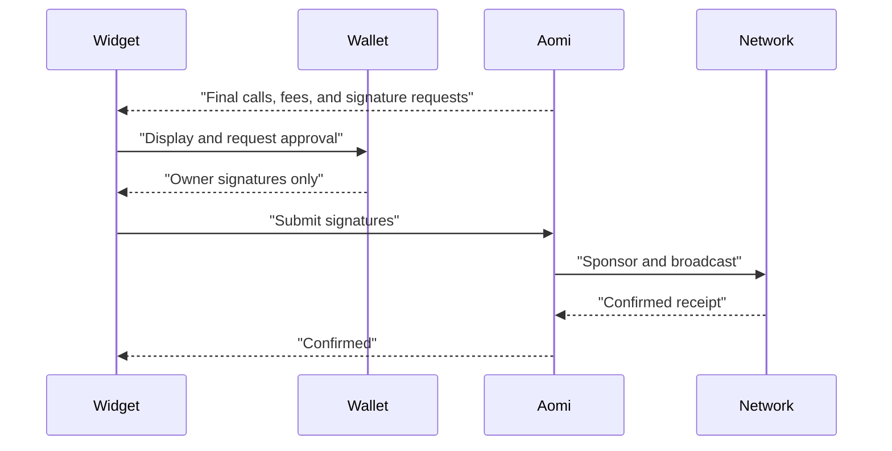

For Apps configured for sponsored account abstraction, Aomi owns transaction preparation and broadcast.

## Execution flow

1. Aomi assembles the complete application batch.
2. Aomi adds the required fee and simulates the final calls.
3. The widget displays the calls, fee, owner, executor, and network.
4. The wallet signs the ordered requests.
5. Aomi sponsors and broadcasts the stored ERC-4337 operation.
6. The widget reports confirmation or failure.

<Info>
  The widget never constructs or broadcasts a sponsored operation. If Aomi does not broadcast it, the operation is not sponsored.
</Info>

There is no direct-wallet or unsponsored fallback for an App that requires Aomi-sponsored execution.
