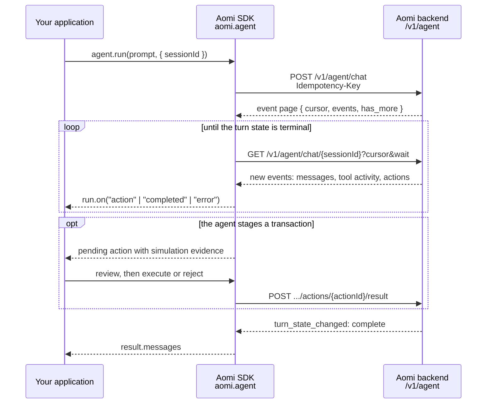

The Agent API owns conversation state. It is one resource with two ways to call it: the TypeScript SDK's `aomi.agent` surface, or the versioned REST resource at `/v1/agent` for any other language. Both are documented on this page.



The SDK runs this loop for you — `agent.run()` starts the turn and keeps polling the cursor until a terminal state, surfacing progress through events. A raw HTTP caller drives the same loop directly with the endpoints in the [Agent REST API reference](/api-reference/agent).

The TypeScript snippets assume an `aomi` instance created with the [Client SDK quickstart](/integrate/client-sdk#quickstart) or [OAuth device flow](/integrate/authentication#oauth-for-a-service-or-cli).

## Run a turn

```ts
const result = await aomi.agent.run("Explain my USDC balance on Base.");

console.log(result.sessionId);
console.log(result.messages);
```

`AgentRun` is Promise-like. You can await it directly or call `result()`.

## Observe a run

Attach listeners immediately after creating the run:

```ts
const run = aomi.agent.run("Swap half my USDC and supply the rest.");

run.on("action", (action) => renderAction(action));
run.on("completed", (result) => renderMessages(result.messages));
run.on("error", ({ error }) => reportError(error));

const result = await run.result();
console.log(result.messages);
```

| Event | Use it for |
| --- | --- |
| `action` | Render an action as it moves through its states (`pending`, `submitted`, `completed`, `rejected`, `expired`, `failed`). Its request can include simulation evidence. |
| `completed` | Update your UI when the run reaches a terminal result. |
| `error` | Capture transport, authorization, and execution failures. |

## Continue a conversation

Pass the same `sessionId` to each turn:

```ts
const sessionId = crypto.randomUUID();

await aomi.agent.run("Remember my preferred chain is Base.", { sessionId });
const next = await aomi.agent.run("Which chain do I prefer?", { sessionId });
```

An Agent session is the persisted conversation. It is not the guest or OAuth credential used to authorize the caller.

## Communicate wallet context with UserState

Each turn can carry a `UserState` — the contractual snapshot of the caller's wallet context that the harness builds and signs against:

```ts
await aomi.agent.run("Swap 1 ETH to USDC.", {
  sessionId,
  userState: {
    connection: { is_connected: true },
    evm: { address: account, chain_id: 8453 },
  },
});
```

When you configure `wallet:` on the `Aomi` constructor, the SDK derives this from the adapter automatically, so most integrations never build it by hand. Pass it explicitly when your application tracks the connection itself.

The contract is strict and schema-validated on the backend — a `userState` with unknown fields is rejected:

| Block | Fields |
| --- | --- |
| `connection` | `is_connected`, `provider`, `provider_label`, `auth_method` |
| `evm` | `address`, `chain_id`, `ens_name` |
| `svm` | `address`, `cluster`, `wallet_name`, `transport`, `capabilities` |
| `preferences`, `ext` | Free-form objects for application data |

Inside the harness, the turn's UserState is live, not a one-shot parameter. Tools that stage work post updates into it: pending transactions and signature requests accumulate in per-chain buckets (`evm_txs`, `solana_txs`, `evm_sigs`, `solana_sigs`), and each staged transaction carries its simulation verdict. You never handle those buckets directly — they surface as the [actions](#handle-actions) on the run, and the raw transaction payloads never pass through the model. Sign or reject the action, and the result is absorbed back into the same state before the next read.

<Note>
  Account abstraction and sponsorship are deliberately not part of `UserState`. They are backend authority, resolved per execution — the client never sends or stores them.
</Note>

## Interrupt work

```ts
const run = aomi.agent.run("Research several lending markets.");

stopButton.addEventListener("click", () => {
  void run.interrupt();
});

await run.result();
```

## Manage sessions

Session management is available through the wire-close client on the same `Aomi` instance:

```ts
const sessions = aomi.raw.agent.sessions;

const page = await sessions.list({ limit: 20 });
const current = await sessions.get(sessionId);
await sessions.update(sessionId, { title: "Base lending research" });
await sessions.update(sessionId, { archived: true });
await sessions.delete(sessionId);
```

Use cursor pagination for user-facing session lists. Use `sessions.all()` only when the complete list is small enough to load into memory.

Renaming, archiving, and deleting sessions require the scopes configured for the signed-in account; staging guest access can be read-only.

## Handle actions

Agent wallet execution is manual by default. Review the request, then resolve or reject it:

```ts
const run = aomi.agent.run("Supply 100 USDC to Aave.");

run.on("action", async (action) => {
  if (action.state !== "pending") return;

  if (!(await confirmRequest(action))) {
    await run.reject(action.id, "User rejected");
    return;
  }

  if (!run.session.actions.canExecute(action.id)) {
    throw new Error("No configured capability can execute this action");
  }

  await run.session.actions.execute(action.id);
});

await run.result();
```

See [Wallet and signing](/integrate/actions-and-signing) for wallet adapters and review boundaries.

## Handle errors

Failed Agent calls throw a typed `AgentApiError`:

```ts
import { AgentApiError } from "@aomi-labs/client";

try {
  await aomi.agent.run("Check my positions.");
} catch (error) {
  if (error instanceof AgentApiError) {
    console.error(error.code, error.requestId);

    if (error.retryable) {
      scheduleRetry();
    }
  }
}
```

`AgentApiError` exposes:

| Property | Description |
| --- | --- |
| `status` | HTTP status code. |
| `code` | Stable machine-readable error code. |
| `retryable` | Whether the failure is normally safe to retry. |
| `requestId` | Identifier to include in support or server-log searches. |
| `details` | Optional structured context. Do not assume one shape for every code. |

Retry only when `retryable` is true, reuse the same idempotency key when retrying one logical mutation, and never retry a wallet signature prompt without showing the user the exact current request again. For `401`/`403` failures, see [Authentication failures](/api-reference/authentication#authentication-failures).

## Call the REST resource directly

Not using TypeScript, or already own OAuth token acquisition? The same resource is documented endpoint by endpoint in the [Agent REST API reference](/api-reference/agent).
