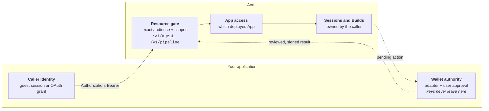
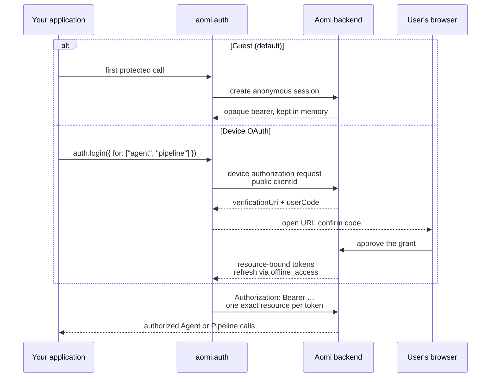

Aomi keeps caller identity, Agent sessions, App access, and wallet authority separate:



| Boundary | What it controls |
| --- | --- |
| Guest session or OAuth grant | Who is calling the Agent or Pipeline API and what the caller may access. |
| App access | Which deployed App the caller may use. This is separate from account authentication. |
| Wallet adapter | Which exact action the user can review, sign, and submit. Connecting a wallet does not grant unattended signing. |

Choose the caller authentication path that matches where your code runs.

## Choose an authentication path

| Integration | Recommended path | Developer experience |
| --- | --- | --- |
| Node.js evaluation | Automatic guest session | [Client SDK quickstart](/integrate/client-sdk#quickstart) |
| Signed-in CLI, bot, or server | OAuth device flow | Public client ID and one-time browser approval |
| Same-origin browser | First-party session | The browser sends the host session cookie |
| Cross-origin browser | Widget/provider authentication | Origin-bound widget session |
| Existing token broker | Low-level token provider | Advanced escape hatch |
| MCP client | OAuth with PKCE | Exact Agent or Pipeline MCP resource |

The two paths most integrations start with — automatic guest and device OAuth — acquire their credential like this:



## Guest mode

Guest mode is the default. In Node.js, the client creates an anonymous session on the first request and reuses its in-memory bearer credential:

```ts
import { Aomi } from "@aomi-labs/client";

const aomi = new Aomi({ baseUrl: process.env.AOMI_BASE_URL! });

console.log(aomi.auth.mode); // "guest"
await aomi.agent.run("Introduce Aomi in one sentence.");
```

The first protected call creates an anonymous session. Guest mode is not a request with no identity.

- The SDK keeps the guest credential with the client.
- Reuse an Agent `sessionId` to continue a conversation.
- Guest-safe Agent calls and Pipeline catalog reads depend on environment policy.
- Guest action resolution and Pipeline execution can be restricted.
- A connected wallet does not silently upgrade a guest into an account.

Call `aomi.auth.logout()` to clear the guest session held by the client.

<Note>
  Guest identity lasts for the lifetime of the client process. Use OAuth when a CLI or service needs durable account-owned access. Cross-origin browser integrations should use the widget or provisioned browser OAuth flow.
</Note>

## OAuth for a service or CLI

Use a provisioned **public** client. Never put a client secret in a CLI, browser, desktop app, or distributed package.

```ts
import { Aomi, oauth } from "@aomi-labs/client";

const aomi = new Aomi({
  baseUrl: process.env.AOMI_BASE_URL!,
  auth: oauth({
    clientId: process.env.AOMI_OAUTH_CLIENT_ID!,
    // Add store: grantStore for durable refresh grants.
    onVerification({ verificationUriComplete, verificationUri, userCode }) {
      console.log(
        `Open ${verificationUriComplete ?? verificationUri} and confirm ${userCode}`,
      );
    },
  }),
});

await aomi.auth.login({ for: ["agent", "pipeline"] });
console.log(await aomi.auth.status());
```

Calling `login()` is optional. Agent and Pipeline calls can acquire or refresh their exact grants lazily.

The SDK manages:

- Separate Agent and Pipeline resource audiences.
- Least-privilege scopes for the requested operation.
- `offline_access` for refreshable device grants.
- Refresh rotation and one retry after an expired credential.
- Revocation and local clearing during `logout()`.

## Persist device grants

Device grants are memory-only unless you provide an `AomiOAuthGrantStore`.

```ts
import type { AomiOAuthGrantStore } from "@aomi-labs/client";

const grantStore: AomiOAuthGrantStore = {
  async load() {
    return encryptedStore.readGrantSnapshot();
  },
  async save(grants) {
    await encryptedStore.replaceGrantSnapshot([...grants]);
  },
};
```

<Warning>
  Treat the stored value like a password. It can contain rotating refresh grants. Use an encrypted database, secret manager, OS keychain, or an owner-only local file. Never print or commit it.
</Warning>

Use the store interface exported by your installed client version. See the runnable device example in the [`aomi` repository](https://github.com/aomi-labs/aomi/tree/main/apps/examples/headless-client/src/oauth).

## Browser and widget access

For a separate-origin web application, use [widget authentication](/integrate/ui/widget). Its wallet or provider proof creates an origin-bound session for that host application.

Standalone browser OAuth is available only to provisioned integrations. It uses a redirect URI, PKCE, and memory-only browser credentials. Do not copy the device-flow grant store into browser code.

## Tokens over raw HTTP

Supplying your own OAuth tokens? The exact resource audiences, required scopes, and failure statuses are documented in the [Authentication reference](/api-reference/authentication).

## Account-owned App credentials

App credentials are user-supplied keys for one deployed App. They are separate from OAuth grants, model-provider BYOK keys, and temporary `aomi secret` values. This API is present in the merged client 0.9.4 source and requires a matching release and deployment.

Use a signed-in OAuth client and the canonical Application ID returned by `aomi.raw.listAccountApps(sessionId)`. The session ID supplies request context; it is not an authentication credential.

```ts
const apps = await aomi.raw.listAccountApps(sessionId);
console.log(apps);

const status = await aomi.raw.getAppCredentialsStatus(sessionId, applicationId);
console.log(status); // Slot names and configuration state, never saved values

await aomi.raw.setAppCredential(sessionId, applicationId, slotName, secretValue);
await aomi.raw.replaceAppCredential(sessionId, applicationId, slotName, rotatedValue);
await aomi.raw.removeAppCredential(sessionId, applicationId, slotName);
```

Acquire values in a private input or secret store. Do not put them in Agent prompts, URLs, logs, screenshots, or committed example files. Only use slots declared by the App. Saving one slot leaves other slots untouched; removing a required slot makes that App require setup again.

With OAuth, the SDK uses `/v1/account/apps/{applicationId}/secrets` and an exact Account resource grant. Agent and Pipeline grants do not authorize credential management. The SDK acquires the needed grant lazily when using `auth: oauth(...)`. Guests cannot manage persistent App credentials.

## Account credits

The same client exposes account credit balance and activity:

```ts
const position = await aomi.account.credits.get({ limit: 20 });
console.log(position.included.remaining_microusd);
console.log(position.bank.balance_microusd);
```

This read requires an account credential accepted by the selected environment. The [runnable account example](https://github.com/aomi-labs/aomi/blob/main/apps/examples/headless-client/src/account/credits.ts) also covers explicit, idempotent top-up and recovery; it does not make purchases unless you opt in.
