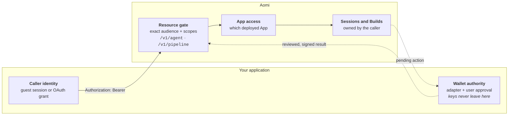
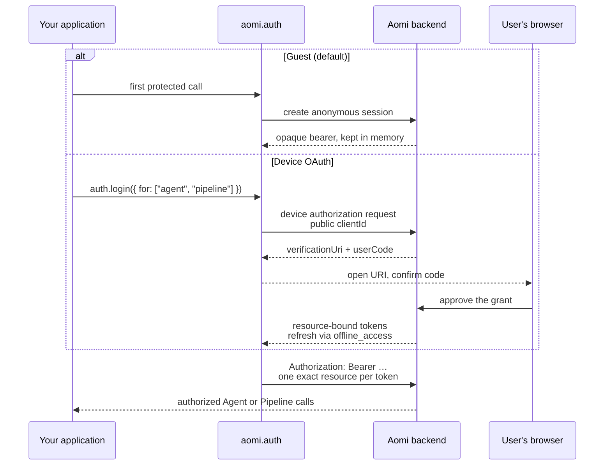

Aomi keeps caller identity, Agent sessions, App access, and wallet authority separate:


```mermaid
flowchart LR
    subgraph app["Your application"]
        CRED["<b>Caller identity</b><br/>guest session or OAuth grant"]
        WAL["<b>Wallet authority</b><br/>adapter + user approval<br/><i>keys never leave here</i>"]
    end
    subgraph aomi["Aomi"]
        GATE["<b>Resource gate</b><br/>exact audience + scopes<br/><code>/v1/agent</code> · <code>/v1/pipeline</code>"]
        APPACC["<b>App access</b><br/>which deployed App"]
        WORK["<b>Sessions and Builds</b><br/>owned by the caller"]
    end
    CRED -->|"Authorization: Bearer"| GATE
    GATE --> APPACC
    APPACC --> WORK
    WORK -.->|"pending action"| WAL
    WAL -.->|"reviewed, signed result"| GATE
```

| Boundary | What it controls |
| --- | --- |
| Guest session or OAuth grant | Who is calling the Agent or Pipeline API and what the caller may access. |
| App access | Which deployed App the caller may use. This is separate from account authentication. |
| Wallet adapter | Which exact action the user can review, sign, and submit. Connecting a wallet does not grant unattended signing. |

## Which credential do I need?

Most integrations need no key at all. Start from the top row and move down only when a call is refused or you need durable, account-owned access.

| Credential | You need it when | How to get it | How it is sent |
| --- | --- | --- | --- |
| **Guest session** (default) | You evaluate Aomi, run scripts, or call the default Agent and public Apps | Nothing to obtain. `new Aomi({ baseUrl })` creates an anonymous session on the first protected call | `Authorization: Bearer`, managed by the SDK |
| **OAuth client ID** | A CLI, bot, or service needs a signed-in account: Pipeline execution, account credits, or App credentials | Self-register a public client with one request ([below](#get-an-oauth-client-id)), or let `aomi account login` register one for you | Not a secret. The SDK exchanges it for resource-bound tokens |
| **App key** | You call a **private** App. Default and public Apps never need one | The Aomi team issues the first key for a private App to its owner's account; that account can then rotate it ([below](#app-keys-for-private-apps)) | `Aomi-App-Key` header: the `apiKey` client option, CLI `--api-key`, or `AOMI_API_KEY` |
| **Account bearer** | Your host already holds a signed-in Aomi account session, such as the widget or a same-origin app | Minted by the host session. The widget does this for you | `Authorization: Bearer`, supplied through `getAccountBearer` |

<Tip>
  An example that reads `AOMI_API_KEY` only needs it for a private App. If you use the default Agent or a public App, leave it unset.
</Tip>

<Note>
  If a guest request returns `403` with `insufficient_scope`, the environment does not allow that operation for guests. Sign in with [OAuth](#oauth-for-a-service-or-cli) and retry.
</Note>

To choose between the hosted portal, the widget, the SDK, and building your own App, see [Choose a surface](/integrate/choose-surface).

Choose the caller authentication path that matches where your code runs.

## Choose an authentication path

| Integration | Recommended path | Developer experience |
| --- | --- | --- |
| Node.js evaluation | Automatic guest session | [Client SDK quickstart](/integrate/client-sdk#quickstart) |
| Signed-in CLI, bot, or server | OAuth device flow | Public client ID and one-time browser approval |
| Same-origin browser | First-party session | The browser sends the host session cookie |
| Cross-origin browser | Widget/provider authentication | Origin-bound widget session |
| Existing token broker | Low-level token provider | Advanced escape hatch |
| MCP client | OAuth with PKCE | Exact Agent or Pipeline MCP resource |

The two paths most integrations start with — automatic guest and device OAuth — acquire their credential like this:


```mermaid
sequenceDiagram
    participant App as Your application
    participant SDK as aomi.auth
    participant Aomi as Aomi backend
    participant User as User's browser
    alt Guest (default)
        App->>SDK: first protected call
        SDK->>Aomi: create anonymous session
        Aomi-->>SDK: opaque bearer, kept in memory
    else Device OAuth
        App->>SDK: auth.login({ for: ["agent", "pipeline"] })
        SDK->>Aomi: device authorization request<br/>public clientId
        Aomi-->>SDK: verificationUri + userCode
        SDK-->>User: open URI, confirm code
        User->>Aomi: approve the grant
        Aomi-->>SDK: resource-bound tokens<br/>refresh via offline_access
    end
    SDK->>Aomi: Authorization: Bearer …<br/>one exact resource per token
    Aomi-->>App: authorized Agent or Pipeline calls
```

## Guest mode

Guest mode is the default. In Node.js, the client creates an anonymous session on the first request and reuses its in-memory bearer credential:

```ts
import { Aomi } from "@aomi-labs/client";

const aomi = new Aomi({ baseUrl: process.env.AOMI_BASE_URL! });

console.log(aomi.auth.mode); // "guest"
await aomi.agent.run("Introduce Aomi in one sentence.");
```

The first protected call creates an anonymous session. Guest mode is not a request with no identity.

- The SDK keeps the guest credential with the client.
- Reuse an Agent `sessionId` to continue a conversation.
- Guest-safe Agent calls and Pipeline catalog reads depend on environment policy.
- Guest action resolution and Pipeline execution can be restricted.
- A connected wallet does not silently upgrade a guest into an account.

Call `aomi.auth.logout()` to clear the guest session held by the client.

<Note>
  Guest identity lasts for the lifetime of the client process. Use OAuth when a CLI or service needs durable account-owned access. Cross-origin browser integrations should use the widget or provisioned browser OAuth flow.
</Note>

## OAuth for a service or CLI

Use a **public** client. Never put a client secret in a CLI, browser, desktop app, or distributed package.

### Get an OAuth client ID

The `aomi` CLI registers its own client the first time you sign in, so CLI users can skip this step:

```bash
aomi account login
aomi account whoami
```

For your own service or bot, register a public device client with one request. Registration is self-serve and needs no account:

```bash
curl -sS -X POST https://chat.aomi.dev/api/auth/oauth2/register \
  -H "content-type: application/json" \
  -d '{
    "client_name": "my-aomi-service",
    "token_endpoint_auth_method": "none",
    "grant_types": ["urn:ietf:params:oauth:grant-type:device_code", "refresh_token"],
    "resources": ["https://chat.aomi.dev/v1/agent"],
    "scope": "agent:read agent:write agent:actions:resolve offline_access"
  }'
```

The response contains your `client_id`. Registration enforces these rules:

- `token_endpoint_auth_method` must be `none`. Only public clients can self-register.
- `grant_types` must be exactly the device-code grant plus `refresh_token`.
- `resources` must contain exactly one REST resource: `/v1/agent`, `/v1/pipeline`, or `/v1/account` on the environment's origin.
- Every scope must belong to that resource. `openid`, `profile`, and `email` are rejected.

| Resource | Scopes to request |
| --- | --- |
| `https://chat.aomi.dev/v1/agent` | `agent:read agent:write agent:actions:resolve offline_access` |
| `https://chat.aomi.dev/v1/pipeline` | `pipeline:catalog pipeline:execute offline_access` |
| `https://chat.aomi.dev/v1/account` | Only the `account:*` scopes you need, such as `account:apps:read account:credentials:read` |

<Warning>
  A self-registered client is bound to the one resource it was registered for. Using it for another resource fails with `invalid_target` ("OAuth client is bound to another Aomi resource"). Register one client per resource, and request only that resource from the SDK, for example `aomi.auth.login({ for: "agent" })`. For one SDK client that covers both Agent and Pipeline, ask the Aomi team for a provisioned client ID.
</Warning>

MCP clients such as Claude Code and Cursor register their own authorization-code clients. See [MCP setup](/guides/mcp).

### Sign in from TypeScript

```ts
import { Aomi, oauth } from "@aomi-labs/client";

const aomi = new Aomi({
  baseUrl: process.env.AOMI_BASE_URL!,
  auth: oauth({
    clientId: process.env.AOMI_OAUTH_CLIENT_ID!,
    // Add store: grantStore for durable refresh grants.
    onVerification({ verificationUriComplete, verificationUri, userCode }) {
      console.log(
        `Open ${verificationUriComplete ?? verificationUri} and confirm ${userCode}`,
      );
    },
  }),
});

// A self-registered client covers one resource. Request "pipeline" as well
// only with a client authorized for both.
await aomi.auth.login({ for: "agent" });
console.log(await aomi.auth.status());
```

Calling `login()` is optional. Agent and Pipeline calls can acquire or refresh their exact grants lazily.

The SDK manages:

- Separate Agent and Pipeline resource audiences.
- Least-privilege scopes for the requested operation.
- `offline_access` for refreshable device grants.
- Refresh rotation and one retry after an expired credential.
- Revocation and local clearing during `logout()`.

## Persist device grants

Device grants are memory-only unless you provide an `AomiOAuthGrantStore`.

```ts
import type { AomiOAuthGrantStore } from "@aomi-labs/client";

const grantStore: AomiOAuthGrantStore = {
  async load() {
    return encryptedStore.readGrantSnapshot();
  },
  async save(grants) {
    await encryptedStore.replaceGrantSnapshot([...grants]);
  },
};
```

<Warning>
  Treat the stored value like a password. It can contain rotating refresh grants. Use an encrypted database, secret manager, OS keychain, or an owner-only local file. Never print or commit it.
</Warning>

Use the store interface exported by your installed client version. See the runnable device example in the [`aomi` repository](https://github.com/aomi-labs/aomi/tree/main/examples/headless/src/oauth).

## Browser and widget access

For a separate-origin web application, use [widget authentication](/integrate/ui/widget). Its wallet or provider proof creates an origin-bound session for that host application.

The widget handles sign-in, explicit wallet/provider linking, and account merge
offers. Linking another sign-in method does not grant automatic signing. Guest
chat recovery on the first-party portal does not apply to a separate-origin
widget, and hosted widgets do not offer the portal's **Switch to that account
instead** action. See [Sign in and manage wallets](/guides/accounts-and-wallets)
for the user flow.

Standalone browser OAuth is available only to provisioned integrations. It uses a redirect URI, PKCE, and memory-only browser credentials. Do not copy the device-flow grant store into browser code.

## Tokens over raw HTTP

Supplying your own OAuth tokens? The exact resource audiences, required scopes, and failure statuses are documented in the [Authentication reference](/api-reference/authentication).

## Select an App

Agent calls use Auto routing by default, which needs no Application ID and no App key. Pin one deployed App with Direct routing:

```ts
await aomi.agent.run("Quote this swap.", {
  target: { mode: "direct", applicationId: 123 },
});
```

```bash
aomi chat "quote this swap" --application-id 123 --new-session
```

An Application ID is the canonical identity of a hosted App. App names can be ambiguous across hosted deployments, so use the ID when identity matters. `aomi app list` prints the name and `applicationId` of each App available to your account. See [Choose a surface](/integrate/choose-surface#find-your-application-id-and-activate-your-app) for activation.

## App keys for private Apps

An App key is an access boundary for one or more **private** Apps. It is checked in addition to caller authentication. Default Apps and public, active Apps never require one.

| Situation | Result |
| --- | --- |
| Public App, no key | Allowed |
| Private App, no `Aomi-App-Key` header | `401` |
| Private App, key not scoped to that App | `403` |

Pass the key once on the client. The SDK sends it as the `Aomi-App-Key` header:

```ts
const aomi = new Aomi({
  baseUrl: process.env.AOMI_BASE_URL!,
  apiKey: process.env.AOMI_API_KEY, // only for a private App
});
```

```bash
aomi chat "run the selected App" \
  --application-id 123 \
  --api-key "$AOMI_API_KEY"
```

### Create an App key

App keys look like `aomi-` followed by 64 hex characters, and Aomi always generates them. The first key for a private App is issued by the Aomi team to the owner's account. After that, an account that holds an active key for the App can mint additional or replacement keys and revoke old ones. There is no portal screen for App keys today; call the account endpoint from a signed-in `chat.aomi.dev` session:

| Method | Path | Body | Returns |
| --- | --- | --- | --- |
| `GET` | `/api/account/app-keys` | None | Your keys' metadata: prefix, label, Apps, and status. Never the full key |
| `POST` | `/api/account/app-keys` | `{ "apps": ["my-app"], "label": "server" }` | `app_key` (the full key, shown once) and its metadata |
| `DELETE` | `/api/account/app-keys/{key_hash}` | None | The revoked key's metadata |

`apps` lists App names that are loaded on the runtime. An unknown name returns `400`; a private App your account holds no key for returns `403`. Store the returned `app_key` in a secret manager immediately; later reads return only its prefix.

An App key does not replace an OAuth account grant, own an Agent session, or authorize a wallet signature. Keep it on a server. Never put it in browser code, prompts, URLs, or logs. The [widget](/integrate/ui/widget) has no App-key input, so private Apps are not available through the widget.

<Warning>
  Do not copy older examples that use `X-API-Key`, `/api/chat`, or a message in the query string. Current Agent calls use the versioned `/v1/agent` resource and the `Aomi-App-Key` header when an App key is required.
</Warning>

## Account-owned App credentials

App credentials are user-supplied keys for one deployed App, such as an exchange API key declared by a CEX App. They are separate from App keys, OAuth grants, model-provider BYOK keys, and temporary `aomi secret` values. The helpers ship in client 0.9.4 and newer and require a deployment that supports them.

Use a signed-in OAuth client and the canonical Application ID returned by `aomi.raw.listAccountApps(sessionId)`. The session ID supplies request context; it is not an authentication credential.

```ts
const apps = await aomi.raw.listAccountApps(sessionId);
console.log(apps);

const status = await aomi.raw.getAppCredentialsStatus(sessionId, applicationId);
console.log(status); // Slot names and configuration state, never saved values

await aomi.raw.setAppCredential(sessionId, applicationId, slotName, secretValue);
await aomi.raw.replaceAppCredential(sessionId, applicationId, slotName, rotatedValue);
await aomi.raw.removeAppCredential(sessionId, applicationId, slotName);
```

Acquire values in a private input or secret store. Do not put them in Agent prompts, URLs, logs, screenshots, or committed example files. Only use slots declared by the App. Saving one slot leaves other slots untouched; removing a required slot makes that App require setup again.

With OAuth, the SDK uses `/v1/account/apps/{applicationId}/secrets` and an exact Account resource grant. Agent and Pipeline grants do not authorize credential management. The SDK acquires the needed grant lazily when using `auth: oauth(...)`. Guests cannot manage persistent App credentials.

The CLI exposes the same operations:

```bash
aomi app list
aomi app credentials status <application-id>
aomi app credentials set <application-id> EXCHANGE_API_KEY
aomi app add <application-id>
```

`set` reads the value from a hidden terminal prompt, or from stdin in a non-interactive process. The value is never a positional argument.

### Temporary session secrets and model keys

Two other stores are separate from App keys and App credentials:

- `aomi secret add NAME=value` sends a value to Aomi for the current Agent session only. `aomi secret list` and `aomi secret clear` manage it.
- Model-provider BYOK keys (`anthropic`, `openai`, `openrouter`) fund inference. Set them with the REPL `/key` command or `--provider-key`, and select them with `--inference-funding user_byok`.

## Account credits

The same client exposes account credit balance and activity:

```ts
const position = await aomi.account.credits.get({ limit: 20 });
console.log(position.included.remaining_microusd);
console.log(position.bank.balance_microusd);
```

This read requires an account credential accepted by the selected environment. The [runnable account example](https://github.com/aomi-labs/aomi/blob/main/examples/headless/src/account/credits.ts) also covers explicit, idempotent top-up and recovery; it does not make purchases unless you opt in.
