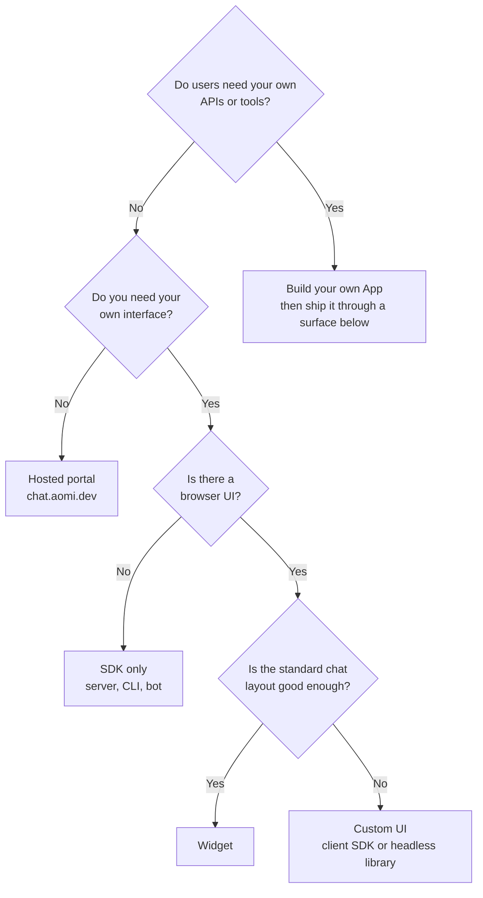

Aomi reaches users through several surfaces. They differ in what you build, whether you need your own App, and which credentials are involved. Pick the lightest surface that does the job. You can move to a heavier one later without changing how transactions are simulated and signed.

## Compare the surfaces

| Surface | Best for | Needs your own App? | Activation? | Application ID? | End-user auth | App key? | Effort |
| --- | --- | --- | --- | --- | --- | --- | --- |
| [Hosted portal](/trade/portal) at chat.aomi.dev | Trying Aomi, demos, users who just want to transact | No. The default Agent and public Apps are ready | No | No | Wallet sign-in on chat.aomi.dev | Never | None |
| [Widget](/guides/widget/quickstart) on your site | Adding chat, threads, and wallet approval to a React app | Only to use your own tools | Only for your own App | Yes, a required prop. Add [Direct routing](/guides/widget/quickstart#route-turns-to-your-app) to reach that App | Browser wallet, Para, or Privy; origin-bound session | Not supported. Private Apps cannot be used in the widget | Low |
| [Custom UI](/integrate/ui/headless-library) with the client SDK | Your own design on top of Aomi threads and actions | Only to use your own tools | Only for your own App | Only for Direct routing | Guest, host account session, or OAuth | Not in browser code | Medium |
| [SDK only](/integrate/client-sdk): server, CLI, bot | Scripts, backends, bots, agents, and automation | No. Auto routing uses the default Agent | Only for your own App | Only for Direct routing | Guest by default; [OAuth](/integrate/authentication#get-an-oauth-client-id) for an account | Only for a private App, kept on the server | Low |
| [Build your own App](/build) | Your own APIs, tools, and system prompt inside the Aomi runtime | Yes | Yes | Yes | Whatever surface you ship it through | Only if the App is private | High |

Every surface keeps the same execution model: Aomi builds and simulates, your user reviews, and the user's wallet signs locally. See [Wallet and signing](/integrate/actions-and-signing).

## Decide in four questions



You do not need your own App to call your own smart contract. The SDK and Pipeline accept raw calls with your calldata, and the default Agent can build calls to arbitrary contracts. Build an App when you want to load your own off-chain APIs or tools into the runtime. See [Where Aomi fits](/concepts/patterns).

## Find your Application ID and activate your App

Skip this section if you use the default Agent. It applies only when you route users to an App you built.

### Activate the App

A newly deployed App starts **inactive** and is not served to users. Activation is authorized by the Aomi team today:

- In the [Developer Platform](/build/developer-platform), the deploy wizard deploys, builds, and activates the release.
- With the CLI, `aomi-build deploy` activates for you when you pass an activation token issued by the Aomi team. Ask in Discord if you do not have one. See [Tokens](/build/toolchain/aomi-build#tokens).

Confirm the result:

```bash
aomi-build deploy status
```

You want `active=true artifact_ready=true loaded=true`.

### Find the Application ID

Sign in once, then list the Apps available to your account:

```bash
aomi account login
aomi app list
```

Each row shows the App's `name` and numeric `applicationId`. From TypeScript, `aomi.raw.listAccountApps(sessionId)` returns the same descriptors. Use the number, not the name: names can repeat across hosted deployments.

## Worked example: route a widget to your App

Suppose you deployed an App named `root-registry` and want the widget on your site to use it. Each condition below must hold. When one is missing, the symptom tells you which.

| # | Condition | How to check | Symptom when it is missing |
| --- | --- | --- | --- |
| 1 | The App is deployed in this environment | `aomi app list` lists `root-registry` | "Conversation unavailable" after you set the ID. Newer backends: `app_not_found` (`404`) |
| 2 | The App is active and loaded | `aomi-build deploy status` shows `active=true artifact_ready=true loaded=true` | "The session is busy" on the first message. Newer backends: `app_inactive` (`409`) |
| 3 | The widget has the right Application ID | `applicationId` equals the number from `aomi app list` | Same as condition 1 |
| 4 | Turns are routed to the App | `routing={{ targets: [{ mode: "direct", apps: [{ applicationId }] }] }}` | The default Agent answers instead of your App |
| 5 | The App is public | Requests succeed without an App key | `401`. Newer backends: `app_key_required`. The widget cannot send App keys |

User sign-in is separate from these conditions. The widget handles it with the `auth` mode you choose.

Put together:

```tsx
const applicationId = Number(process.env.NEXT_PUBLIC_AOMI_APPLICATION_ID); // from `aomi app list`

<AomiWidget
  applicationId={applicationId}
  baseUrl="https://chat.aomi.dev"
  routing={{ targets: [{ mode: "direct", apps: [{ applicationId }] }] }}
/>
```

From a server, the same App is one option away. Add `apiKey` only if the App is private:

```ts
const aomi = new Aomi({
  baseUrl: "https://chat.aomi.dev",
  apiKey: process.env.AOMI_API_KEY, // private Apps only
});

await aomi.agent.run("Register today's batch root.", {
  target: { mode: "direct", applicationId },
});
```

<Note>
  The `app_*` error codes ship with a backend update. Until your environment has it, use the symptom column.
</Note>

## Next steps

<CardGroup cols={3}>
  <Card title="Credentials" icon="key" href="/integrate/authentication#which-credential-do-i-need">
    Which credential each surface needs and how to get it.
  </Card>
  <Card title="Where Aomi fits" icon="diagram-project" href="/concepts/patterns">
    Integration patterns beyond trading.
  </Card>
  <Card title="Hackathon fast start" icon="bolt" href="/guides/hackathon">
    From zero to a first call in five minutes.
  </Card>
</CardGroup>
