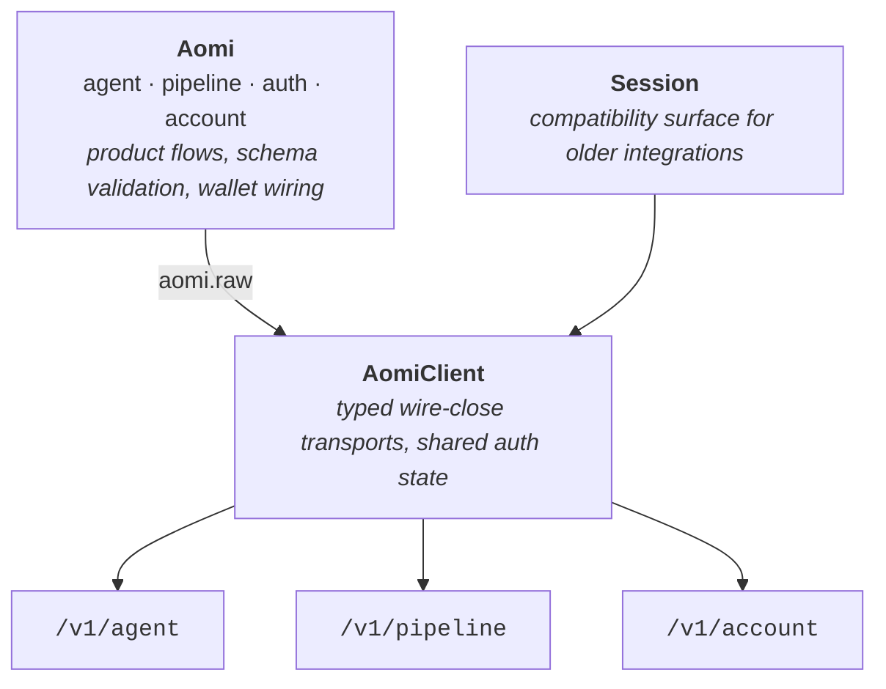

Use **Integrate Aomi** when you want to call Aomi from an existing product or service with TypeScript or raw HTTP. Use [Try Aomi](/trade/portal) for the no-code surfaces (Portal, skills, MCP, CLI), and [Build on Aomi](/build) when you want to create and deploy a new App.

`@aomi-labs/client` works in Node.js and browsers. The `Aomi` class gives you five surfaces:

```ts
import { Aomi } from "@aomi-labs/client";

const aomi = new Aomi({
  baseUrl: process.env.AOMI_BASE_URL!,
});

aomi.agent;    // stateful Agent turns
aomi.pipeline; // stateless Build flows
aomi.auth;     // guest or OAuth lifecycle
aomi.account;  // account credit balance and activity
aomi.raw;      // wire-close client for advanced control
```

<Note>
  On September 22, 2026, npm's `latest` was `@aomi-labs/client` 0.7.6; merged source was 0.9.4. The quickstart, device OAuth, routing, credits, and EVM/SVM Pipeline examples type-check against 0.7.6. The App credential helpers and durable Commit examples describe newer merged source and require a compatible build and deployment. A source version does not mean that version is published.
</Note>

## Check compatibility

Keep the installed package and API environment aligned:

```bash
npm view @aomi-labs/client version
npm ls @aomi-labs/client
curl --fail "$AOMI_BASE_URL/openapi.json" -o openapi.json
```

The production origin is `https://chat.aomi.dev`. Its published OpenAPI lists the versioned Agent and Pipeline routes, but a listed route does not guarantee that the environment implements every contract on `main`. The newer account credential and durable Commit APIs require a matching package and deployment. Select an environment that explicitly supports the feature you use; do not combine portable Builds from incompatible versions.

These guides describe merged contracts only. Open pull requests are not part of the supported examples.

## Quickstart

Create a working Node.js integration in one file. Guest mode does not need an API key or OAuth client.

<Tabs>
  <Tab title="npm">
    ```bash
    npm install @aomi-labs/client
    ```
  </Tab>
  <Tab title="pnpm">
    ```bash
    pnpm add @aomi-labs/client
    ```
  </Tab>
  <Tab title="yarn">
    ```bash
    yarn add @aomi-labs/client
    ```
  </Tab>
</Tabs>

Add a TypeScript runner if your project does not already have one:

```bash
npm install --save-dev tsx @types/node
```

Set the API origin supplied for your environment:

```bash
export AOMI_BASE_URL="https://chat.aomi.dev"
```

### Run two Agent turns

```ts
// example.ts
import { Aomi, type MessageEvent } from "@aomi-labs/client";

const baseUrl = process.env.AOMI_BASE_URL!;
const aomi = new Aomi({ baseUrl });

const sessionId = crypto.randomUUID();

await aomi.agent.run("Remember that my demo color is cobalt.", {
  sessionId,
});

const result = await aomi.agent.run("Reply with only my demo color.", {
  sessionId,
});

console.log(lastAgentText(result.messages));

function lastAgentText(messages: readonly MessageEvent[]) {
  return [...messages]
    .reverse()
    .find((message) => message.sender === "agent")?.content;
}
```

Reusing `sessionId` continues the same conversation. Persist that ID with your application's conversation record.

Run it with your TypeScript runner:

```bash
npx tsx example.ts
```

No API key is needed — the SDK starts in [guest mode](/integrate/authentication#guest-mode), creating an anonymous session on the first request.

<Warning>
  Guest mode is useful for evaluation, not a substitute for service authentication. For account-owned sessions or protected actions, use the [OAuth device flow](/integrate/authentication#oauth-for-a-service-or-cli). For a browser product, use [Widget authentication](/integrate/ui/widget) or your provisioned browser OAuth flow.
</Warning>

## Integration layer

The `Aomi` facade is the product-level layer: it manages guest or OAuth state, validates arguments against live schemas, wires your wallet capabilities into Agent runs, and shapes responses into typed product objects like `AgentRun` and `Build`. Beneath it sits `AomiClient`, the wire-close layer: one typed method per versioned API operation, with errors normalized and mutation headers applied, but no product behavior added. Both layers share authentication state — `aomi.raw` is the same `AomiClient` with the same guest session or OAuth grants — so you can drop down for a single direct call without constructing a second client or authenticating twice.



| Layer | Use it for |
| --- | --- |
| `Aomi` | Product-oriented Agent, Pipeline, authentication, and wallet flows. Recommended for new integrations. |
| `aomi.raw` | Direct Agent sessions, Pipeline directories, account state, and other wire-close calls without a second client. |
| `AomiClient` | Advanced integrations that want to construct only the low-level transport. Prefer its typed Agent and Pipeline transports over the generic request escape hatch — they normalize errors, encode parameters, and apply mutation headers consistently. |
| `Session` | Compatibility surface for applications already using the older session-oriented client. |

## Next steps

<CardGroup cols={2}>
  <Card title="Agent API" icon="robot" href="/integrate/agent">
    Observe progress, manage sessions, interrupt work, and handle actions.
  </Card>
  <Card title="Pipeline API" icon="diagram-project" href="/integrate/pipeline">
    Discover live operations and keep simulation separate from commit.
  </Card>
  <Card title="Authentication" icon="key" href="/integrate/authentication">
    Start as a guest or add OAuth for account-owned access.
  </Card>
  <Card title="Wallet and signing" icon="signature" href="/integrate/actions-and-signing">
    Keep wallet review and execution inside your application.
  </Card>
</CardGroup>
