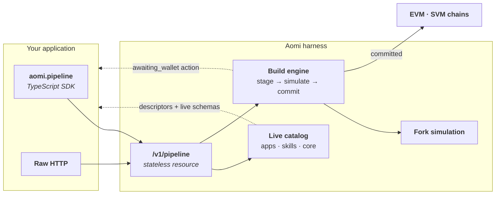

The Pipeline API directly exposes the Aomi harness to external clients and agents. It discovers live capabilities, builds chain actions, simulates them, and keeps commit explicit.



The catalog is the runtime's own registry of Apps, skills, and core operations, and the build engine is the same stage → simulate → commit machinery the Agent uses — minus the conversation. The resource is stateless: nothing is stored between calls, state lives in your application or on chain, and anything requiring a signature comes back to you as a pending action.

<Info>
  The **Pipeline API** is a callable product surface. The [transaction pipeline](/concepts/transaction-pipeline) is the broader build → simulate → sign → broadcast safety model.
</Info>

## Build a transaction with Pipeline

The direct lane takes chain actions you already have and walks them through the full lifecycle: stage them into a Build, simulate that Build on a fork, review the evidence, then cross the explicit commit boundary.

Unlike the Agent lane, no [UserState](/integrate/agent#communicate-wallet-context-with-userstate) travels with these calls — the resource is stateless, so every input is explicit (chain, calls, instructions) and everything the harness cannot execute on its own comes back to you as a pending action. When the Agent drives this same build engine inside a conversation, that lifecycle state rides UserState instead.

<Tabs>
  <Tab title="EVM">
    **1 · Stage.** Staging turns raw calls — a target, calldata, and value — into a chain-specific Build without executing anything:

    ```ts
    const staged = await aomi.pipeline.evm.stage({
      chainId: 8453,
      calls: [{ to: contract, data: calldata, value: 0n }],
    });
    ```

    A staged Build carries your actions and a portable `digest`, nothing more. It has not touched a chain and has no simulation evidence yet.

    **2 · Simulate.** Simulation runs the staged Build against a fork of the live chain and returns what would actually happen:

    ```ts
    const simulated = await staged.simulate();

    console.log(simulated.summary);
    console.log(simulated.actions);
    console.log(simulated.simulation);
    console.log(simulated.digest);
    ```

    If you do not need the intermediate staged Build, `aomi.pipeline.evm.build({ chainId, calls })` stages and simulates in one call.

    **3 · Review.** Render `summary`, `actions`, `simulation`, and any warnings before offering a commit control. This is the approval boundary that belongs to your application:

    ```ts
    renderReview({
      summary: simulated.summary,
      actions: simulated.actions,
      simulation: simulated.simulation,
    });
    ```

    **4 · Commit.** Commit revalidates the simulated Build and executes it:

    ```ts
    const result = await simulated.commit();

    switch (result.status) {
      case "committed":
      case "submitted":
        console.log(result.receipts);
        break;
      case "awaiting_wallet":
        showPendingAction(result.action);
        break;
    }
    ```

    - `committed` and `submitted` return `receipts` for the executed transactions.
    - `awaiting_wallet` means the harness cannot execute on its own: `result.action` is the pending action your application must review and complete through its wallet flow. Pipeline commit does not automatically execute the wallet configured on `Aomi`.

    Commit uses the portable Build digest as its default idempotency key. Supply your own key when it needs to match an application-level request:

    ```ts
    await simulated.commit({ idempotencyKey: checkoutAttemptId });
    ```

    TypeScript enforces the lifecycle: a merely staged Build cannot be passed to commit — only a simulated one can.
  </Tab>
  <Tab title="SVM">
    **1 · Stage.** The Solana input is an ordered instruction bundle that lands inside one atomic transaction. Hand Pipeline the instructions and let the harness assemble the transaction, or preserve venue-supplied bytes exactly as built:

    ```ts
    // From instructions — the harness assembles the transaction
    const staged = await aomi.pipeline.svm.stage({
      kind: "instructions",
      instructions: [
        {
          programId: program,
          accounts: accountMetas,
          data: instructionData, // base64 by default
        },
      ],
      cluster: "mainnet-beta",
      feePayer: payer,
    });

    // Or from a prebuilt transaction — venue bytes preserved verbatim
    const stagedTx = await aomi.pipeline.svm.stage({
      kind: "transaction",
      transaction: { transaction: base64Transaction },
    });
    ```

    **2 · Simulate.** `aomi.pipeline.svm.build(input)` stages and simulates in one call; otherwise simulate the staged Build to get the real outcome:

    ```ts
    const simulated = await staged.simulate();
    ```

    **3 · Review.** Same boundary as EVM — render the evidence before offering a commit control:

    ```ts
    renderReview({
      summary: simulated.summary,
      actions: simulated.actions,
      simulation: simulated.simulation,
    });
    ```

    **4 · Commit.** Commit returns the same `committed` / `submitted` / `awaiting_wallet` statuses with the same idempotency rules:

    ```ts
    const result = await simulated.commit();
    ```

    Because the bundle is atomic, the instructions execute in order inside a single transaction or not at all — there is no partially applied state to reason about.
  </Tab>
</Tabs>

<Warning>
  Do not turn a successful simulation into implicit approval. Simulation evidence is informative, not signing authority. And on staging, guest sessions can read the catalog but cannot execute Pipeline mutations — use a grant with `pipeline:execute` to test stage, simulate, build, or commit.
</Warning>

## Read chain state

Each chain namespace also exposes read operations alongside the Build lifecycle, for fetching the state your application composes transactions from. They are curated aliases onto the runtime's core tool namespaces (`evm-core`, `svm-reads`):

| Operation | EVM tool | SVM tool |
| --- | --- | --- |
| `account` | `get_account_info` | `svm_get_account_info` |
| `contract` / `program` | `get_contract` | `svm_get_program` |
| `balance` / `token-holdings` | `get_erc20_balance` | `svm_get_token_holdings` |
| `context` | `get_time_and_onchain_context` | `svm_get_context` |

List them with `GET /v1/pipeline/evm` or `GET /v1/pipeline/svm` and invoke with `POST`, like an App operation. For the live input schema, read the underlying tool's descriptor — `GET /v1/pipeline/apps/default/operations/{tool}` — which is the guaranteed-schema path; the chain-level `GET` returns only a pointer descriptor.

The aliases are a curated subset. The rest of the core namespaces — including `encode_and_call`, `simulate_batch`, and `sync_chain` on EVM — is discoverable and invocable through the default App's operations catalog at `/v1/pipeline/apps/default/operations`. The SDK does not yet expose typed methods for any of these; call them through the raw transport or HTTP.

## Catalog with Apps and Skills

Do not hard-code a second registry of Apps or skills. Read the catalog exposed by your environment:

```ts
const [apps, skills] = await Promise.all([
  aomi.raw.pipeline.apps.list(),
  aomi.raw.pipeline.skills.list(),
]);

console.log(apps.entries);
console.log(skills.entries);
```

### Browse it like a filesystem

The catalog is a hypermedia tree: every `GET` returns a JSON node with a `path`, a `kind`, and `href`s you can follow, so a client walks capabilities the same way it would walk directories. Start at `GET /v1/pipeline` and you get a directory whose children are more directories:

```json
{
  "kind": "directory",
  "path": "/v1/pipeline",
  "entries": [
    { "name": "core", "kind": "directory", "href": "/v1/pipeline/core" },
    { "name": "evm", "kind": "directory", "href": "/v1/pipeline/evm" },
    { "name": "svm", "kind": "directory", "href": "/v1/pipeline/svm" },
    { "name": "apps", "kind": "directory", "href": "/v1/pipeline/apps" },
    { "name": "skills", "kind": "directory", "href": "/v1/pipeline/skills" }
  ]
}
```

The tree that produces:

```text
/v1/pipeline
├── core/                        (empty directory today)
├── evm/
│   ├── account, contract, …     operation   GET=descriptor   POST=invoke
│   └── build, stage, simulate, commit
├── svm/                         same shape, SVM names
├── apps/                        paged listing from the backend catalog
│   └── {app}/
│       └── operations/
│           └── {operation}      GET=descriptor   POST=invoke
└── skills/
    └── {skill}/
        ├── SKILL.md             document (text/markdown)
        └── operations/
            └── {operation}      GET=descriptor   POST=invoke
```

Three node kinds:

| Kind | `GET` | `POST` |
| --- | --- | --- |
| `directory` | List children (`entries`, with `next` on paged listings) | — |
| `operation` | Read the descriptor (`inputSchema`, method, `href`) | Execute it |
| `document` | Return the file (`SKILL.md` as markdown) | — |

## Inspect an operation

Operation descriptors include the current input schema:

```ts
const echo = await aomi.pipeline
  .app("default")
  .operation("dummy_echo");

console.log(echo.description);
console.log(echo.inputSchema);
```

This descriptor is available on staging and accepts a `message` string. Catalog contents vary by environment, so discover the App and operation before relying on them. The SDK validates Build arguments against the descriptor schema.

## Build from an App operation

Where the direct lanes take calls or instructions you already built, an App operation builds them for you — the operation resolves your arguments into staged, simulated chain actions:

```ts
const scope = aomi.pipeline.app(selectedApp);
const descriptor = await scope.operation(selectedOperation);

renderForm(descriptor.inputSchema);

const build = await scope.build(selectedOperation, formValues);

console.log(build.summary);
console.log(build.actions);
console.log(build.simulation);
console.log(build.digest);
```

`build()` returns a simulated EVM or SVM Build — the same object as step 2 of the lifecycle above. Review and commit it exactly the same way.

## Read skill instructions

```ts
const instructions = await aomi.pipeline
  .skill("leveraged-lending")
  .instructions();
```

Skill and App operations remain runtime-discovered. Avoid documenting a fixed list of catalog entries in your integration.

## Handle errors

Failed Pipeline calls throw a typed `PipelineApiError`, which exposes the same `status`, `code`, `retryable`, `requestId`, and `details` properties as [`AgentApiError`](/integrate/agent#handle-errors).

`PipelineSchemaError` is different: it is thrown locally, before any request, when the supplied arguments do not match the live operation schema.

```ts
import { PipelineSchemaError } from "@aomi-labs/client";

try {
  await aomi.pipeline
    .app(selectedApp)
    .build(selectedOperation, formValues);
} catch (error) {
  if (error instanceof PipelineSchemaError) {
    showFieldErrors(error);
  }
}
```

Refresh the operation descriptor before retrying. The live catalog can change independently of your application release.

## Call the REST resource directly

Not using TypeScript, or already own OAuth token acquisition? The same resource is documented endpoint by endpoint in the [Pipeline REST API reference](/api-reference/pipeline).
