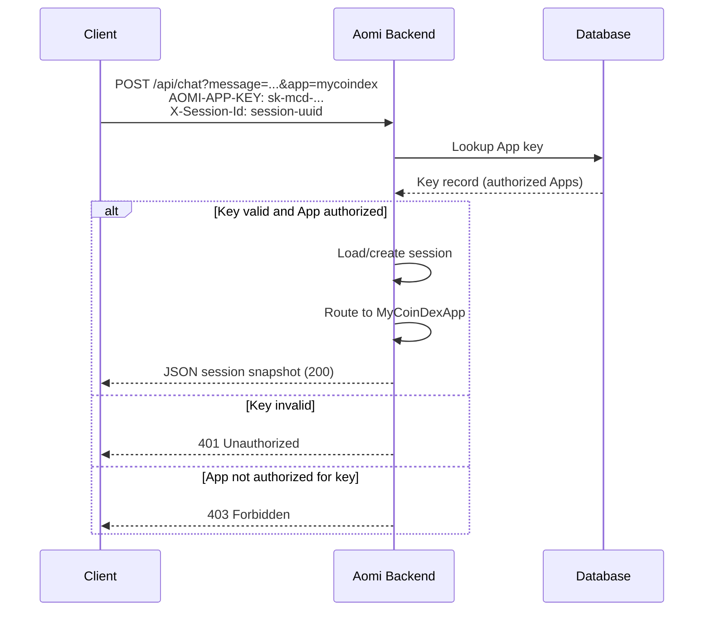

Every Aomi-powered assistant runs inside an **App**. This page explains how Apps, App keys, and sessions work together.

## What is an App?

An App is a self-contained AI assistant environment that encapsulates:

| Component | Description |
| --- | --- |
| **Tools** | The API-backed functions the assistant can call |
| **Preamble** | The system prompt defining personality and rules |
| **Model config** | Default LLM and available alternatives |
| **RAG docs** | Optional document store for domain knowledge |

Each App is fully isolated — its tools and configuration have no visibility into other Apps.

## App Keys

App keys are issued by Aomi and scoped to one or more Apps.

### Properties

- **Scoped** — each key authorizes access to specific Apps
- **Stored securely** — keys are hashed in the database
- **Revocable** — keys can be deactivated without affecting the App

### Usage

Include the App key in the `AOMI-APP-KEY` header. The chat message rides in the query string as `message`:

```bash
curl -X POST "https://api.aomi.dev/api/chat?message=What%20is%20the%20price%20of%20ETH%3F&app=mycoindex" \
  -H "AOMI-APP-KEY: sk-mcd-a1b2c3d4e5f6" \
  -H "X-Session-Id: 550e8400-e29b-41d4-a716-446655440000"
```

### Scoping

A single key can authorize multiple Apps:

```
Key: sk-mcd-a1b2c3d4e5f6
Authorized: ["mycoindex", "mycoindex-staging"]
```

Or an App can have multiple keys (production vs. development).

## Authentication Flow



## Sessions

Sessions represent conversation threads identified by a UUID in the `X-Session-Id` header.

### Properties

- **ID** — client-generated UUID
- **Messages** — full conversation history
- **Wallet binding** — optional association with a wallet address
- **Processing status** — idle, processing, or interrupted

### Lifecycle

Sessions use a three-tier load strategy:

1. **Memory cache** — check if the session is active in memory
2. **Database** — load persisted session from PostgreSQL
3. **Create new** — if not found, create a fresh session

### Wallet Binding

Sessions can be associated with a wallet address for cross-session context and wallet-aware tool calls.

```
Session: 550e8400-e29b-41d4-a716-446655440000
Wallet:  0x742d35Cc6634C0532925a3b844Bc9e7595f2bD68
Chain:   Ethereum (1)
```

## Default App

Aomi provides a `default` App accessible without an App key. Useful for public demos, evaluation, and testing. The default App has general-purpose tools but no custom configuration. For production, use a scoped App key with your own App.

## Headers Reference

| Header | Required | Description |
| --- | --- | --- |
| `AOMI-APP-KEY` | For non-default Apps | Your Aomi App key |
| `X-Session-Id` | Yes | UUID identifying the conversation session |

## Next Steps

- [API Reference](/reference/api-reference) — full endpoint documentation
- [Sessions](/reference/sessions) — session management deep-dive
- [Quickstart](/getting-started/quickstart) — get a working integration in 5 minutes
