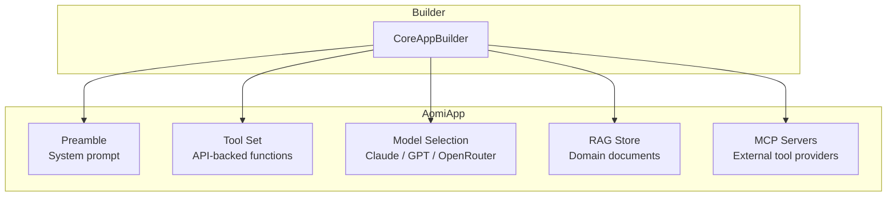
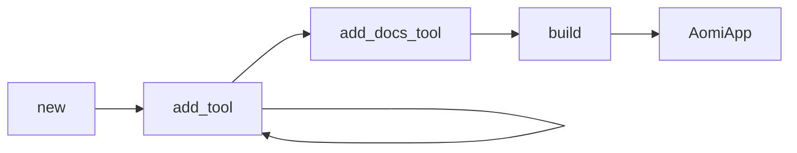
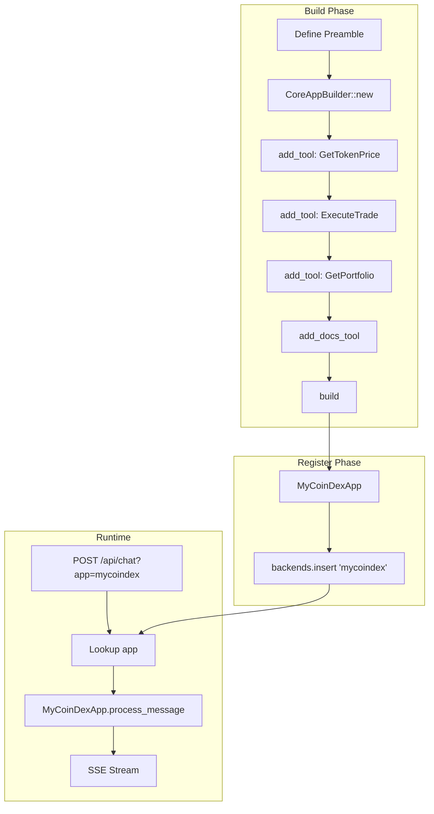

This page explains how AI assistants are constructed on the Aomi platform. It covers the AomiApp abstraction, the builder pattern, tool definitions, model selection, and app registration.

## AomiApp: The Core Abstraction

Every AI assistant on the Aomi platform implements the **AomiApp** pattern. An AomiApp bundles:

| Component | Purpose |
| --- | --- |
| **Tools** | Functions the AI can call during conversations |
| **Preamble** | System prompt defining personality, rules, and domain knowledge |
| **Model** | Which LLM powers the assistant |
| **RAG docs** | Optional document store for knowledge retrieval |
| **MCP servers** | Optional Model Context Protocol connections for external tool servers |



## CoreAppBuilder

Apps are constructed using the builder pattern:



### Basic Example

```rust
use aomi_chat::CoreAppBuilder;

let app = CoreAppBuilder::new("You are a helpful trading assistant.")
    .await?
    .add_tool(GetTokenPrice)?
    .add_tool(ExecuteTrade)?
    .add_tool(GetPortfolio)?
    .build(skip_mcp, system_events, sender)
    .await?;
```

### With RAG Documents

```rust
let app = CoreAppBuilder::new(&preamble)
    .await?
    .add_tool(GetTokenPrice)?
    .add_tool(ExecuteTrade)?
    .add_docs_tool(sender, None)
    .await?
    .build(false, Some(&system_events), Some(&sender_to_ui))
    .await?;
```

The `add_docs_tool` method registers a document search tool that queries a vector store of ingested documents.

## Tools

Tools are the functions your AI assistant can call. Each tool wraps an API endpoint or computation and makes it available to the LLM during conversations.

### Defining a Tool

Tools are defined using the `#[tool]` macro:

```rust
use rig::tool;
use serde::{Deserialize, Serialize};
use schemars::JsonSchema;

#[derive(Debug, Deserialize, JsonSchema, Clone)]
pub struct GetTokenPriceArgs {
    /// The token symbol (e.g., "ETH", "BTC")
    pub symbol: String,
}

#[derive(Debug, Serialize, Clone)]
pub struct TokenPrice {
    pub symbol: String,
    pub price: f64,
    pub currency: String,
}

/// Get the current price of a token
#[tool(description = "Get the current price of a cryptocurrency token")]
pub async fn get_token_price(
    args: GetTokenPriceArgs,
) -> Result<TokenPrice, ToolError> {
    let price = your_api_client.get_price(&args.symbol).await?;

    Ok(TokenPrice {
        symbol: args.symbol,
        price,
        currency: "USD".into(),
    })
}
```

The LLM uses the tool's `description` and parameter documentation to decide when and how to call it. Clear descriptions and well-documented parameters lead to better tool use.

> For full trait definitions and API details, see the [SDK Reference](/reference/sdk-api).

### Tool Documentation

The doc comments on your args struct fields become the parameter descriptions the LLM sees:

```rust
#[derive(Debug, Deserialize, JsonSchema, Clone)]
pub struct ExecuteTradeArgs {
    /// The token to buy (symbol or contract address)
    pub buy_token: String,

    /// The token to sell (symbol or contract address)
    pub sell_token: String,

    /// Amount to sell in human-readable format (e.g., "1.5")
    pub amount: String,

    /// Maximum acceptable slippage as a percentage (e.g., "0.5" for 0.5%)
    #[serde(default = "default_slippage")]
    pub max_slippage: String,
}
```

## Preamble

The preamble is the system prompt that defines the assistant's personality, capabilities, and rules. It is the single most important configuration for shaping behavior.

### Example Preamble

```
You are the MyCoinDex trading assistant.

## Capabilities
- Check real-time token prices
- View user portfolio and P&L
- Execute trades (with user confirmation)
- List available trading pairs

## Rules
- Always confirm with the user before executing a trade
- Show prices in USD unless the user requests otherwise
- If you don't have data for a token, say so clearly
- Never fabricate prices or portfolio data

## Tone
- Professional but approachable
- Concise responses unless the user asks for detail
- Use bullet points for lists of data
```

### Dynamic Preambles

Preambles can include runtime context:

```rust
fn build_preamble(user_preferences: &UserPrefs) -> String {
    format!(
        "You are the MyCoinDex trading assistant.\n\
         \n\
         User preferences:\n\
         - Default currency: {}\n\
         - Risk tolerance: {}\n\
         - Preferred chains: {}",
        user_preferences.currency,
        user_preferences.risk_level,
        user_preferences.chains.join(", ")
    )
}
```

## Model Selection

Aomi supports multiple LLM providers. The model is configured via the `Selection` type:

| Provider | Models | Notes |
| --- | --- | --- |
| **Anthropic** | Claude Sonnet, Claude Haiku | Strong tool use, reliable structured output |
| **OpenAI** | GPT-4o, GPT-4o Mini | Broad general knowledge |
| **OpenRouter** | 100+ models | Access to Llama, Mistral, and others |

Models can be switched at runtime via the `/api/control/model` endpoint without redeploying the app.

## RAG: Document Store

For assistants that need domain knowledge beyond what tools provide, Aomi supports RAG (Retrieval-Augmented Generation):

1. **Ingest** — documents (markdown, PDF, HTML) are chunked and embedded into a vector store.
2. **Search** — when the assistant needs context, it queries the vector store for relevant chunks.
3. **Augment** — retrieved chunks are injected into the LLM context alongside the user's message.

RAG is added via the builder:

```rust
builder.add_docs_tool(sender, None).await?;
```

## MCP: Model Context Protocol

Aomi supports [Model Context Protocol](https://modelcontextprotocol.io/) for connecting to external tool servers. This allows the assistant to use tools hosted outside the Aomi platform.

MCP servers are connected during the build phase:

```rust
let app = CoreAppBuilder::new(&preamble)
    .await?
    .add_tool(LocalTool)?
    .build(false, system_events, sender) // false = don't skip MCP
    .await?;
```

When `skip_mcp` is `false`, the builder connects to configured MCP servers and registers their tools alongside local tools.

## App Registration

Once an app is built, it is registered in the backend's app map:

```rust
fn build_backends() -> HashMap<String, Arc<dyn AomiBackend>> {
    let mut backends = HashMap::new();

    // Register MyCoinDex
    let mycoindex_app = MyCoinDexApp::new().await?;
    backends.insert("mycoindex".to_string(), Arc::new(mycoindex_app));

    // Register another app
    let defiwatch_app = DeFiWatchApp::new().await?;
    backends.insert("defiwatch".to_string(), Arc::new(defiwatch_app));

    backends
}
```

When a request arrives with `?app=mycoindex`, the backend looks up the app in this map and routes the request to the corresponding app.

Each registered app implements the `AomiBackend` trait, which provides a uniform interface for the backend to route messages to any app. For the full trait definition, see the [SDK Reference](/reference/sdk-api).

## Putting It All Together

Here is the complete flow for a MyCoinDex app:



## Next Steps

- [How It Works](/concepts/how-it-works) — see the full request flow with sequence diagrams.
- [API Reference](/reference/api-reference) — the HTTP endpoints your frontend uses.
- [SDK Reference](/reference/sdk-api) — detailed Rust SDK reference for `CoreAppBuilder` and related types.
