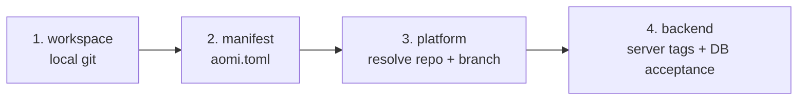

<Info>Verified against aomi-sdk@08b21f9 on 2026-06-29.</Info>

The builder toolchain is two Rust binaries that cover the full life of an App. You install both at once from the latest source:

<CodeGroup>
```bash macOS / Linux
cargo install --git https://github.com/aomi-labs/aomi-sdk --features cli,dev-runtime aomi-sdk
```

```powershell Windows
cargo install --git https://github.com/aomi-labs/aomi-sdk --features cli,dev-runtime aomi-sdk
```
</CodeGroup>

The `cli` feature builds `aomi-build`; the `dev-runtime` feature builds `aomi-run`. Install with `--features cli` alone and you get only `aomi-build`, not `aomi-run`. These binaries have no `--version` flag; run `aomi-build --help` (or `--help` on either of them) to confirm the install.

<Note>
These are not standalone crates or npm packages, so there is no `aomi-run` to find on crates.io or npm. They are binaries built from the `aomi-sdk` crate, which is why the install command points at that crate and uses feature flags to choose which binaries you get.
</Note>

Each binary owns one job. `aomi-build` is the single CLI: it scaffolds, compiles, deploys, and activates. `aomi-run` exercises a built plugin locally.

<CardGroup cols={2}>
  <Card title="aomi-build" icon="hammer">
    Scaffold from an OpenAPI spec, compile the plugin, deploy your source through the backend, and activate the release. This is where an App is born and how it ships.
  </Card>
  <Card title="aomi-run" icon="terminal">
    Chat with your compiled plugin against a real LLM, locally, with no backend. This is how you sanity check tool behavior.
  </Card>
</CardGroup>

<Note>
You can run either of these without installing. Prefix with `cargo run -p aomi-sdk --features cli --bin aomi-build --`, or `--features dev-runtime --bin aomi-run --`. The install is just a convenience.
</Note>

## Which tool, when

<Steps>
  <Step title="Build">
    Use **aomi-build** to turn an OpenAPI spec into a compiled plugin (a `cdylib`). It scaffolds the app crate, generates a typed client, stubs one tool per endpoint, and compiles. You then curate the tools by hand. End with a passing `test.json`.
  </Step>
  <Step title="Run">
    Use **aomi-run** to chat with that compiled plugin locally. It loads the `.dylib`, reads its manifest, and opens a REPL wired to Anthropic, OpenAI, or OpenRouter. No backend, no deploy. You watch which tools the model picks and how they respond.
  </Step>
  <Step title="Ship">
    Use **aomi-build** to publish. First `connect` installs the Aomi GitHub App on your source repo and saves your activation token. Then `deploy` sends a deploy request to the backend, which reads your source through that install, opens a pull request, and CI builds and cuts a release. `activate` then tells a backend to load that release. You run `activate` yourself, using your activation token.
  </Step>
</Steps>

---

## aomi-build

`aomi-build` scaffolds, compiles, and end to end tests an App. The full path from "external API docs" to "tested plugin" is a six stage pipeline. Every stage runs on its own, and `new-app` is the one shot orchestrator for the first stages plus the compile.

```
gen-specs ──▶ gen-client ──▶ gen-tool ──▶ curate ──▶ cargo build ──▶ test.json + e2e runner
   (1)          (2)            (3)         (4)          (5)              (6)
```

Stages 1 through 3 and 5 are pure CLI. Stage 4 (curate) and the `test.json` authoring in stage 6 are done with the authoring skills, not the binary.

### Subcommands

`aomi-build` is the single CLI for the whole life of an App. Running it with no subcommand launches an interactive wizard that walks `connect` then `deploy` then `activate`.

**Build and scaffold:**

| Subcommand | What it does |
|---|---|
| `compile` | Build every app plugin into `plugins/`. The everyday build command. |
| `init <name>` | Scaffold a bare app skeleton. Use when you are not driving from an OpenAPI spec. |
| `new-app <p>` | Orchestrator: `gen-specs` then `gen-client` then `gen-tool` then `cargo build`. |
| `gen-specs <p>` | Discover or fetch an OpenAPI spec and write the YAML. |
| `gen-client <p>` | Turn the OpenAPI YAML into a typed Rust client via progenitor. |
| `gen-tool <p>` | Scaffold the app crate and write one stub tool per `operationId`. |
| `tighten-spec <p>` | Sharpen loose `additionalProperties: true` schemas from real captured samples. |
| `test-schema <p>` | Validate the spec against the live API with schemathesis. |

**Deploy and activate:**

| Subcommand | What it does |
|---|---|
| `connect` | Install the Aomi GitHub App on your source repo and save your activation token. Run once, before your first deploy. |
| `deploy` | Send a deploy request to the backend. The backend reads your source through the connected GitHub App, opens a pull request, and CI builds the cdylib and cuts a release. |
| `status` | Read `.aomi/deployment.json` and the backend, and report whether the release is built and loaded. |
| `activate` | Tell a backend to fetch a published release by tag, validate it, and load it. Run with your activation token. |
| `token` | Mint, list, or revoke platform or app activation tokens. |
| `source` | Resolve a connected source repo to its `app_source_id`. |
| `apps` | List a platform's apps. |
| `request` | Legacy. Ask platform ops for onboarding details. Superseded by `connect`. |

Here `<p>` is the platform slug, for example `petstore` or `khalani`.

### Flags

| Flag | Applies to | Meaning |
|---|---|---|
| `--app <name>` | `compile` | Build a single app instead of all of them. |
| `--release` | `compile` | Build in release mode. |
| `--target <triple>` | `compile` | Cross compile for a target triple, for example `aarch64-apple-darwin`. |
| `--from-url <URL>` | `gen-specs`, `new-app` | Direct spec URL when discovery does not find one. |
| `--shared` | stages 1 through 3, `new-app` | Treat artifacts as shared under `ext/` instead of app local under `apps/`. |
| `--no-tool` | `new-app` | Stop after `gen-client`; skip tool scaffolding. |
| `--force` | `gen-client` | Regenerate even when output already exists. |
| `--base-url <URL>` | `test-schema` | Live API base URL to validate against. |

<Note>
Spec generation stages default to **app local**: every artifact lives under `apps/<p>/`. Pass `--shared` only when several Apps wrap the same upstream (say, multiple Apps over one exchange) and should reuse one client under `ext/`.
</Note>

### Scaffold and compile a new App

<Tabs>
  <Tab title="From an OpenAPI spec">
    ```bash
    # One shot: gen-specs -> gen-client -> gen-tool -> cargo build
    aomi-build new-app petstore

    # Point at the spec when discovery misses it
    aomi-build new-app petstore --from-url https://example.com/openapi.json

    # Stop after the client; skip tool scaffolding
    aomi-build new-app petstore --no-tool
    ```
  </Tab>
  <Tab title="Bare skeleton">
    ```bash
    # No spec; hand author the tools
    aomi-build init my-app
    ```
  </Tab>
  <Tab title="Compile existing apps">
    ```bash
    aomi-build compile                 # all apps into plugins/
    aomi-build compile --app x         # one app
    aomi-build compile --release       # release build
    aomi-build compile --target aarch64-apple-darwin
    ```
  </Tab>
</Tabs>

After `new-app` finishes, the App compiles but its tools are mechanical, one per endpoint, with machine names. You make it useful by curating the tool layer (stage 4) with the authoring skills, then rebuilding.

<Note>
`aomi-build compile` builds the apps inside an aomi-sdk style workspace and writes them into `plugins/`. If you are building a single standalone App crate, the kind you publish to `community-apps`, you do not need `aomi-build`. Build it with `cargo build --release` and find the plugin in `target/release/`.
</Note>

### Sharpen and validate the spec

```bash
# Infer concrete response types from real captured JSON.
# Samples go directly in <platform>.samples/ named <operationId>.<status>.json
mkdir -p ext/specs/khalani.samples
curl ... > ext/specs/khalani.samples/getQuote.200.json
aomi-build tighten-spec khalani              # prints the diff only
aomi-build tighten-spec khalani --in-place   # writes the tightened spec back
aomi-build gen-client khalani --shared --force   # regenerate with tighter types

# Catch schema drift against the live API
aomi-build test-schema khalani --base-url https://api.hyperstream.dev
```

### The end to end test

Each App carries one canonical e2e spec at `apps/<platform>/test.json`. It describes a real LLM run: an optional wallet seed, a list of user prompts, the tools expected per turn, optional wallet callbacks, and a final state assertion. The runner lives in the backend repo, not here. You point it at your compiled plugin with an env var:

```bash
cd apps/khalani && cargo build

AOMI_E2E_APP_PATH=.../apps/khalani/target/debug/libkhalani.dylib \
  cargo test -p aomi-runtime --test local-app-e2e app_e2e_specs -- --nocapture
```

| Env var | Required | Purpose |
|---|---|---|
| `AOMI_E2E_APP_PATH` | yes | Absolute path to the compiled dylib (or a manifest bundle directory). |
| `ANTHROPIC_API_KEY` | yes | Provider key for the real LLM call. |
| `AOMI_E2E_SPEC` | no | Override `test.json` discovery and run one explicit spec file. |

<Accordion title="test.json shape (abridged)">
The spec runs turn by turn. `expected_tools` checks `must_call` (all listed) or `any_of` (at least one). `final_assertion` checks the user state, tool responses, and turn cap.

```json
{
  "user_story": "Plain English description shown in the test banner",
  "wallet_seed": {
    "address": "0xd8dA6BF26964aF9D7eEd9e03E53415D37aA96045",
    "chain_id": 1,
    "is_connected": true
  },
  "turns": [
    {
      "prompt": "Swap 100 USDC from Ethereum to ETH on Optimism via X.",
      "expected_tools": { "must_call": ["x_quote", "x_build_deposit"] }
    }
  ],
  "final_assertion": {
    "user_state": { "pending_txs": { "min_count": 1 } },
    "no_errors": true,
    "max_turns": 30
  }
}
```

Two limits worth knowing. Host tools (`stage_tx`, `simulate_batch`, `commit_txs`) carry a model set `topic` arg, so listing them in `must_call` will not match; the runtime fires them internally during routed enforcement. And a terminal `wallet:tx_complete` callback consumes `pending_txs`, so assert `max_count: 0` after a callback rather than `min_count: 1`.
</Accordion>

---

## aomi-run

`aomi-run` loads a compiled plugin and opens an interactive REPL against a real LLM, locally, with no backend required. It is how you feel out whether the model reaches for the right tools before you ever ship.

There are no subcommands. You pass the plugin path as the one positional argument, then a handful of flags.

```bash
aomi-run apps/khalani/target/debug/libkhalani.dylib
```

On start, `aomi-run` prints a summary of what it loaded, stubs any host namespaces the plugin asked for, and opens the REPL. The block below is illustrative, not literal output, and the version reflects the current SDK line (`3.0.x`):

```text
# illustrative boot banner
▶ monad-oneshot v0.1.0  (aomi-sdk 3.0.1)
  tools      : 4 (get_balance, wrap_mon, unwrap_wmon, send_mon)
  namespaces : evm-core (stubbed)
  ⚙ stubbed 12 tools for namespace 'evm-core'
─────────────────────────────────────────
 aomi-run REPL · app=monad-oneshot · session=<uuid>
 max_turns=20 · /help for commands
─────────────────────────────────────────
```

The `tools` line lists your App's own tools. The `namespaces` line and the `⚙ stubbed` line show the host capabilities the dev runtime stands in for, since the real backend is not present. Inside the REPL, `/help` lists commands and `/quit` exits.

<Note>
`aomi-run` calls a real LLM, so it needs a provider key in your environment. With the default Anthropic provider, set `ANTHROPIC_API_KEY` before you run. `aomi-run` checks for the key before it even loads the plugin. Pass `--env-file` to load it from a dotenv file.
</Note>

### Flags

| Flag | Default | Meaning |
|---|---|---|
| `<plugin>` (positional) | required | Path to the built plugin (`.dylib`, `.so`, or `.dll`). |
| `--provider <P>` | `anthropic` | LLM provider: `anthropic`, `openai`, or `openrouter`. |
| `--model <ID>` | per provider | Model id. Defaults to a sane choice for the chosen provider. |
| `--max-turns <N>` | `20` | Tool call rounds allowed inside one user turn before the model must answer in text. `0` means no tool round trips. |
| `--max-tokens <N>` | `4096` | Cap on output tokens per LLM response. |
| `--env-file <FILE>` | none | dotenv file loaded before any env var is read (API key and plugin secrets). |
| `--session-id <ID>` | fresh UUID | Override the session id baked into every tool call context. |
| `--verbose`, `-v` | off | More log detail. Sets a debug `RUST_LOG` if one is not already set. |

```bash
# OpenAI provider, explicit model, secrets from a file
aomi-run apps/x/target/debug/libx.dylib \
  --provider openai --model gpt-5 \
  --env-file .env.local --verbose
```

The default model per provider is `claude-sonnet-4-6` for Anthropic, `gpt-5` for OpenAI, and `anthropic/claude-sonnet-4` for OpenRouter. The provider's API key must be present in the environment (or in `--env-file`); `aomi-run` checks for it before it even loads the plugin.

<Warning>
**aomi-run is a v1 dev runtime, not the real backend.** Some behavior is intentionally stubbed:

- **Routed return envelopes** (`evm_commit_message`, `stage_tx`, `svm_sign_tx`, and the rest) do not fire. The model receives the envelope as opaque JSON; no wallet UX runs.
- **Host namespace toolsets** (`evm-core`, `database`, `forge`, and others) are replaced with stub tools that return an "unavailable in dev runtime" value. The model still sees them by name, but a call resolves to a no op note.
- **Skill activation** is not supported.
- **`$SECRET:...` argument substitution** does not run, though the plugin's own env var secret fallback still works.
- **State attributes** always return `None`.

For any of those, deploy the plugin and exercise it against the real backend.
</Warning>

---

## Deploy and activate with aomi-build

The deploy half of `aomi-build` publishes your App source through the backend, then activates the resulting release. The CLI never clones a platform repo or pushes branches. It is a thin relay: `deploy` POSTs to the backend, and the backend reads your source through the connected Aomi GitHub App, opens a pull request, and lets CI build the cdylib and cut the release.

Run these from your **source repo**, the crate that holds `aomi.toml` and `src/lib.rs`.

| Subcommand | What it does | Who runs it |
|---|---|---|
| `connect` | Installs the Aomi GitHub App on your source repo and saves your activation token. Run once, before your first deploy. | The app author |
| `deploy` | POSTs a deploy request to the backend. The backend reads your source through the GitHub App, opens a pull request, and CI builds the cdylib and cuts a release. | The app author |
| `status` | Reads `.aomi/deployment.json` and the backend, and reports whether the release is built and loaded. | The app author |
| `activate` | Tells a backend to fetch a published release by tag, validate it, and load it. | The app author, with their activation token |
| `request` | Legacy. Asks platform ops for onboarding details. Superseded by `connect`. | The app author |

<Note>
The backend identifies your source through the GitHub App install, recorded as `app_source_id`. The deployed App lands at `apps/<installation-id>/<repo-key>/<app>/` on the `community-apps` publish branch, and CI publishes a release tagged `apps-<installation-id>-<repo-key>-<app>-<short-commit>`.
</Note>

### connect

The first step for a new contributor. `connect` installs the Aomi GitHub App on your source repo and saves the activation token you use to activate releases. Run it once, before your first deploy.

```bash
AOMI_BACKEND_URL=https://staging-api.aomi.dev aomi-build connect
```

It prints a browser URL to install the Aomi GitHub App. Install it on the repo that holds your App, then paste back the `installation_id` GitHub shows you. After that, every deploy reads your source through this install.

| Flag | Meaning |
|---|---|
| `--platform <NAME>` | Platform to connect for. Scopes the install and the token check. |
| `--installation-id <ID>` | Connected GitHub App installation id. Prompted if omitted. |
| `--backend <URL>` | Backend base URL. Defaults to `AOMI_BACKEND_URL`, then saved config. |
| `--activation-token <TOKEN>` | Activation token to store, issued by your Aomi admin. Prompted if omitted. |
| `--no-browser` | Print the install URL instead of opening a browser. |

### deploy

```bash
# Preview the plan and run the preflight checks. Changes nothing.
AOMI_BACKEND_URL=https://staging-api.aomi.dev aomi-build deploy --dry-run

# Real deploy.
AOMI_BACKEND_URL=https://staging-api.aomi.dev aomi-build deploy
```

`deploy` sends `POST /api/platforms/:platform/deploy` carrying your `app_source_id`. The backend reads your source through the GitHub App, opens a pull request, and CI builds and publishes the release. A successful deploy writes `.aomi/deployment.json` with the backend's deployment record, including the release tags `activate` reads later.

| Flag | Meaning |
|---|---|
| `--app-source-id <ID>` | Connected GitHub App install id for this repo. Defaults to `AOMI_APP_SOURCE_ID`, else resolved from the connected repo. |
| `--backend <URL>` | Backend base URL. Defaults to `AOMI_BACKEND_URL`. |
| `--dry-run` (alias of `--preflight`) | Preview the deployment manifest and run the preflight checks. No deploy. |
| `--json` | Print the plan or outcome as JSON. |

<Note>
`--dry-run` is an alias of `--preflight`. Both preview the plan and run the checks without deploying.
</Note>

### status

```bash
aomi-build status --path /path/to/app
```

`status` reads `.aomi/deployment.json` and, when a backend URL is configured, reports the backend load state for each release tag.

| Flag | Meaning |
|---|---|
| `[APP_RELEASE_TAG]` | Release to check. Falls back to deployment.json. |
| `--backend <URL>` | Backend base URL. Pass `--backend ''` to skip. |
| `--path <DIR>` | Source repo for the deployment.json fallback. Default: `.` |
| `--json` | Print the status report as JSON. |

### activate

Run by the app author with the activation token saved during `connect`. It tells the backend to fetch a release by tag, validate it, and load it. Run it from your source repo and it reads the release tags from `.aomi/deployment.json`, so usually you set only `AOMI_APP_ACTIVATION_TOKEN` and `AOMI_BACKEND_URL` and run `aomi-build activate`.

```bash
# Activate every app from deployment.json.
AOMI_APP_ACTIVATION_TOKEN=<your-activation-token> \
AOMI_BACKEND_URL=https://staging-api.aomi.dev \
  aomi-build activate

# Activate a named subset.
aomi-build activate foo bar

# Activate an explicit release tag.
aomi-build activate --release-tag apps-1-myrepo-foo-abc1234
```

`activate` sends `POST /api/platforms/:platform/apps/activate`. By default it uses the release tags recorded in `.aomi/deployment.json`.

| Flag | Meaning |
|---|---|
| `[APPS]...` | Apps to activate. Defaults to every app from `.aomi/deployment.json`. |
| `--release-tag <TAG>` | Activate this release tag. Repeat for multi-app activation. |
| `--platform <NAME>` | Platform tag. Falls back to deployment.json, then `community`. |
| `--backend <URL>` | Backend base URL. Defaults to `AOMI_BACKEND_URL`. **Required.** |
| `--activation-token <T>` | Your activation token. Defaults to `AOMI_APP_ACTIVATION_TOKEN`. **Required.** |
| `--target-tag <TAG>` | Backend server tag the release may load on. Repeatable. |
| `--path <DIR>` | Source repo for the deployment.json fallback. Default: `.` |

<Note>
When you pass app names with `--release-tag`, their count must match the tag count, and the backend verifies each app name matches its release tag.
</Note>

### The validation pipeline

Every `deploy`, including `--dry-run`, runs a validation pipeline and records the result in `.aomi/deployment.json`. It runs in four ordered stages. Each stage is a precondition for the next, so a failing gate short circuits the rest and downstream stages are recorded as `skipped`.



Stages 1 and 2 are **offline**, computed from local git and `aomi.toml`. Stages 3 and 4 are **online**: they only run when a backend URL is available, and otherwise stay `skipped`.

| Stage | Question it answers |
|---|---|
| `workspace` | Is the local tree shippable? (`git_clean`) |
| `manifest` | Does `aomi.toml` declare what we need? (`platform_declared`, `git_declared`) |
| `platform` | Can we resolve the platform repo and deploy branch? (`backend_reachable`, `platform_resolved`, `branch_matches_contract`, `git_url_matches_platform`) |
| `backend` | Will the backend actually accept this release? (`server_tags_subset`) |

Each check is `error` (a gate that fails the stage and should block the deploy) or `warn` (advisory; downgrades the stage to `warning` but does not block). The two `warn` checks are `git_declared` and `git_url_matches_platform`, since a backend lookup can supply the repo and forks are tolerated. The big one to watch is `branch_matches_contract`: if your target branch is not the platform's contractual `deployment_branch`, the push will not auto deploy.

<Accordion title="What a passing preflight looks like">
The human summary prints one line per stage:

```
Preflight
  [ok]   workspace git_clean
  [ok]   manifest  platform_declared, git_declared  |  defaulted=true server_tags=[staging]
  [ok]   platform  backend_reachable, platform_resolved, branch_matches_contract, git_url_matches_platform  |  deployment_branch=publish github_repo=aomi-labs/community-apps name=community
  [ok]   backend   server_tags_subset
```

A stage rolls up to `passed` (all checks passed), `failed` (an `error` check failed, blocked here), `warning` (only `warn` checks failed), or `skipped` (an upstream gate failed or inputs were absent, such as no backend URL).
</Accordion>

### The deployment.json artifact

`.aomi/deployment.json` is the deployment record the backend writes back next to your `aomi.toml` after a successful deploy. It carries the resolved plan and the release tags, and three independent `state` flags:

- `deployed`: the backend accepted the deploy and opened the pull request that CI builds.
- `activated`: the backend wrote the app row with `is_active = true`.

A `--dry-run` deploy previews the plan and runs the checks but does not record a deploy. `activate` reads this file for its defaults, including the release tags, so running it from the same directory as a prior `deploy` lets you drop most flags.

<Warning>
Add `.aomi/` to your `.gitignore`. It is a local artifact, and committing it tends to dirty your tree and trip `git_clean` on the next deploy.
</Warning>

---

## Related

<CardGroup cols={3}>
  <Card title="Building an App" icon="book" href="/reference/building-apps">
    The full authoring walkthrough, from spec to curated tools to test.
  </Card>
  <Card title="SDK reference" icon="cube" href="/reference/sdk-api">
    The Rust plugin SDK that your App compiles against.
  </Card>
  <Card title="Client CLI" icon="npm" href="/reference/cli">
    The npm `aomi` command for chatting with and driving a deployed App from your terminal.
  </Card>
</CardGroup>
