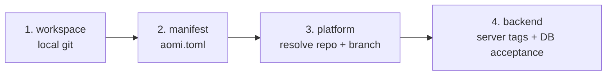

The builder toolchain is three Rust binaries that cover the full life of an App. You install all three at once from the latest source:

```bash
cargo install --git https://github.com/aomi-labs/aomi-sdk --features cli,dev-runtime aomi-sdk
```

The `cli` feature builds `aomi-build` and `aomi-git`; the `dev-runtime` feature builds `aomi-run`. These binaries have no `--version` flag; run `aomi-git --help` (or `--help` on any of them) to confirm the install.

Each binary owns one job. You move left to right as your App matures.

<CardGroup cols={3}>
  <Card title="aomi-build" icon="hammer">
    Scaffold from an OpenAPI spec, compile the plugin, and run the end to end test. This is where an App is born.
  </Card>
  <Card title="aomi-run" icon="terminal">
    Chat with your compiled plugin against a real LLM, locally, with no backend. This is how you sanity check tool behavior.
  </Card>
  <Card title="aomi-git" icon="rocket">
    Deploy your source into a platform repo, watch CI, and activate the release on a backend. This is how an App ships.
  </Card>
</CardGroup>

<Note>
You can run any of these without installing. Prefix with `cargo run -p aomi-sdk --features cli --bin aomi-build --` (or `aomi-git`), or `--features dev-runtime --bin aomi-run --`. The install is just a convenience.
</Note>

## Which tool, when

<Steps>
  <Step title="Build">
    Use **aomi-build** to turn an OpenAPI spec into a compiled plugin (a `cdylib`). It scaffolds the app crate, generates a typed client, stubs one tool per endpoint, and compiles. You then curate the tools by hand. End with a passing `test.json`.
  </Step>
  <Step title="Run">
    Use **aomi-run** to chat with that compiled plugin locally. It loads the `.dylib`, reads its manifest, and opens a REPL wired to Anthropic, OpenAI, or OpenRouter. No backend, no deploy. You watch which tools the model picks and how they respond.
  </Step>
  <Step title="Ship">
    Use **aomi-git** to publish. `deploy` stages your source into a platform repo (such as `community-apps`) and pushes to the publish branch, where CI builds and cuts a release. `activate` then tells a backend to load that release. The platform operator runs `activate` because they hold the activation token.
  </Step>
</Steps>

---

## aomi-build

`aomi-build` scaffolds, compiles, and end to end tests an App. The full path from "external API docs" to "tested plugin" is a six stage pipeline. Every stage runs on its own, and `new-app` is the one shot orchestrator for the first stages plus the compile.

```
gen-specs ──▶ gen-client ──▶ gen-tool ──▶ curate ──▶ cargo build ──▶ test.json + e2e runner
   (1)          (2)            (3)         (4)          (5)              (6)
```

Stages 1 through 3 and 5 are pure CLI. Stage 4 (curate) and the `test.json` authoring in stage 6 are done with the authoring skills, not the binary.

### Subcommands

| Subcommand | What it does |
|---|---|
| `compile` | Build every app plugin into `plugins/`. The everyday build command. |
| `init <name>` | Scaffold a bare app skeleton. Use when you are not driving from an OpenAPI spec. |
| `new-app <p>` | Orchestrator: `gen-specs` then `gen-client` then `gen-tool` then `cargo build`. |
| `gen-specs <p>` | Discover or fetch an OpenAPI spec and write the YAML. |
| `gen-client <p>` | Turn the OpenAPI YAML into a typed Rust client via progenitor. |
| `gen-tool <p>` | Scaffold the app crate and write one stub tool per `operationId`. |
| `tighten-spec <p>` | Sharpen loose `additionalProperties: true` schemas from real captured samples. |
| `test-schema <p>` | Validate the spec against the live API with schemathesis. |

Here `<p>` is the platform slug, for example `petstore` or `khalani`.

### Flags

| Flag | Applies to | Meaning |
|---|---|---|
| `--app <name>` | `compile` | Build a single app instead of all of them. |
| `--release` | `compile` | Build in release mode. |
| `--target <triple>` | `compile` | Cross compile for a target triple, for example `aarch64-apple-darwin`. |
| `--from-url <URL>` | `gen-specs`, `new-app` | Direct spec URL when discovery does not find one. |
| `--shared` | stages 1 through 3, `new-app` | Treat artifacts as shared under `ext/` instead of app local under `apps/`. |
| `--no-tool` | `new-app` | Stop after `gen-client`; skip tool scaffolding. |
| `--force` | `gen-client` | Regenerate even when output already exists. |
| `--base-url <URL>` | `test-schema` | Live API base URL to validate against. |

<Note>
Spec generation stages default to **app local**: every artifact lives under `apps/<p>/`. Pass `--shared` only when several Apps wrap the same upstream (say, multiple Apps over one exchange) and should reuse one client under `ext/`.
</Note>

### Scaffold and compile a new App

<Tabs>
  <Tab title="From an OpenAPI spec">
    ```bash
    # One shot: gen-specs -> gen-client -> gen-tool -> cargo build
    aomi-build new-app petstore

    # Point at the spec when discovery misses it
    aomi-build new-app petstore --from-url https://example.com/openapi.json

    # Stop after the client; skip tool scaffolding
    aomi-build new-app petstore --no-tool
    ```
  </Tab>
  <Tab title="Bare skeleton">
    ```bash
    # No spec; hand author the tools
    aomi-build init my-app
    ```
  </Tab>
  <Tab title="Compile existing apps">
    ```bash
    aomi-build compile                 # all apps into plugins/
    aomi-build compile --app x         # one app
    aomi-build compile --release       # release build
    aomi-build compile --target aarch64-apple-darwin
    ```
  </Tab>
</Tabs>

After `new-app` finishes, the App compiles but its tools are mechanical, one per endpoint, with machine names. You make it useful by curating the tool layer (stage 4) with the authoring skills, then rebuilding.

<Note>
`aomi-build compile` builds the apps inside an aomi-sdk style workspace and writes them into `plugins/`. If you are building a single standalone App crate, the kind you publish to `community-apps`, you do not need `aomi-build`. Build it with `cargo build --release` and find the plugin in `target/release/`.
</Note>

### Sharpen and validate the spec

```bash
# Infer concrete response types from real captured JSON
mkdir -p ext/specs/khalani.samples/get_quote
curl ... > ext/specs/khalani.samples/get_quote/sample.json
aomi-build tighten-spec khalani
aomi-build gen-client khalani --shared --force   # regenerate with tighter types

# Catch schema drift against the live API
aomi-build test-schema khalani --base-url https://api.hyperstream.dev
```

### The end to end test

Each App carries one canonical e2e spec at `apps/<platform>/test.json`. It describes a real LLM run: an optional wallet seed, a list of user prompts, the tools expected per turn, optional wallet callbacks, and a final state assertion. The runner lives in the backend repo, not here. You point it at your compiled plugin with an env var:

```bash
cd apps/khalani && cargo build

AOMI_E2E_APP_PATH=.../apps/khalani/target/debug/libkhalani.dylib \
  cargo test -p aomi-runtime --test local-app-e2e app_e2e_specs -- --nocapture
```

| Env var | Required | Purpose |
|---|---|---|
| `AOMI_E2E_APP_PATH` | yes | Absolute path to the compiled dylib (or a manifest bundle directory). |
| `ANTHROPIC_API_KEY` | yes | Provider key for the real LLM call. |
| `AOMI_E2E_SPEC` | no | Override `test.json` discovery and run one explicit spec file. |

<Accordion title="test.json shape (abridged)">
The spec runs turn by turn. `expected_tools` checks `must_call` (all listed) or `any_of` (at least one). `final_assertion` checks the user state, tool responses, and turn cap.

```json
{
  "user_story": "Plain English description shown in the test banner",
  "wallet_seed": {
    "address": "0xd8dA6BF26964aF9D7eEd9e03E53415D37aA96045",
    "chain_id": 1,
    "is_connected": true
  },
  "turns": [
    {
      "prompt": "Swap 100 USDC from Ethereum to ETH on Optimism via X.",
      "expected_tools": { "must_call": ["x_quote", "x_build_deposit"] }
    }
  ],
  "final_assertion": {
    "user_state": { "pending_txs": { "min_count": 1 } },
    "no_errors": true,
    "max_turns": 30
  }
}
```

Two limits worth knowing. Host tools (`stage_tx`, `simulate_batch`, `commit_txs`) carry a model set `topic` arg, so listing them in `must_call` will not match; the runtime fires them internally during routed enforcement. And a terminal `wallet:tx_complete` callback consumes `pending_txs`, so assert `max_count: 0` after a callback rather than `min_count: 1`.
</Accordion>

---

## aomi-run

`aomi-run` loads a compiled plugin and opens an interactive REPL against a real LLM, locally, with no backend required. It is how you feel out whether the model reaches for the right tools before you ever ship.

There are no subcommands. You pass the plugin path as the one positional argument, then a handful of flags.

```bash
aomi-run apps/khalani/target/debug/libkhalani.dylib
```

### Flags

| Flag | Default | Meaning |
|---|---|---|
| `<plugin>` (positional) | required | Path to the built plugin (`.dylib`, `.so`, or `.dll`). |
| `--provider <P>` | `anthropic` | LLM provider: `anthropic`, `openai`, or `openrouter`. |
| `--model <ID>` | per provider | Model id. Defaults to a sane choice for the chosen provider. |
| `--max-turns <N>` | `20` | Tool call rounds allowed inside one user turn before the model must answer in text. `0` means no tool round trips. |
| `--max-tokens <N>` | `4096` | Cap on output tokens per LLM response. |
| `--env-file <FILE>` | none | dotenv file loaded before any env var is read (API key and plugin secrets). |
| `--session-id <ID>` | fresh UUID | Override the session id baked into every tool call context. |
| `--verbose`, `-v` | off | More log detail. Sets a debug `RUST_LOG` if one is not already set. |

```bash
# OpenAI provider, explicit model, secrets from a file
aomi-run apps/x/target/debug/libx.dylib \
  --provider openai --model gpt-5 \
  --env-file .env.local --verbose
```

The default model per provider is `claude-sonnet-4-6` for Anthropic, `gpt-5` for OpenAI, and `anthropic/claude-sonnet-4` for OpenRouter. The provider's API key must be present in the environment (or in `--env-file`); `aomi-run` checks for it before it even loads the plugin.

<Warning>
**aomi-run is a v1 dev runtime, not the real backend.** Some behavior is intentionally stubbed:

- **Routed return envelopes** (`commit_eip712`, `stage_tx`, `sign_tx_solana`, and the rest) do not fire. The model receives the envelope as opaque JSON; no wallet UX runs.
- **Host namespace toolsets** (`evm-core`, `database`, `forge`, and others) are replaced with stub tools that return an "unavailable in dev runtime" value. The model still sees them by name, but a call resolves to a no op note.
- **Skill activation** is not supported.
- **`$SECRET:...` argument substitution** does not run, though the plugin's own env var secret fallback still works.
- **State attributes** always return `None`.

For any of those, deploy the plugin and exercise it against the real backend.
</Warning>

---

## aomi-git

`aomi-git` publishes your App source through a platform's Git policy, then activates the resulting release on a backend. It never edits your source. It copies a snapshot into a transit clone of the platform repo and pushes from there.

Run it from your **source repo**, the crate that holds `aomi.toml` and `src/lib.rs`.

| Subcommand | What it does | Who runs it |
|---|---|---|
| `deploy` | Snapshots your source, stages it under `apps/<slug>/` in the platform repo, commits, and pushes to the publish branch. CI then builds the cdylib and cuts a release. | The app author |
| `status` | Reads `.aomi/deployment.json`, polls GitHub Actions and release state, and reports whether activation is ready. | The app author |
| `activate` | Tells a backend to fetch a published release, validate it, and load it. | The platform operator (holds the activation token) |

### deploy

```bash
# Plan only. Writes .aomi/deployment.json, pushes nothing.
aomi-git deploy --dry-run

# Real deploy via the managed transit cache (the default).
aomi-git deploy

# Real deploy via a hand managed clone (escape hatch).
aomi-git deploy --platform-dir /path/to/platform-repo
```

| Flag | Mirrors `aomi.toml` | Meaning |
|---|---|---|
| `[PATH]` (`--path`) | — | App source directory. Default: `.` |
| `--platform <NAME>` | `[app].platform` | Platform tag. Default: the toml value, then `community`. |
| `--git <URL\|owner/repo>` | `[app].git` | Platform repo. Resolved from the backend record when omitted. |
| `--platform-dir <DIR>` | — | Hand managed local clone to stage and push from. Skips the transit cache. |
| `--backend <URL>` | `AOMI_BACKEND_URL` | Backend base URL for online checks. |
| `--dry-run` | — | Plan plus best effort backend reads. No staging, push, or activation. |
| `--allow-dirty` | — | Permit a dirty working tree in the plan and during staging. |
| `--json` | — | Print the plan or outcome as JSON. |

<Note>
**Auto activate on deploy.** If `AOMI_APP_ACTIVATION_TOKEN` is set and the push lands, `deploy` tries to activate right away. This usually returns a 502 on the first push because the release tarball does not exist yet, since CI is still building. That is expected. The normal flow is to let the platform operator run `activate` once CI is green.
</Note>

### status

```bash
aomi-git status --path /path/to/app
```

| Flag | Mirrors `aomi.toml` | Meaning |
|---|---|---|
| `[RELEASE_TAG]` | — | Release to check. Falls back to deployment.json's `target.release_tag`. |
| `--git <URL\|owner/repo>` | `[app].git` | Platform repo. Falls back to deployment.json. |
| `--backend <URL>` | `AOMI_BACKEND_URL` | Backend base URL. Pass `--backend ''` to skip. |
| `--access-token <$ENV\|VAL>` | `[app].access_token` | GitHub PAT for private repo reads. Omit for public repos. |
| `--path <DIR>` | — | Source repo for the deployment.json fallback. Default: `.` |
| `--json` | — | Print the status report as JSON. |

### activate

Run by whoever holds the platform's activation token. It tells the backend to fetch a release by tag, validate it, and load it.

```bash
aomi-git activate apps-my-bot-abc1234 \
  --backend https://staging-api.aomi.dev \
  --activation-token <platform-token> \
  --git aomi-labs/community-apps \
  --target-tag staging \
  --visibility public
```

| Flag | Mirrors `aomi.toml` | Meaning |
|---|---|---|
| `[RELEASE_TAG]` | — | Release to activate (e.g. `apps-my-bot-abc1234`). Falls back to deployment.json. |
| `--platform <NAME>` | `[app].platform` | Platform tag. Falls back to deployment.json, then `community`. |
| `--git <URL\|owner/repo>` | `[app].git` | `source_repo` on the app row. Falls back to deployment.json, then a backend lookup. |
| `--backend <URL>` | `AOMI_BACKEND_URL` | Backend base URL. **Required.** |
| `--activation-token <T>` | `AOMI_APP_ACTIVATION_TOKEN` | Platform activation token. **Required.** |
| `--access-token <$ENV\|VAL>` | `[app].access_token` | GitHub PAT for the backend's one shot release fetch. Only for private platform repos. |
| `--target-tag <TAG>` | — | Required backend server tag. Repeatable. |
| `--visibility <V>` | `[app].public` | `private` (default) or `public`. |
| `--display-name <STR>` | `[app].display_name` | Registry label. Falls back to deployment.json. |
| `--source-commit <SHA>` | — | Provenance. Falls back to deployment.json. |
| `--source-tree <SHA>` | — | Provenance. Falls back to deployment.json. |
| `--source-digest <SHA>` | — | Provenance. Falls back to deployment.json. |
| `--path <DIR>` | — | Source repo for the deployment.json fallback. Default: `.` |
| `--request` | — | Post an activation request to the Discord webhook instead of activating directly. |
| `--dry-run` | — | Print the activation request that would be sent. No HTTP. |
| `--json` | — | Print the backend response as JSON. |

<Note>
Flags resolve through a defaults pyramid: a CLI flag wins, then `.aomi/deployment.json` at `--path`, then a backend lookup, then a hardcoded default. Each step is best effort, so a missing deployment.json or an unreachable backend never aborts the whole plan. Only the operation that genuinely needs the unresolved value will error. Two env vars feed the chain: `AOMI_BACKEND_URL` (used by all three subcommands) and `AOMI_APP_ACTIVATION_TOKEN` (used by `activate` and deploy auto activate).
</Note>

### The validation pipeline

Every `deploy`, including `--dry-run`, runs a validation pipeline and records the result in `.aomi/deployment.json`. It runs in four ordered stages. Each stage is a precondition for the next, so a failing gate short circuits the rest and downstream stages are recorded as `skipped`.



Stages 1 and 2 are **offline**, computed from local git and `aomi.toml`. Stages 3 and 4 are **online**: they only run when a backend URL is available, and otherwise stay `skipped`.

| Stage | Question it answers |
|---|---|
| `workspace` | Is the local tree shippable? (`git_clean`) |
| `manifest` | Does `aomi.toml` declare what we need? (`platform_declared`, `git_declared`) |
| `platform` | Can we resolve the platform repo and deploy branch? (`backend_reachable`, `platform_resolved`, `branch_matches_contract`, `git_url_matches_platform`) |
| `backend` | Will the backend actually accept this release? (`server_tags_subset`) |

Each check is `error` (a gate that fails the stage and should block the deploy) or `warn` (advisory; downgrades the stage to `warning` but does not block). The two `warn` checks are `git_declared` and `git_url_matches_platform`, since a backend lookup can supply the repo and forks are tolerated. The big one to watch is `branch_matches_contract`: if your target branch is not the platform's contractual `deployment_branch`, the push will not auto deploy.

<Accordion title="What a passing preflight looks like">
The human summary prints one line per stage:

```
Preflight
  [ok]   workspace git_clean
  [ok]   manifest  platform_declared, git_declared  |  defaulted=true server_tags=[staging]
  [ok]   platform  backend_reachable, platform_resolved, branch_matches_contract, git_url_matches_platform  |  deployment_branch=publish github_repo=aomi-labs/community-apps name=community
  [ok]   backend   server_tags_subset
```

A stage rolls up to `passed` (all checks passed), `failed` (an `error` check failed, blocked here), `warning` (only `warn` checks failed), or `skipped` (an upstream gate failed or inputs were absent, such as no backend URL).
</Accordion>

### The deployment.json artifact

`.aomi/deployment.json` is the plan artifact written next to your `aomi.toml`. It is always rewritten in full on each operation, via temp file plus rename, so a partial write is never observable. Beyond the `stages`, it carries the resolved plan (`app`, `source`, `platform`, `target`), a flat `errors` log, and three independent `state` flags:

- `pushed`: the push to the platform repo succeeded.
- `deployed`: the push landed on the contractual deploy branch (a strict subset of `pushed`; a `--dry-run` or `--platform-dir` run that did not push stays `false`).
- `activated`: the backend wrote the app row with `is_active = true`.

`activate` reads this file for its defaults, so running it from the same directory as a prior `deploy` lets you drop most flags.

<Warning>
Add `.aomi/` to your `.gitignore`. It is a local artifact, and committing it tends to dirty your tree and trip `git_clean` on the next deploy.
</Warning>

---

## Related

<CardGroup cols={3}>
  <Card title="Building an App" icon="book" href="/reference/building-apps">
    The full authoring walkthrough, from spec to curated tools to test.
  </Card>
  <Card title="SDK reference" icon="cube" href="/reference/sdk-api">
    The Rust plugin SDK that your App compiles against.
  </Card>
  <Card title="npm CLI" icon="npm" href="/reference/cli">
    The JavaScript side: pulling published Apps into the headless React library.
  </Card>
</CardGroup>
