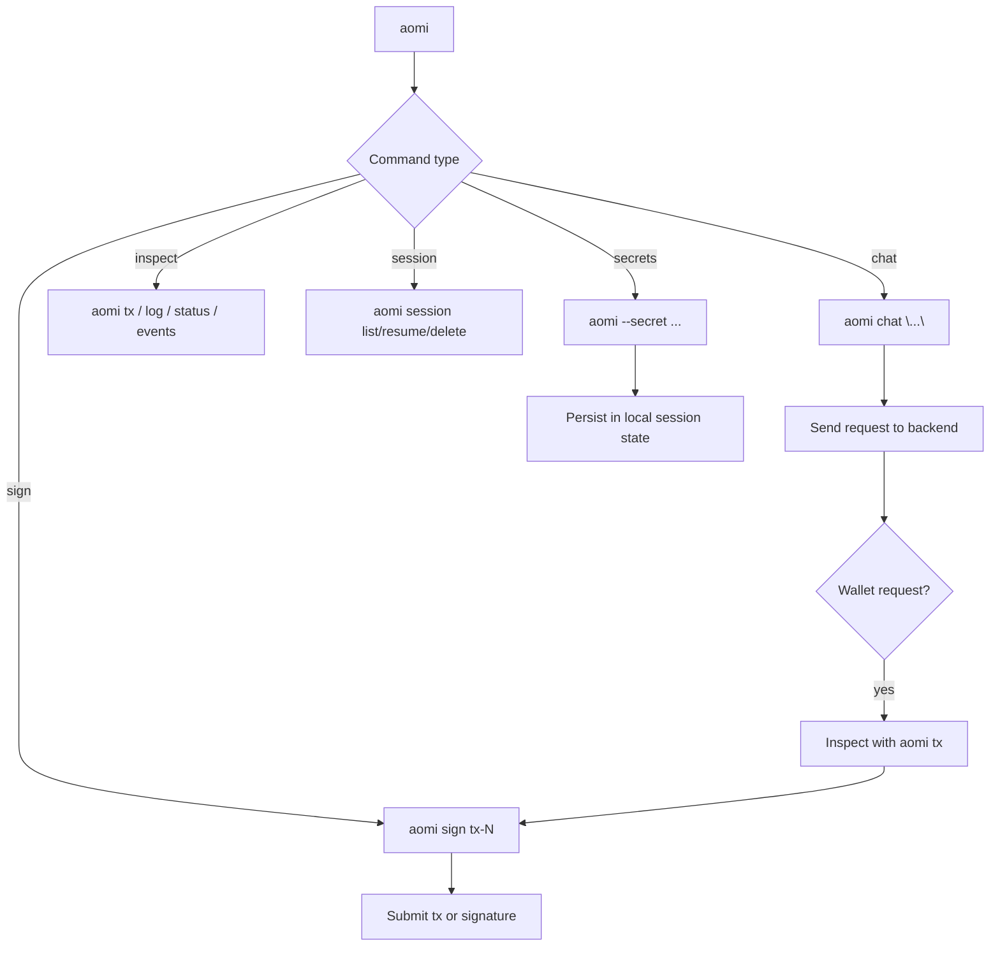
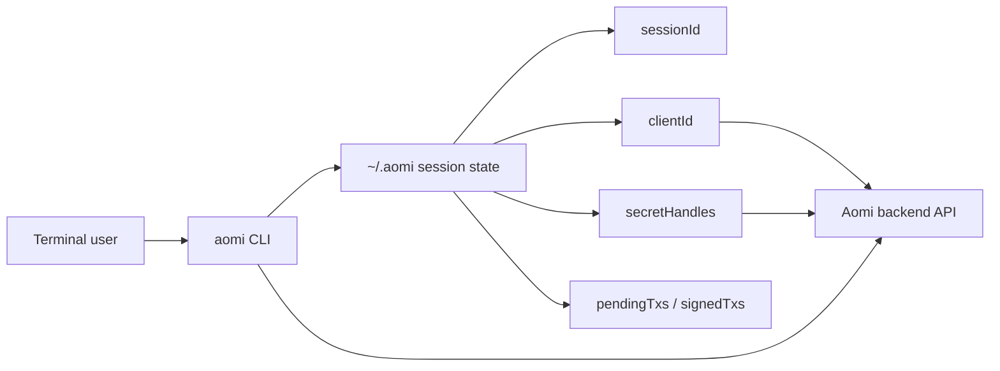

The Aomi CLI ships with `@aomi-labs/client` and exposes the `aomi` executable. Use it to chat with an Aomi backend, persist sessions, inspect wallet requests, and manage secrets.

## Installation

### One-off

```bash
npx @aomi-labs/client --help
```

### Global

```bash
npm install -g @aomi-labs/client
aomi --version
```

## Core Commands



### chat

```bash
aomi chat "swap 1 ETH for USDC"
aomi chat "swap 1 ETH for USDC" --model claude-sonnet-4
aomi chat "swap 1 ETH" --verbose
```

### app

```bash
aomi app list
aomi app current
```

### model

```bash
aomi model list
aomi model current
aomi model set claude-sonnet-4
```

### chain

```bash
aomi chain list
```

### secret

```bash
aomi --secret ALCHEMY_API_KEY=sk_live_123 TENDERLY_ACCESS_TOKEN=tok_456
aomi --secret ALCHEMY_API_KEY=sk_live_123 chat "check my wallet"
aomi secret list
aomi secret clear
```

### session

```bash
aomi session list
aomi session resume session-2
aomi session delete session-2
```

### sign

```bash
aomi sign tx-1 --private-key 0x...
```

### Other

```bash
aomi log       # View local log
aomi tx        # View pending transactions
aomi status    # Session state summary
aomi events    # View system events
aomi close     # Close active session
```

## Transaction Flow

```bash
$ aomi chat "swap 1 ETH for USDC on Uniswap" --public-key 0xYourAddr --chain 1
⚡ Wallet request queued: tx-1

$ aomi tx
Pending (1):
  ⏳ tx-1  to: 0x3fC9...7FAD  value: 1000000000000000000  chain: 1

$ aomi sign tx-1 --private-key 0xabc...
✅ Sent! Hash: 0xabc123...
```

### Signing Modes

| Mode | Description |
| --- | --- |
| default | Account abstraction first, automatic EOA fallback |
| `--aa` | Require AA, no fallback |
| `--eoa` | Force direct EOA execution |

Additional AA flags:

| Flag | Description |
| --- | --- |
| `--aa-provider alchemy\|pimlico` | AA provider selection |
| `--aa-mode 4337\|7702` | AA mode selection |

You can further constrain AA execution:

| Flag | Description |
| --- | --- |
| `--aa-provider alchemy\|pimlico` | AA provider selection |
| `--aa-mode 4337\|7702` | AA mode selection |

## Options

| Flag | Env | Description |
| --- | --- | --- |
| `--backend-url` | `AOMI_BACKEND_URL` | Backend URL |
| `--api-key` | `AOMI_API_KEY` | API key for non-default apps |
| `--app` | `AOMI_APP` | App name |
| `--model` | `AOMI_MODEL` | Model to use |
| `--secret <NAME=value>` | — | Ingest secret values |
| `--public-key` | `AOMI_PUBLIC_KEY` | Wallet address |
| `--private-key` | `PRIVATE_KEY` | Hex private key for signing |
| `--rpc-url` | `CHAIN_RPC_URL` | RPC URL for tx submission |
| `--chain` | `AOMI_CHAIN_ID` | Chain ID |
| `--verbose, -v` | — | Stream tool calls live |
| `--version, -V` | — | Print version |

## Session State

The CLI stores session files under `~/.aomi/`:

- `sessionId` — active backend conversation
- `clientId` — stable client identity for secret handles
- `model` — last selected model
- `publicKey` — persisted wallet address
- `chainId` — persisted active chain
- `secretHandles` — ingested secret handles for the session
- `pendingTxs` — unsigned wallet requests
- `signedTxs` — completed transactions



## Examples

```bash
# Start a session
aomi chat "hello"

# Switch models
aomi model set gpt-5

# Inject a secret, then use it immediately
aomi --secret ALCHEMY_API_KEY=sk_live_123 chat "simulate a swap on Base"

# Review local session state
aomi status
aomi log

# Close the active local session pointer
aomi close
```

## Next Steps

- [CLI Usage](/guides/cli-usage) — CLI usage guide for development
- [Integration Guide](/guides/integration) — full platform walkthrough
- [Evals & Testing](/guides/evals-testing) — test assistant behavior
