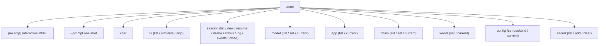
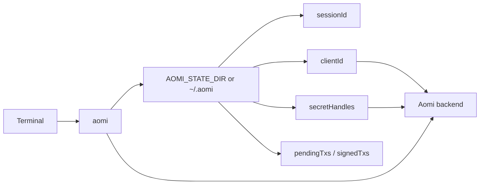

The `aomi` command ships inside the **@aomi-labs/client** npm package. You use it to chat with an Aomi backend, keep a session across runs, inspect wallet requests, sign and submit transactions, and manage per session secrets.

<Warning>
This is the **client** CLI. It talks to a running Aomi backend. It is not the builder toolchain.

If you are building and shipping an Agentic Application, you want the Rust SDK tools `aomi-build`, `aomi-run`, and `aomi-git` instead. See [the builder toolchain](/reference/cli-toolchain) for those. This page covers only the npm `aomi` client.
</Warning>

The package is published as `@aomi-labs/client` and registers one binary named `aomi`.

## Install

<Tabs>
<Tab title="Run once with npx">
```bash
npx @aomi-labs/client --version
npx @aomi-labs/client --help
```
</Tab>
<Tab title="Global">
```bash
npm install -g @aomi-labs/client
aomi --version
```
</Tab>
<Tab title="pnpm">
```bash
pnpm add @aomi-labs/client
pnpm exec aomi --version
```
</Tab>
</Tabs>

Examples below use `aomi` for brevity. To run a command once without installing, prefix it with `npx @aomi-labs/client`.

## Two ways to run it

The root command has two modes plus a set of noun verb subcommands.

<CardGroup cols={2}>
<Card title="Interactive REPL" icon="terminal">
Run `aomi` with no arguments to open a prompt. Type messages, or use slash commands like `/app`, `/model`, and `/key`. Requires a TTY.
</Card>
<Card title="Single message and scripting" icon="bolt">
Run `aomi --prompt "..."` to send a single message and exit, or use a subcommand such as `aomi tx sign` or `aomi secret add` for non interactive flows.
</Card>
</CardGroup>

### Interactive REPL

```bash
aomi
```

This opens a prompt. Anything that is not a slash command is sent to the agent as a message. The REPL needs a real terminal. In a non TTY environment (a pipe or CI job), use `--prompt` instead.

Slash commands available inside the REPL:

| Command | What it does |
| --- | --- |
| `/heap` | Show the REPL help |
| `/app <name>` | Switch the active app |
| `/model <rig>` | Set the active backend model |
| `/model list` | Show available models |
| `/model show` | Show the current model |
| `/key <provider:key>` | Save a BYOK provider key |
| `/key show` | Show BYOK provider key status |
| `/key clear` | Clear all BYOK provider keys |
| `:exit` (or `:quit`) | Quit the CLI |

### Single prompt

```bash
aomi --prompt "swap 1 ETH for USDC"
aomi -p "what is the price of ETH?"
aomi --prompt "hello" --show-tool
```

Pass `--show-tool` to print tool output while running in prompt or REPL mode.

You can save a bring your own key provider key before the prompt runs:

```bash
aomi --provider-key anthropic:sk-ant-... --prompt "hello"
```

## Commands



### chat

Send one message and print the response, then exit.

```bash
aomi chat "swap 1 ETH for USDC"
aomi chat "swap 1 ETH for USDC" --model claude-sonnet-4
aomi chat "swap 1 ETH" --verbose
```

The message is a positional argument. `--verbose` (or `-v`) streams agent responses, tool calls, and events live. Without it, only the final agent message prints.

### tx

Manage the transactions the backend hands back as wallet requests.

| Command | What it does |
| --- | --- |
| `aomi tx list` | List pending and signed transactions |
| `aomi tx simulate [txIds...]` | Simulate a batch of pending transactions |
| `aomi tx sign [txIds...]` | Sign and submit pending transactions |

`tx simulate` and `tx sign` take zero or more transaction IDs as positional arguments. See [Transaction flow](#transaction-flow) and [Signing modes](#signing-modes) below.

### session

The CLI is not a long running process. Each command starts, runs, and exits. Session state lives locally between runs so the next command continues the same conversation.

| Command | What it does |
| --- | --- |
| `aomi session list` | List local sessions with metadata |
| `aomi session new` | Start a fresh session and make it active |
| `aomi session resume <id>` | Resume a local session by ID or `session-N` |
| `aomi session delete <id>` | Delete a local session by ID or `session-N` |
| `aomi session status` | Show current session state |
| `aomi session log` | Show conversation history |
| `aomi session events` | List system events |
| `aomi session close` | Close the current session |

```bash
aomi session list
aomi session resume session-2
aomi session log
aomi session status
aomi session close
```

### model

Discover and switch backend models for the active session.

| Command | What it does |
| --- | --- |
| `aomi model list` | List models available to the current backend |
| `aomi model set <rig>` | Set the active model for the current session |
| `aomi model current` | Show the current model |

```bash
aomi model list
aomi model set claude-sonnet-4
aomi model current
```

`aomi model set` persists the selected model in local session state after the backend confirms the change. `aomi chat --model ...` applies the model before sending and updates that persisted state too.

### app

| Command | What it does |
| --- | --- |
| `aomi app list` | List available apps |
| `aomi app current` | Show the current app |

```bash
aomi app list
aomi app current
```

<Note>
There is no `aomi app use` or `aomi app set` command. Switch apps with the `--app <name>` flag on a command, the `AOMI_APP` environment variable, or `/app <name>` inside the REPL.
</Note>

### chain

| Command | What it does |
| --- | --- |
| `aomi chain list` | List supported chains |
| `aomi chain set <id>` | Persist the active chain ID |
| `aomi chain current` | Show the active chain ID |

```bash
aomi chain list
aomi chain set 137
aomi chain current
```

For a single chain specific command, you can also pass `--chain <id>` on that command, or set `AOMI_CHAIN_ID` to share a chain across several commands. Run `aomi chain list` to see the chains your backend accepts.

### wallet

| Command | What it does |
| --- | --- |
| `aomi wallet set <privateKey>` | Persist a signing key and its derived wallet address |
| `aomi wallet current` | Show the configured wallet address |

```bash
aomi wallet set 0xYourPrivateKey
aomi wallet current
```

### config

| Command | What it does |
| --- | --- |
| `aomi config set-backend <url>` | Persist the backend base URL |
| `aomi config current` | Show the configured backend URL |

```bash
aomi config set-backend https://my-backend.example.com
aomi config current
```

### secret

Ingest per session secrets so the backend uses opaque handles instead of raw values.

| Command | What it does |
| --- | --- |
| `aomi secret list` | List configured secrets for the active session |
| `aomi secret add NAME=value [NAME=value ...]` | Add one or more secrets |
| `aomi secret clear` | Clear all secrets for the active session |

```bash
aomi secret add ALCHEMY_API_KEY=sk_live_123
aomi secret add ALCHEMY_API_KEY=sk_live_123 TENDERLY_ACCESS_TOKEN=tok_456
aomi secret list
aomi secret clear
```

<Warning>
There is no `aomi secret set` command and no top level `--secret` flag. Add secrets only through `aomi secret add NAME=value`. Each value must use the `NAME=value` shape, or the command exits with an error.
</Warning>

To start a clean secret context, combine with `--new-session`:

```bash
aomi secret add ALCHEMY_API_KEY=sk_live_123 --new-session
aomi --prompt "simulate a swap on Base"
```

## Transaction flow

The backend builds transactions. The CLI persists them locally, then signs and submits them when you choose.

<Steps>
<Step title="Chat and queue a request">
```bash
aomi chat "swap 1 ETH for USDC on Uniswap" --public-key 0xYourAddr --chain 1
```
When the agent needs a signature, the request is queued locally as `tx-1`. The CLI prints the destination, value, and chain.
</Step>
<Step title="Inspect pending transactions">
```bash
aomi tx list
```
```text
Pending (1):
  ⏳ tx-1  to: 0x3fC91A3afd70395Cd496C647d5a6CC9D4B2b7FAD  value: 1000000000000000000  chain: 1  (2:14:07 PM)
```
</Step>
<Step title="Sign and submit">
```bash
aomi tx sign tx-1 --private-key 0xYourPrivateKey
```
The CLI signs, submits, prints the hash, and notifies the backend.
</Step>
</Steps>

The same flow handles EIP-712 typed data signatures. When the backend asks for a typed signature (for example a CoW Protocol order or a permit approval), it appears in `aomi tx list` with kind `eip712_sign`. The same `aomi tx sign` command handles both kinds.

## Signing modes

By default `aomi tx sign` tries account abstraction first and falls back to direct EOA signing if AA is unavailable or fails. You can force a mode.

| Flag | Behavior |
| --- | --- |
| (default) | AA first, automatic EOA fallback |
| `--aa` | Require AA. Error if no AA provider is configured |
| `--eoa` | Force direct EOA execution, skip AA |

You can also constrain the AA provider and mode:

| Flag | Accepted values |
| --- | --- |
| `--aa-provider <name>` | `alchemy` or `pimlico` |
| `--aa-mode <mode>` | `4337` or `7702` |

`--aa` and `--eoa` are mutually exclusive. `--aa-provider` and `--aa-mode` cannot be combined with `--eoa`.

```bash
aomi tx sign tx-1 --private-key 0xYourPrivateKey --rpc-url https://eth.llamarpc.com
aomi tx sign tx-1 --aa --aa-provider alchemy --aa-mode 7702
aomi tx sign tx-1 --eoa
```

<Note>
For Solana sign requests, pass a Solana keypair with `--solana-private-key` (a base58 secret key, or a JSON byte array), or set `SOLANA_PRIVATE_KEY`.
</Note>

## Flags and environment variables

These global flags work on the root command and on the subcommands. Flags take priority over environment variables.

| Flag | Env variable | Description |
| --- | --- | --- |
| `--backend-url <url>` | `AOMI_BACKEND_URL` | Backend base URL |
| `--api-key <key>` | `AOMI_API_KEY` | API key for non default apps |
| `--app <name>` | `AOMI_APP` | Active app |
| `--model <rig>` | `AOMI_MODEL` | Model to apply for the session |
| `--new-session` | n/a | Create a fresh active session for this command |
| `--chain <id>` | `AOMI_CHAIN_ID` | Active chain for chat and session context |
| `--public-key <address>` | `AOMI_PUBLIC_KEY` | Wallet address, so the agent knows your wallet |
| `--private-key <hex>` | `PRIVATE_KEY` | Hex signing key for `aomi tx sign` |
| `--solana-private-key <key>` | `SOLANA_PRIVATE_KEY` | Solana keypair for Solana sign requests |
| `--rpc-url <url>` | `CHAIN_RPC_URL` | RPC URL for transaction submission |
| `--aa-provider <name>` | `AOMI_AA_PROVIDER` | AA provider: `alchemy` or `pimlico` |
| `--aa-mode <mode>` | `AOMI_AA_MODE` | AA mode: `4337` or `7702` |

Root command only flags:

| Flag | Description |
| --- | --- |
| `-p`, `--prompt <prompt>` | Send a single prompt and exit |
| `--show-tool` | Show tool output in prompt or REPL mode |
| `--provider-key <provider:key>` | Save a BYOK provider key before running |
| `-v`, `--version` | Print the installed CLI version |

`--verbose` (`-v`) is available on `aomi chat` to stream tool calls and responses live.

<Note>
If you pass both `--public-key` and `--private-key`, the CLI checks that the public key matches the address derived from the private key and exits if they disagree. If you pass only `--private-key`, it derives the public key for you.
</Note>

### Wallet connection

Pass `--public-key` so the agent knows your address. This lets it build transactions and read your balances. The address is saved in state, so later commands in the same session do not need it again.

```bash
aomi chat "send 0 ETH to myself" \
  --public-key 0x5D907BEa404e6F821d467314a9cA07663CF64c9B
```

### Fresh sessions

Use `--new-session` when a command should start a fresh backend and local session instead of reusing the active one.

```bash
aomi chat "show my balances" --new-session
aomi secret add ALCHEMY_API_KEY=... --new-session
aomi session new
```

## How state works

The CLI is not a daemon. Each command starts, runs, and exits. Conversation history lives on the backend. Between runs, the CLI persists local state under `AOMI_STATE_DIR`, or `~/.aomi` by default.

| Field | Purpose |
| --- | --- |
| `sessionId` | Which conversation to continue |
| `clientId` | Stable client identity used for session secret handles |
| `model` | Last model successfully applied to the session |
| `publicKey` | Wallet address from `--public-key` |
| `chainId` | Active chain ID from `--chain` |
| `secretHandles` | Opaque handles returned for ingested secrets |
| `pendingTxs` | Unsigned transactions waiting for `aomi tx sign` |
| `signedTxs` | Completed transactions with hashes or signatures |



Individual session files live under `<state dir>/sessions/`, with a pointer to the active session stored in the state root.

```bash
aomi chat "hello"           # creates a session, saves sessionId
aomi chat "swap 1 ETH"      # reuses the session, queues tx-1 on a wallet request
aomi tx sign tx-1           # signs tx-1, moves it to signedTxs, notifies the backend
aomi tx list                # shows all transactions
aomi session close          # clears the active local session pointer
```

## Common tasks

A few flows you will reach for often. Each uses the commands documented above.

### Chat with your App locally

Sanity check a preamble or a new tool before you deploy. The CLI talks to your App as deployed on the backend, so deploy a change first, then check it here.

```bash
aomi --app mycoindex                                        # open the REPL
aomi --prompt "what is the price of ETH?" --app mycoindex   # or one shot
```

Add `--verbose` to watch which tools the model calls and what they return. Run `aomi session log` to read the whole exchange back, tool results included.

### Compare models

Run the same prompt across models without starting over.

```bash
aomi model list
aomi model set gpt-5
aomi chat "summarize my portfolio risk" --model claude-sonnet-4
```

### Debug a tool call

When the model does not call the tool you expect, run the chat in verbose mode to see the tool calls, their arguments, and the raw results live.

```bash
aomi chat "what is the price of ETH?" --verbose
```

### Simulate before you sign

When a chat asks the agent to act onchain, the transaction is queued locally. Simulate it before signing so no funds move until you are happy with the result. See [Transaction flow](#transaction-flow) for the full walkthrough.

### Inspect or resume a session

Each conversation is a session, kept locally so you can pick it up later.

```bash
aomi session list
aomi session resume session-1
aomi session status
```

## Next steps

<CardGroup cols={2}>
<Card title="Trade on Aomi" href="/trade/execution" icon="arrow-right-arrow-left">
How the agent turns a prompt into a simulated, signed onchain trade.
</Card>
<Card title="The builder toolchain" href="/reference/cli-toolchain" icon="wrench">
The Rust toolchain for building and shipping Apps: `aomi-build`, `aomi-run`, `aomi-git`.
</Card>
</CardGroup>
