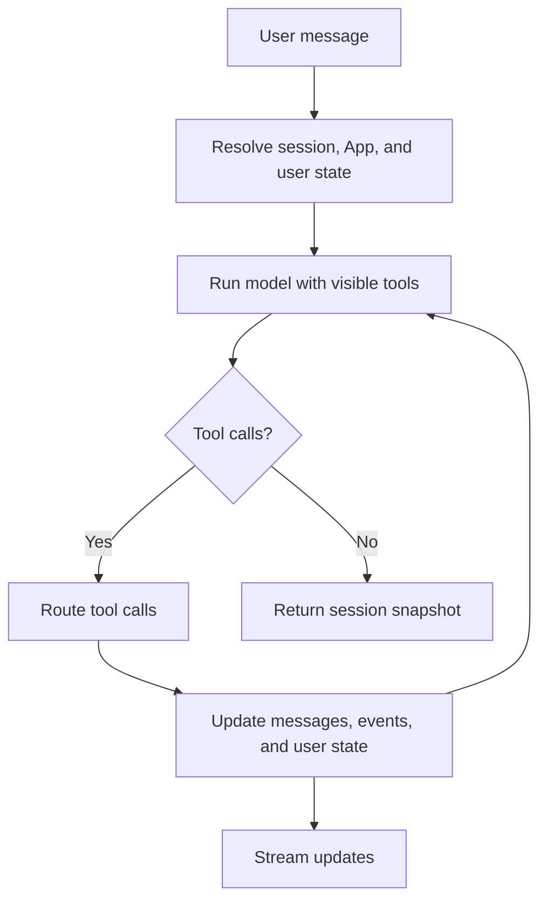

The Aomi runtime is the hosted execution environment for Apps.

You build an **Agentic Application** as a Rust plugin. Aomi loads it, exposes its tools to the model, tracks session state, manages wallet-aware actions, and streams updates back to clients.

This page explains the public execution model. It focuses on the behavior you can rely on when you build, integrate, or test an App.

<Note>
You do not run the hosted runtime yourself. You ship an App and call Aomi through the widget, the headless library, the HTTP API, the CLI, or another supported surface.
</Note>

## What the runtime owns

The runtime owns the control plane around your App:

| Area | What Aomi handles |
| --- | --- |
| App selection | Resolves which App should handle a session and loads its tool surface. |
| Model loop | Sends context and tool definitions to the selected model, then repeats until the turn finishes. |
| Tool routing | Routes tool calls to your App, Aomi host capabilities, activated skills, or external tool surfaces. |
| User state | Tracks wallet identity, chain context, pending transactions, pending signatures, and simulation status. |
| Safety flow | Stages transactions, simulates them, and asks the user's wallet to sign only after the safety checks pass. |
| Events | Emits streaming text, tool updates, wallet requests, callbacks, errors, and notices. |
| History | Returns the current session snapshot so clients can render messages and state. |

Your App owns its own domain logic. A tool can read an API, build transaction parameters, normalize data, or return route instructions. The runtime decides how that work fits into the session.

## Turn lifecycle

A turn starts when a user sends a message. The runtime resolves the session, target App, wallet context, and model selection before it starts the model loop.



A single user message can produce multiple model passes. After each tool call, the runtime adds the tool result to the conversation context and lets the model continue. The turn ends when the model stops calling tools or the request is interrupted.

## The model and tool loop

The model does not call your Rust code directly. It receives tool definitions and returns structured tool calls. The runtime validates and routes those calls.

For each model pass, the runtime provides:

- The App preamble.
- The visible conversation history.
- The current user state.
- Your App's tools.
- Any active Aomi host capabilities.
- Any skills that are available for that turn.

When the model calls a tool, the runtime records the canonical tool name, the arguments, and the result. This structured record is what testing and reporting use. Do not rely on rendered transcript text as the only source of truth.

## App tools and host capabilities

An App contributes custom tools. Aomi contributes host capabilities.

Custom tools are the functions you define with `DynAomiTool`. They should return stable JSON and clear errors. They should not sign transactions or hold private keys.

Host capabilities provide runtime-owned actions such as:

- Reading wallet and chain context.
- Staging transactions.
- Simulating staged transactions.
- Requesting wallet approval.
- Handling wallet callbacks.
- Managing pending transaction and signature state.

Your App declares which host namespaces it needs. A read-only App can use no host namespaces. A wallet-aware App can ask for the EVM host surface.

See [Building an App](/reference/building-apps) and [SDK reference](/reference/sdk-api) for the authoring contract.

## User state

User state is the runtime's session-local control plane. It is more than chat history.

For wallet-aware Apps, user state can include:

- The connected wallet address.
- The active chain.
- Pending EVM transactions.
- Pending signature requests.
- Simulation results for staged actions.
- Callback results from the user's wallet.

This state is host-owned. The model can ask the host to stage an action and can reference the resulting IDs. It should not invent pending IDs, rebuild calldata after staging, or claim that an action executed before wallet or chain evidence exists.

## Transaction harness

The transaction harness is the runtime flow that turns a model-planned action into a user-reviewed onchain action.

The EVM flow is:

```mermaid
flowchart LR
    PROMPT[User intent] --> PLAN[Model plans action]
    PLAN --> STAGE[stage_tx]
    STAGE --> PENDING[Host stores pending tx id]
    PENDING --> SIMULATE[simulate_batch]
    SIMULATE --> REVIEW[User reviews result]
    REVIEW --> COMMIT[commit_txs]
    COMMIT --> WALLET[Wallet request]
    WALLET --> CALLBACK[Wallet callback]
    CALLBACK --> CLEANUP[Runtime updates state]
```



The important boundary is ownership:

- `stage_tx` creates a host-owned pending transaction record.
- `simulate_batch` simulates stored pending transactions by ID.
- `commit_txs` asks the user's wallet to approve and submit the staged action.
- The wallet callback proves whether the user approved, rejected, or completed the request.

<Warning>
Staging is not signing. Simulation is not signing. Commit creates a wallet request, but the action is not complete until the wallet callback or chain evidence confirms it.
</Warning>

For transaction details, see [Simulation Reference](/reference/simulation) and [Non-custodial wallets](/concepts/non-custodial-wallets).

## Simulation before signing

Aomi simulates transaction batches before they reach the user's wallet.

Simulation uses the pending transaction records stored by the runtime. This matters because the stored record is authoritative. The model does not get to replace the transaction body during simulation or commit.

Batch simulation also preserves ordering. If an App stages an approval and then a swap, the swap simulation sees the approval state from the earlier simulated step.

If simulation fails, the runtime returns the failure to the model and the user instead of prompting the wallet to sign.

## Wallet events and callbacks

Wallet work crosses an async boundary.

When a commit step creates a wallet request, the runtime emits an event to the client. The client asks the user's wallet to approve or reject the action. Then the client sends a callback back to Aomi.

Callbacks let the runtime:

- Clear completed or rejected pending actions.
- Add callback evidence to the session.
- Wake the model for any follow-up work.
- Return an updated session snapshot.

This is why wallet-aware flows should be tested with more than final text. You need evidence that the right wallet request was emitted and that the callback path handled the outcome.

## Streaming and session snapshots

Chat endpoints return the current session snapshot. Clients use that snapshot to render messages, user state, and processing status.

For live updates, subscribe to the Server-Sent Events channel:

```http
GET /api/updates
X-Session-Id: <session-id>
Accept: text/event-stream
```

Common event types include:

| Event | Meaning |
| --- | --- |
| `title_changed` | The session title changed. |
| `tool_update` | A tool produced an update or result. |
| `tool_complete` | A tool finished. |
| `system_notice` | The runtime has a user-facing notice. |

Most clients pair SSE with `GET /api/state` so they can fetch the latest full snapshot after an event.

See [API Reference](/reference/api-reference#subscribe-to-updates) and [Sessions](/reference/sessions) for endpoint details.

## Next steps

Use this page for the runtime execution model. Use the deeper references when you need a narrower contract:

- [Sessions](/reference/sessions): session IDs, threads, state snapshots, and session APIs.
- [Simulation Reference](/reference/simulation): transaction simulation and failure handling.
- [API Reference](/reference/api-reference): HTTP endpoints and payloads.
- [SDK reference](/reference/sdk-api): App authoring, `DynAomiTool`, and `dyn_aomi_app!`.
- [Builder toolchain](/reference/cli-toolchain): local App testing and toolchain commands.
