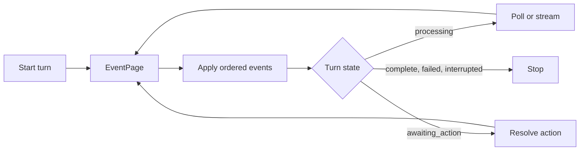

The Aomi runtime is the hosted execution environment for Apps. You ship a Rust
plugin. The runtime loads its manifest, gives the model its tools and preamble,
and records each turn as an ordered event log.

Use the [Agent REST API](/api-reference/agent) or a supported client to drive
this runtime. Use the stateless [Pipeline REST API](/api-reference/pipeline)
when your application needs deterministic operation discovery and
build → simulate → commit without a model turn.

## What an App contributes

A plugin contributes:

- a stable App name and version;
- a preamble that defines its role and workflow;
- typed `DynAomiTool` implementations;
- optional secret declarations and host namespaces; and
- optional routed follow-up hints in a `ToolReturn`.

The host owns model orchestration, session history, authorization, action
review, signing policy, and event delivery. Plugin tools receive
`DynToolCallCtx`; they do not receive private keys and must never log or
return injected credential values.

## Turn lifecycle

A turn starts with `POST /v1/agent/chat`. The body contains a message and may
select an App, application ID, mode, model, user state, or an existing cursor.
The mutation requires an `Idempotency-Key`.


```mermaid
flowchart LR
    START[Start turn] --> PAGE[EventPage]
    PAGE --> APPLY[Apply ordered events]
    APPLY --> STATE{Turn state}
    STATE -->|processing| POLL[Poll or stream]
    STATE -->|awaiting_action| REVIEW[Resolve action]
    STATE -->|complete, failed, interrupted| DONE[Stop]
    POLL --> PAGE
    REVIEW --> PAGE
```

If you omit a session ID, the service derives a stable one from the accepted
request and idempotency key. A retry of the same logical request therefore
reuses the same turn instead of starting another one.

Each response is an `EventPage`:

```json
{
  "session_id": "session-123",
  "cursor": "opaque-cursor",
  "events": [],
  "has_more": false,
  "commits": []
}
```

Treat `cursor` as opaque. Apply events in their returned order and continue
while `has_more` is true or the latest `turn_state_changed` event is
`processing`.

## Event contract

Every durable event has a concrete `type`. The public union includes:

- `message` and `turn_state_changed`;
- `tool_update` and `tool_complete`;
- task lifecycle events;
- `title_changed` and `error`; and
- `action`.

An action is a durable review boundary. It includes an ID, revision, state,
typed request, and optional typed result. Its states are `pending`,
`submitted`, `completed`, `rejected`, `expired`, and `failed`.

Resolve it through
`POST /v1/agent/chat/{sessionId}/actions/{actionId}/result` with the exact
revision and a typed result. The route requires the
`agent:actions:resolve` scope and an idempotency key. Do not replace the
reviewed request with caller-authored transaction fields.

## Routed plugin returns

A plugin can return a `ToolReturn` with route steps. An immediate step fires
after the tool returns. A deferred step can wait for a named artifact bound by
an earlier step.

Route metadata is a host-managed continuation hint. It does not bypass policy
or approval. Preserve the arguments and callback artifacts emitted by the
tool. The host binds wallet and execution results into the declared alias, so
plugin code should not reconstruct signatures, transaction hashes, quote IDs,
or route IDs.

## User state

Client-supplied `userState` is a bounded projection with these top-level
blocks:

| Block | Purpose |
| --- | --- |
| `connection` | Connection provider and authentication method |
| `evm` | EVM address, chain, and broadcaster preference |
| `svm` | SVM address, cluster, transport, capabilities, and broadcaster preference |
| `preferences` | Client preferences |
| `ext` | Explicit extension data |

Pending transactions, pending signatures, action state, and simulation records
are host-owned. Do not send them inside `userState`.

## Polling and streaming

`GET /v1/agent/chat/{sessionId}` returns another durable event page. The
optional integer `wait` query parameter is measured in milliseconds and is bounded to `30000`; clients commonly request `wait=25000`.

`GET /v1/agent/chat/{sessionId}/stream` emits:

| SSE event | Payload |
| --- | --- |
| `page` | A durable `EventPage` with the next reconnect cursor |
| `message` | A transient live message snapshot |
| `resync` | A signal to fetch a durable page again |

Persist only cursors from `page` events. Reconcile from the durable log after
a disconnect or `resync`.

## Related references

- [Agent REST API](/api-reference/agent)
- [Rust SDK](/build/plugins/rust-sdk)
- [Simulation reference](/reference/simulation-reference)
- [Transaction pipeline](/concepts/transaction-pipeline)
