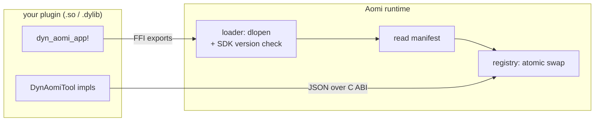

<Info>Verified against aomi-sdk@08b21f9 on 2026-06-29.</Info>

The Aomi SDK is a Rust crate for building **Apps**. An App is a dynamic plugin that the Aomi runtime hot loads at runtime as a shared library (`cdylib`) over a stable C ABI. You write typed tools in Rust, compile to a `.so` (Linux) or `.dylib` (macOS), and the runtime loads it without a restart.

<Note>
This is the public plugin surface. You build against the `aomi-sdk` crate, and your tools cross the FFI boundary as JSON. The runtime and loader are not part of this crate, so you never link against host internals. The compatibility gate is the SDK version: the host and your plugin must build against the same `aomi-sdk` version.
</Note>

## The four pieces

A minimal App needs four things:

<Steps>
<Step title="An app struct">
A marker type that ties everything together. It must be `Clone + Default + Send + Sync + 'static`. A unit struct works well.

```rust
#[derive(Clone, Default)]
struct MyApp;
```
</Step>

<Step title="A typed args struct">
Deserialized from the incoming JSON. Derive `Deserialize` and `JsonSchema`. The doc comments on each field are model facing: they become the parameter schema the LLM reads when it picks your tool.

```rust
use aomi_sdk::schemars::JsonSchema;
use serde::Deserialize;

#[derive(Debug, Deserialize, JsonSchema)]
struct GreetArgs {
    /// The name of the person to greet
    name: String,
}
```
</Step>

<Step title="A tool implementation">
A struct that implements `DynAomiTool`. This is your actual logic.

```rust
use aomi_sdk::{DynAomiTool, DynToolCallCtx};
use serde_json::Value;

struct Greet;

impl DynAomiTool for Greet {
    type App = MyApp;
    type Args = GreetArgs;
    const NAME: &'static str = "greet";
    const DESCRIPTION: &'static str = "Greet someone by name.";

    fn run(_app: &MyApp, args: GreetArgs, _ctx: DynToolCallCtx) -> Result<Value, String> {
        Ok(serde_json::json!({ "message": format!("Hello, {}!", args.name) }))
    }
}
```
</Step>

<Step title="The dyn_aomi_app! macro">
This generates the manifest, the dispatch router, and the FFI exports the host calls. You never write the C ABI by hand.

```rust
aomi_sdk::dyn_aomi_app!(
    app = MyApp,
    name = "greeter",
    version = "0.1.0",
    preamble = "You are a friendly greeter.",
    tools = [Greet],
    namespaces = ["evm-core"],
);
```
</Step>
</Steps>

## Cargo.toml

The crate must build as a `cdylib`, and it depends on `aomi-sdk`.

```toml
[lib]
crate-type = ["cdylib"]

[dependencies]
aomi-sdk = "=3.0.0"
schemars = "1"
serde = { version = "1", features = ["derive"] }
serde_json = "1"
```

<Note>
Pin `aomi-sdk` exactly (`=3.0.0`), not with a caret range. The runtime gates plugin loading on an exact SDK version match, so the pin must equal the platform's `required_sdk_version` (see `platform.json` in the platform repo). A mismatch fails before your App ever loads.
</Note>

<Warning>
Pin the platform requirement, not the crate's own version. The `aomi-sdk` crate ships at `3.0.1`, but the community platform requires `=3.0.0`. Match `platform.json`'s `required_sdk_version`, today `=3.0.0`, not the crate's latest.
</Warning>

<Note>
`aomi-sdk` exports `schemars` and `serde_json` again from inside itself, so your tool code can reach them through the crate (for example `aomi_sdk::schemars::JsonSchema`) without managing version alignment yourself.
</Note>

## The `DynAomiTool` trait

Every tool is one struct that implements `DynAomiTool`. The trait carries two associated types, three consts, and the run methods.

```rust
pub trait DynAomiTool: Send + Sync + 'static {
    type App: DynAomiApp;
    type Args: DeserializeOwned + JsonSchema + Send + 'static;

    const NAME: &'static str;
    const DESCRIPTION: &'static str;
    const IS_ASYNC: bool = false;

    fn run(_app: &Self::App, _args: Self::Args, _ctx: DynToolCallCtx)
        -> Result<Value, String>;

    fn run_async(_app: &Self::App, _args: Self::Args, _ctx: DynToolCallCtx, _sink: DynAsyncSink)
        -> Result<(), String>;
}
```

| Member | What it is |
| --- | --- |
| `type App` | The app struct this tool belongs to. Ties the tool to one App. |
| `type Args` | Your typed args struct. Must derive `Deserialize` and `JsonSchema`. |
| `NAME` | The unique tool name the LLM calls, such as `get_token_price`. |
| `DESCRIPTION` | One line shown to the LLM for tool selection. Write it for the model. |
| `IS_ASYNC` | `false` by default. Set `true` to stream results over time. |
| `run` | Synchronous logic. Override this for normal tools. |
| `run_async` | Streaming logic. Override this when `IS_ASYNC = true`. |

The runtime auto generates each tool's parameter schema from `Args` using `JsonSchema`. You do not write JSON Schema by hand.

<Tip>
Prefer intent shaped names like `search_*`, `get_*`, `build_*`, and `submit_*` over raw endpoint wraps. Keep the set small. Three to eight tools per App is typical for a clean workflow.
</Tip>

### The tool context

Every `run` call receives a `DynToolCallCtx`. It is a small projection of the host context with only what your tool needs.

```rust
pub struct DynToolCallCtx {
    pub session_id: String,
    pub tool_name: String,
    pub call_id: String,
    pub state_attributes: Map<String, Value>,
    pub secrets: HashMap<String, String>,
}
```

You can read nested host attributes by path with helper methods:

```rust
fn run(_app: &MyApp, _args: Args, ctx: DynToolCallCtx) -> Result<Value, String> {
    let org_id = ctx.attribute_u64(&["user", "org_id"]).ok_or("missing org_id")?;
    let name = ctx.attribute_string(&["user", "name"]).unwrap_or_default();
    Ok(serde_json::json!({ "org_id": org_id, "name": name }))
}
```

## Async tools

For long running or streaming work, set `IS_ASYNC = true` and implement `run_async` instead of `run`. The host polls for updates through the `DynAsyncSink`. You push intermediate values with `emit`, signal the terminal result with `complete`, report a failure with `fail`, and check for host cancellation with `is_canceled`.

```rust
impl DynAomiTool for StreamingTool {
    type App = MyApp;
    type Args = StreamArgs;
    const NAME: &'static str = "stream";
    const DESCRIPTION: &'static str = "Stream results over time.";
    const IS_ASYNC: bool = true;

    fn run_async(
        _app: &MyApp,
        args: StreamArgs,
        _ctx: DynToolCallCtx,
        sink: DynAsyncSink,
    ) -> Result<(), String> {
        sink.emit(serde_json::json!({ "step": 1 })).map_err(|e| e.to_string())?;
        sink.complete(serde_json::json!({ "done": true })).map_err(|e| e.to_string())?;
        Ok(())
    }
}
```

<Warning>
Intermediate `emit` updates must be bare values. The terminal `complete` call is the only place that accepts a routed return. There is no terminal anchor for routing mid stream, so the SDK rejects routed envelopes passed to `emit`.
</Warning>

## The `dyn_aomi_app!` macro

`dyn_aomi_app!` is the one macro you call per App. It wires your tools into a dispatch router, builds the plugin manifest the host reads, and generates the FFI exports the runtime calls across the C ABI. You do not implement `DynAomiApp` or any C function by hand.

```rust
aomi_sdk::dyn_aomi_app!(
    app = MyApp,
    name = "greeter",
    version = "0.1.0",
    preamble = PREAMBLE,
    tools = [Greet, GetPrice],
    secrets = [API_KEY],
    namespaces = ["evm-core"],
);
```

| Field | Meaning |
| --- | --- |
| `app` | Your app struct. |
| `name` | The App key the runtime uses, such as `"defi"`. |
| `version` | Semver string for this App, such as `"0.1.0"`. |
| `preamble` | The system prompt injected into the LLM context for this App. |
| `tools` | The list of tool structs to register. |
| `secrets` | Optional. The named credentials this App declares. See below. |
| `namespaces` | Host namespaces this App needs. Defaults to `["evm-core"]`. |

## Secrets

If your App needs external credentials, declare them as `Secret` slots. Each slot has a canonical name in `SCREAMING_SNAKE_CASE`, a one sentence description shown in the settings UI, and a `required` flag.

```rust
use aomi_sdk::Secret;

const API_KEY: Secret = Secret::new(
    "EXCHANGE_API_KEY",
    "Exchange API key id from the dashboard.",
    true,
);

aomi_sdk::dyn_aomi_app!(
    app = MyApp,
    name = "exchange",
    version = "0.1.0",
    preamble = PREAMBLE,
    tools = [PlaceOrder],
    secrets = [API_KEY],
    namespaces = ["evm-core"],
);
```

The host reads the declared slots from your manifest. When a slot is `required: true`, the host gates App load on the user having filled that slot in the runtime secret vault. At tool call time the host pre resolves the slots and injects the raw values into `ctx.secrets`. Your tool reads them with `resolve_secret_value`, which never logs, persists, or echoes the value to the model.

`resolve_secret_value` checks three sources in order and returns your `missing_message` if none resolve:

<Steps>
<Step title="Explicit argument">
The value the caller passed in, if any.
</Step>
<Step title="Injected vault secret">
`ctx.secrets[name]`, injected by the host from the per App vault.
</Step>
<Step title="Environment variable">
A fallback `name` env var, used by the CLI and tests where no vault is in scope.
</Step>
</Steps>

```rust
let key = aomi_sdk::resolve_secret_value(
    &ctx,
    args.api_key.as_deref(),
    "EXCHANGE_API_KEY",
    "Set EXCHANGE_API_KEY in your Aomi settings to use this tool.",
)?;
```

## Host namespaces

The `namespaces` field lists host side capability sets the runtime injects alongside your own tools. The default is `["evm-core"]`, which most Apps want for EVM wallet flows.

| You want to… | Set namespaces to |
| --- | --- |
| Use the default EVM wallet flow | omit the field, or `["evm-core"]` |
| Ship a namespace only App (no wallet flow) | `["database"]` |
| Opt out of host namespaces entirely | `[]` |

## How the runtime hot loads your plugin

You ship a compiled `.so` or `.dylib`. The runtime does the rest. It calls the generated FFI exports across the C ABI, reads your manifest, validates the SDK version, and serves tool calls. When a new build arrives, the runtime swaps it in atomically.



All data crosses the boundary as JSON serialized C strings. Active chat sessions keep the old plugin while new sessions pick up the new one, so a reload needs no restart.

## Testing your tools

The `aomi_sdk::testing` module lets you unit test tools without loading the full FFI plugin. Build a context with `TestCtxBuilder`, then call `run_tool` for sync tools or `run_async_tool` for streaming tools.

```rust
use aomi_sdk::testing::{TestCtxBuilder, run_tool};
use serde_json::json;

#[test]
fn greet_returns_message() {
    let ctx = TestCtxBuilder::new("greet").build();
    let result = run_tool::<Greet>(&MyApp, json!({ "name": "Ada" }), ctx);
    assert!(result.is_ok());
}
```

`TestCtxBuilder` also lets you seed state attributes with `.attribute(...)` and inject a resolved secret with `.secret(...)`, so you can simulate exactly what the host would pass.

```rust
let ctx = TestCtxBuilder::new("place_order")
    .secret("EXCHANGE_API_KEY", "test-key")
    .attribute("user", json!({ "org_id": 42 }))
    .build();
```

`run_async_tool` returns `(updates, terminal)`: every non terminal `emit` value in order, plus the terminal `complete` payload.

## A full example, start to finish

A minimal greeter App, straight from the crate docs:

```rust
use aomi_sdk::{DynAomiTool, DynToolCallCtx};
use aomi_sdk::schemars::JsonSchema;
use serde::Deserialize;
use serde_json::Value;

#[derive(Clone, Default)]
struct MyApp;

#[derive(Debug, Deserialize, JsonSchema)]
struct GreetArgs {
    /// The name of the person to greet
    name: String,
}

struct Greet;

impl DynAomiTool for Greet {
    type App = MyApp;
    type Args = GreetArgs;
    const NAME: &'static str = "greet";
    const DESCRIPTION: &'static str = "Greet someone by name.";

    fn run(_app: &MyApp, args: GreetArgs, _ctx: DynToolCallCtx) -> Result<Value, String> {
        Ok(serde_json::json!({ "message": format!("Hello, {}!", args.name) }))
    }
}

aomi_sdk::dyn_aomi_app!(
    app = MyApp,
    name = "greeter",
    version = "0.1.0",
    preamble = "You are a friendly greeter.",
    tools = [Greet],
    namespaces = ["evm-core"],
);
```

The reference template at `sdk/examples/app-template-http` in the `aomi-labs/aomi-sdk` repo shows the recommended file split for a real App: `src/lib.rs` for the manifest and preamble, `src/client.rs` for the HTTP client and typed args, and `src/tool.rs` for the tool implementations.

## Next steps

<CardGroup cols={2}>
<Card title="Building an App" icon="hammer" href="/reference/building-apps">
The full workflow for authoring, structuring, and publishing an App.
</Card>
<Card title="CLI toolchain" icon="terminal" href="/reference/cli-toolchain">
`aomi-build` to scaffold, compile, and deploy plugins, and `aomi-run` to exercise them locally.
</Card>
</CardGroup>
