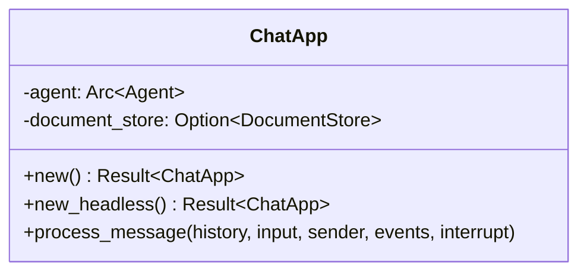

The Rust SDK provides a builder-pattern API for creating AI-powered blockchain agents. Build custom agentic applications with just a few lines of code.

## Quick Start

```rust
use aomi_runtime::{ChatApp, ChatAppBuilder};

// Minimal setup
let app = ChatApp::new().await?;

// Or with custom configuration
let app = ChatAppBuilder::new(&my_preamble).await?
    .add_tool(MyCustomTool)?
    .build(false, None, None).await?;
```

## ChatAppBuilder

### Constructor Methods

#### `new(preamble: &str)`

Creates a builder with Anthropic connection and core tools:

```rust
let builder = ChatAppBuilder::new("You are a helpful assistant.").await?;
```

Automatically registers core tools: `SendTransactionToWallet`, `EncodeFunctionCall`, `GetCurrentTime`, `CallViewFunction`, `SimulateContractCall`, `GetAccountInfo`, `GetAccountTransactionHistory`, `BraveSearch`, `GetContractABI`, `GetContractSourceCode`, `GetContractFromEtherscan`.

#### `new_with_model_connection(preamble, sender, no_tools, system_events)`

Full control over initialization:

```rust
let builder = ChatAppBuilder::new_with_model_connection(
    &preamble,
    Some(&sender_to_ui),
    false,
    Some(&system_events),
).await?;
```

#### `new_for_tests(system_events)`

Lightweight test mode without Anthropic connection:

```rust
#[cfg(test)]
let builder = ChatAppBuilder::new_for_tests(Some(&events)).await?;
let scheduler = builder.scheduler_for_tests();
```

### Builder Methods

| Method | Description |
|--------|-------------|
| `add_tool(tool)` | Register a custom tool |
| `add_docs_tool(loading_sender, sender_to_ui)` | Add RAG documentation search |
| `build(skip_mcp, system_events, sender_to_ui)` | Finalize into a `ChatApp` |

## ChatApp



### Factory Methods

```rust
// Full-featured app
let app = ChatApp::new().await?;

// For evaluation (no docs, no MCP, no tools)
let app = ChatApp::new_headless().await?;

// Custom options
let app = ChatApp::new_with_options(true, false).await?;
```

### Processing Messages

```rust
app.process_message(
    &mut history,
    user_input,
    &sender_to_ui,
    &system_events,
    &mut interrupt_receiver,
).await?;
```

## Streaming Response

```rust
use aomi_runtime::{stream_completion, ChatCommand};
use futures::StreamExt;

let mut stream = stream_completion(
    agent, handler, &input, history.clone(), system_events.clone(),
).await;

while let Some(result) = stream.next().await {
    match result {
        Ok(ChatCommand::StreamingText(text)) => {
            response.push_str(&text);
        }
        Ok(ChatCommand::ToolCall { topic, stream }) => {
            println!("Tool: {}", topic);
        }
        Ok(ChatCommand::AsyncToolResult { call_id, tool_name, result }) => {
            println!("{}: {:?}", tool_name, result);
        }
        Ok(ChatCommand::Complete) => break,
        Ok(ChatCommand::Error(e)) => eprintln!("Error: {}", e),
        Ok(ChatCommand::Interrupted) => break,
        Err(e) => eprintln!("Stream error: {}", e),
    }
}
```

### ChatCommand Variants

| Variant | Description |
| ------- | ----------- |
| `StreamingText(String)` | Incremental LLM output |
| `ToolCall { topic, stream }` | Tool invocation |
| `AsyncToolResult { call_id, tool_name, result }` | Multi-step tool result |
| `Complete` | Response finished |
| `Error(String)` | Processing error |
| `Interrupted` | User cancelled |

## System Events

### SystemEventQueue

Thread-safe event buffer for out-of-band communication:

```rust
use aomi_runtime::{SystemEventQueue, SystemEvent};

let queue = SystemEventQueue::new();
queue.push(SystemEvent::SystemNotice("Connected".into()));
queue.push(SystemEvent::InlineDisplay(json!({"type": "progress", "value": 50})));

let events = queue.slice_from(0);
```

### SystemEvent Variants

| Variant | Purpose |
| ------- | ------- |
| `InlineDisplay(Value)` | UI notifications (tool progress, wallet requests) |
| `SystemNotice(String)` | Status messages (connection status) |
| `SystemError(String)` | Error messages (API failures) |
| `AsyncUpdate(Value)` | Background updates (title changes) |

## Tool Scheduler

```rust
use aomi_tools::ToolScheduler;

let scheduler = ToolScheduler::get_or_init().await?;
scheduler.register_tool(MyTool)?;
let handler = scheduler.get_handler();
let is_multi = handler.is_multi_step("my_tool");
```

## Custom Tools

### Macro-based

```rust
use rig::tool;

#[tool(description = "Get the current price of a cryptocurrency")]
pub async fn get_crypto_price(params: GetPriceParams) -> Result<PriceResult, ToolError> {
    let price = fetch_price(&params.symbol, &params.currency).await?;
    Ok(PriceResult { symbol: params.symbol, price, currency: params.currency })
}
```

### AomiApiTool Trait

```rust
use aomi_tools::{AomiApiTool, AnyApiTool};

impl AomiApiTool for MyTool {
    type ApiRequest = MyParams;
    type ApiResponse = MyResult;
    type MultiStepResults = ();
    type Error = MyError;

    fn name(&self) -> &'static str { "my_tool" }
    fn description(&self) -> &'static str { "Does something useful" }
    fn check_input(&self, request: Self::ApiRequest) -> bool { !request.value.is_empty() }
    async fn call(&self, request: Self::ApiRequest) -> Result<Self::ApiResponse, Self::Error> {
        Ok(MyResult { })
    }
}
```

### Multi-Step Tools

```rust
use aomi_tools::MultiStepApiTool;

impl MultiStepApiTool for LongRunningTool {
    fn call_stream(&self, request: Self::ApiRequest, sender: Sender<eyre::Result<Value>>) -> BoxFuture<'static, eyre::Result<()>> {
        async move {
            sender.send(Ok(json!({"status": "starting"}))).await?;
            tokio::time::sleep(Duration::from_secs(1)).await;
            sender.send(Ok(json!({"status": "complete", "result": "done"}))).await?;
            Ok(())
        }.boxed()
    }
}
```

## Complete Example

```rust
use aomi_runtime::{ChatApp, ChatAppBuilder, SystemEventQueue, ChatCommand};
use tokio::sync::mpsc;
use futures::StreamExt;

#[tokio::main]
async fn main() -> eyre::Result<()> {
    let (tx, mut rx) = mpsc::channel::<ChatCommand>(100);
    let system_events = SystemEventQueue::new();

    let preamble = "You are a DeFi assistant. Help users with token swaps and portfolio management.";
    let app = ChatAppBuilder::new(preamble).await?
        .add_tool(GetTokenPrice)?
        .add_tool(SwapTokens)?
        .build(true, Some(&system_events), Some(&tx)).await?;

    let mut history = vec![];
    let (interrupt_tx, mut interrupt_rx) = mpsc::channel(1);

    app.process_message(
        &mut history,
        "What's the current price of ETH?".into(),
        &tx, &system_events, &mut interrupt_rx,
    ).await?;

    while let Some(cmd) = rx.recv().await {
        match cmd {
            ChatCommand::StreamingText(text) => print!("{}", text),
            ChatCommand::Complete => break,
            _ => {}
        }
    }
    Ok(())
}
```

## Next Steps

- [Building Apps](/reference/building-apps) — complete app deployment guide
- [Custom Tools](/guides/custom-tools) — detailed tool development
- [API Reference](/reference/api-reference) — HTTP API documentation
