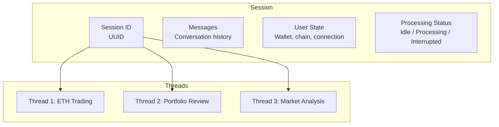
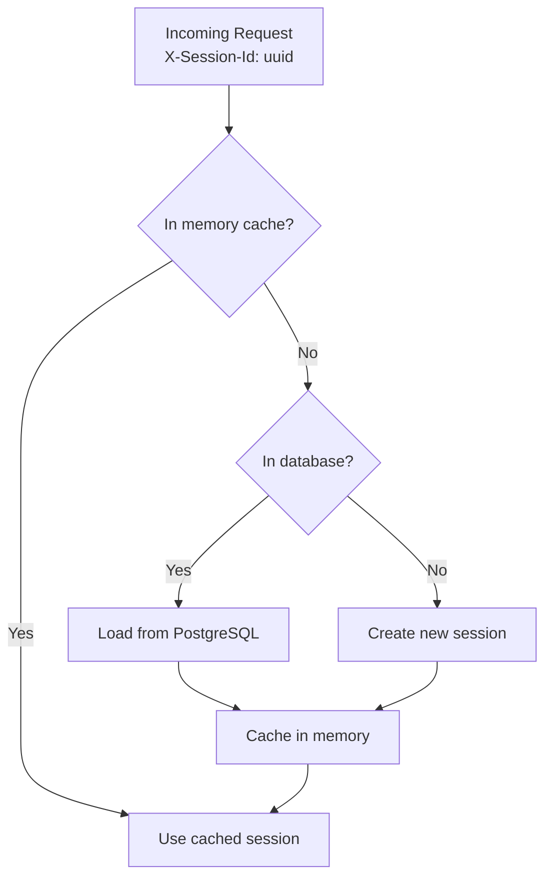
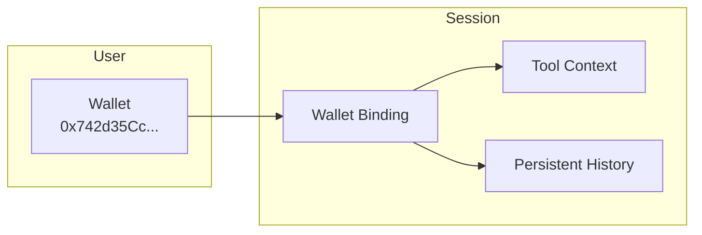

A session is a conversation thread with message history. This page covers how sessions are created, loaded, persisted, and managed.

## Overview



## Session Creation

Sessions are created by the client. The client generates a UUID and sends it as the `X-Session-Id` header.

```ts
const sessionId = crypto.randomUUID();

const response = await fetch("/api/chat?app=mycoindex", {
  method: "POST",
  headers: {
    "X-Session-Id": sessionId,
    "X-API-Key": "sk-mcd-...",
    "Content-Type": "application/json",
  },
  body: JSON.stringify({ text: "Hello" }),
});
```

If no session exists for that ID, the backend creates one automatically on the first request.

## Session Loading: Three-Tier Strategy

When a request arrives, the backend loads the session using a three-tier approach:



1. **Memory cache** — the session is already active in the server's memory. This is the fastest path and handles the common case where a user is mid-conversation.
2. **Database** — the session was previously persisted to PostgreSQL. It is loaded and cached in memory.
3. **Create new** — no prior session exists. A fresh session is created and cached.

## Message Persistence

Messages are persisted to PostgreSQL as they are exchanged. This ensures conversation history survives server restarts and enables users to resume conversations.

Each message record includes:

| Field | Type | Description |
| --- | --- | --- |
| `id` | UUID | Unique message identifier |
| `session_id` | UUID | Parent session |
| `thread_id` | UUID | Parent thread |
| `role` | string | `user`, `assistant`, or `system` |
| `content` | text | Message text content |
| `tool_calls` | JSON | Tool calls made by the assistant (if any) |
| `tool_results` | JSON | Results from tool execution (if any) |
| `created_at` | timestamp | When the message was created |

## Wallet Binding

Sessions can optionally be associated with a wallet address (public key). This enables wallet-aware behavior:



- **Tool context** — tools like `GetPortfolio` can automatically scope queries to the connected wallet.
- **Persistent history** — conversations tied to a public key persist across sessions and devices.
- **Cross-session continuity** — the assistant remembers previous interactions when the same wallet reconnects.

Wallet binding is optional. Sessions work without a wallet for non-Web3 use cases.

## Thread Management

Within a session, users can create multiple **threads** — separate conversation topics with independent message histories.

### Operations

| Operation | API Call | Description |
| --- | --- | --- |
| **Create** | `POST /api/sessions` | Start a new thread |
| **List** | `GET /api/sessions/{id}` | List all threads in a session |
| **Switch** | Client-side | Change the active thread (update `X-Session-Id`) |
| **Rename** | `PATCH /api/sessions/{id}` | Update a thread's title |
| **Delete** | `DELETE /api/sessions/{id}` | Remove a thread and its messages |

### Using the Widget

The widget's sidebar provides a thread management UI out of the box:

- Click **New Thread** to start a new conversation.
- Click a thread in the sidebar to switch to it.
- Right-click or use the menu to rename or delete threads.

### Using the Headless Lib

With `@aomi-labs/react`, manage threads programmatically:

```tsx
import { useRuntimeActions, useThreadContext } from "@aomi-labs/react";

function ThreadManager() {
  const { currentThreadId } = useThreadContext();
  const { createThread, deleteThread, selectThread, renameThread } =
    useRuntimeActions();

  return (
    <div>
      <p>Current thread: {currentThreadId}</p>
      <button onClick={() => createThread()}>New Thread</button>
      <button onClick={() => renameThread(currentThreadId, "My Topic")}>
        Rename
      </button>
    </div>
  );
}
```

## Session State

The full session state includes:

```ts
type SessionState = {
  // Conversation
  messages: Message[];
  threads: ThreadMetadata[];
  currentThreadId: string;

  // User state
  userState: {
    address: string | null; // Wallet address
    chainId: number | null; // Connected chain
    isConnected: boolean; // Wallet connection status
  };

  // Processing
  status: "idle" | "processing" | "interrupted";
  isGenerating: boolean;
};
```

### Polling State

Use the state endpoint to poll for the current session state:

```ts
const state = await fetch(
  `/api/state?session_id=${sessionId}`
).then((r) => r.json());

console.log(state.status); // "idle" | "processing"
console.log(state.userState.address); // "0x742d..." or null
```

### Real-Time Updates

For real-time updates without polling, subscribe to the SSE updates endpoint:

```ts
const events = new EventSource(
  `/api/updates?session_id=${sessionId}`,
);

events.onmessage = (event) => {
  const data = JSON.parse(event.data);
  // Handle state update
};
```

## Next Steps

- [API Reference](/reference/api-reference) — full endpoint documentation for session operations.
- [Headless Library](/guides/headless-library) — build custom session UIs with @aomi-labs/react.
- [Widget Installation](/guides/widget-installation) — install and configure the chat widget.
