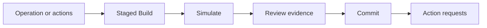

Simulation is the verification boundary between building an onchain action and
requesting authority to execute it. The public Pipeline API exposes this as a
portable, attested Build.

## Lifecycle

EVM and SVM each expose `stage`, `simulate`, `build`, and `commit`
operations under `/v1/pipeline/{chain}`.



- `stage` validates chain actions and returns a Build with
  `status: "staged"`.
- `simulate` consumes a staged Build and returns a Build with
  `status: "simulated"`.
- `build` resolves a catalog operation, stages its actions, and simulates
  them in one call.
- `commit` accepts a simulated Build, revalidates it, and returns the action
  requests needed to cross the signing or execution boundary.

Commit requires an `Idempotency-Key`. Reuse it only for retries of the same
Build.

## The Build envelope

A Build uses `version: 2` and carries:

| Field | Meaning |
| --- | --- |
| `status` | `staged` or `simulated` |
| `actions` | Ordered chain actions |
| `origin` | App, skills, and catalog operations that assembled the actions |
| `simulation` | Typed evidence on a simulated Build |
| `summary` | Optional application-facing summary |
| `expiresAt` | Unix timestamp after which commit is rejected |
| `digest` | SHA-256 identity of the Build |
| `attestation` | Server authentication of the Build, owner, and App scope |

Pass the returned Build unchanged to the next lifecycle call. Editing its
actions, order, digest, expiry, or attestation invalidates it.

## Simulation evidence

`PipelineSimulation` has a `passed` or `failed` status and concrete
collections for:

- balance changes;
- token approval changes;
- fee estimates;
- warnings;
- guard results;
- gas; and
- logs.

Render the evidence your user needs to make a decision. A passed simulation is
evidence about the proposed action; it is not signing authority.

EVM batches preserve their action order in one simulated state transition.
SVM actions keep their chain-specific transaction or instruction shape. In
both cases, commit operates on the same ordered actions and digest that were
simulated.

## Failed simulation

A failed simulation remains reviewable but cannot be committed as successful
execution. Surface the returned status, warnings, and guard results. Do not
construct a replacement transaction inside the commit request. Build or stage
a corrected action and simulate it again.

Common failure classes include a contract or program error, insufficient
balance, an expired quote or block reference, an unavailable upstream, or a
guard refusal. Treat the structured response as authoritative instead of
parsing model text for the outcome.

## Commit response

A successful Pipeline commit has `status: "committed"`.

EVM returns:

```json
{
  "status": "committed",
  "digest": "sha256:…",
  "result": {},
  "requests": []
}
```

SVM returns `results` as an array instead of the single `result` field.
Both return `requests`, an array of typed `ActionRequest` values. Those
requests describe the reviewed execution or signature work the application
must resolve. Pipeline commit statuses do not use `submitted` or
`awaiting_wallet`.

## Agent actions

Inside an Agent turn, the same approval boundary appears as an `action`
event. The request contains its simulation evidence. Submit the wallet or
signing outcome through the action-result route with the action's current
revision. The result variants are submitted transaction legs, signed outputs,
or a rejection reason.

## Related references

- [Pipeline REST API](/api-reference/pipeline)
- [Agent REST API](/api-reference/agent)
- [Transaction pipeline](/concepts/transaction-pipeline)
- [Accounts and wallets](/concepts/accounts-and-wallets)
