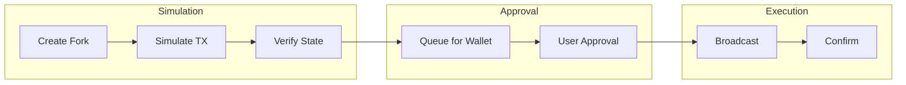
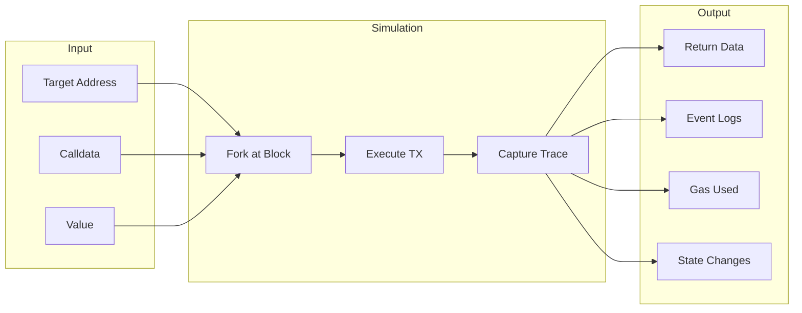
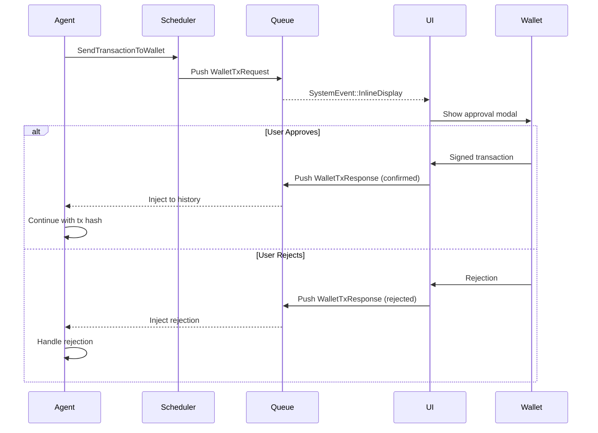
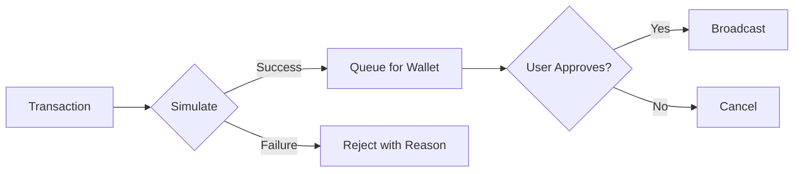

The simulation pipeline is the core safety mechanism of the Aomi platform. Every transaction is simulated on a forked network before it reaches the user's wallet.

Aomi uses a **simulation-first** approach for all on-chain transactions. Before any transaction reaches your wallet for signing, it is executed against a forked copy of the current network state. You review the exact outcome — token changes, gas, contract calls — before approving.

This is how the system prevents LLM-generated transactions from being sent without verification.

## Overview

## How Simulation Works

Simulation runs on a forked copy of the network state, managed by the host runtime. The fork includes any pending state from the current session, so each transaction is checked against the world as it will actually look when the user signs.

You do not manage the fork yourself. The host owns the fork lifecycle and exposes the simulation step as part of its tool contract. Your App stages transactions and asks the host to simulate them; the host runs them against the fork and returns the outcome.

## The Host Simulation Flow

An App never broadcasts a transaction directly. It stages each transaction, asks the host to simulate the staged batch, and then asks the host to commit. The host tool contract for this flow is:

| Host tool | Purpose |
| --- | --- |
| `view_state` | Encode calldata from ABI arguments and run a read-only `eth_call`. |
| `run_tx` | Simulate a single state-changing call without staging it. |
| `stage_tx` | Stage an EVM transaction in `user_state.pending_txs` for later simulation and signing. The host attaches an authoritative `pending_tx_id`. |
| `simulate_batch` | Simulate one or more staged transactions by `pending_tx_id` before prompting a wallet. Returns pass or fail, any revert reason, and gas or decoded-call context. |
| `commit_tx` | Ask the user wallet to sign and broadcast one staged transaction. Returns the `transaction_hash`. |

The order is always the same: **stage first, then `simulate_batch`, then commit**. Because each staged transaction sees the state changes from the ones before it, an approve-then-swap pair simulates correctly as a batch.

For the full host capability contract, see [Building Apps](/reference/building-apps).

## Transaction Simulation

### Simulating a Staged Batch

The host simulates the transactions you staged with `stage_tx`. It runs them in order against the fork and reports the result of each one:

For each staged transaction, the host returns the simulation outcome: whether it succeeded, the revert reason if it failed, the gas used, and any decoded-call context the host can provide. The agent reads these results before deciding whether to commit.

### Batch Simulation

When you stage more than one transaction, `simulate_batch` runs them in order against the same fork. Each transaction sees the state changes from the ones before it, so a dependent pair such as approve-then-swap simulates exactly as it will execute on-chain. The host returns a pass or fail result per transaction, and the agent can compare outcomes before committing.

## Wallet Approval Flow

After simulation succeeds, the transaction is queued for wallet approval:

The flow in summary:

1. AI constructs transaction(s)
2. Simulation runs on fork
3. Results presented to user (token changes, gas, state diffs)
4. User reviews and approves
5. Transaction submitted to real network
6. Wallet signs locally

## Multi-Network Support

Simulation works across every network the host runs. When you stage a transaction you pass its `chain_id`, and the host simulates it against a fork of that network. An App can stage transactions on different chains without managing any fork infrastructure itself.

## When Simulation Fails

When `simulate_batch` reports a failure, the result includes the reason so the agent can react instead of prompting a wallet for a transaction that would fail:

| Outcome | Cause | What happens next |
| --- | --- | --- |
| Reverted | The contract reverted or the transaction would fail on-chain | The agent surfaces the revert reason and does not commit |
| Insufficient funds | Not enough ETH or tokens for the operation | The agent asks the user to fund the account or adjusts the transaction |
| Gas estimation failed | The transaction is too complex to estimate automatically | The agent retries with an explicit gas limit |
| RPC error | The upstream network endpoint was unavailable | The host retries or the agent reports the failure |

## Security Best Practices

| Practice | Description |
| --- | --- |
| **Always simulate** | Never skip the simulation step |
| **Show state changes** | Display balance deltas clearly |
| **Require confirmation** | Never auto-execute transactions |
| **Validate addresses** | Check checksums and formats |
| **Warn on high value** | Alert for large transfers |
| **Check approvals** | Verify token approvals before swaps |

## Next Steps

- [Non-Custodial Automation](/concepts/non-custodial-wallets) — wallet security model
- [Building Apps](/reference/building-apps) — host tool contract for staging and committing
- [Execution](/trade/execution) — transaction lifecycle from simulation to settlement