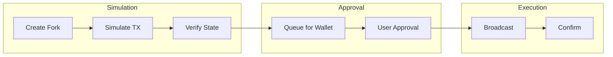
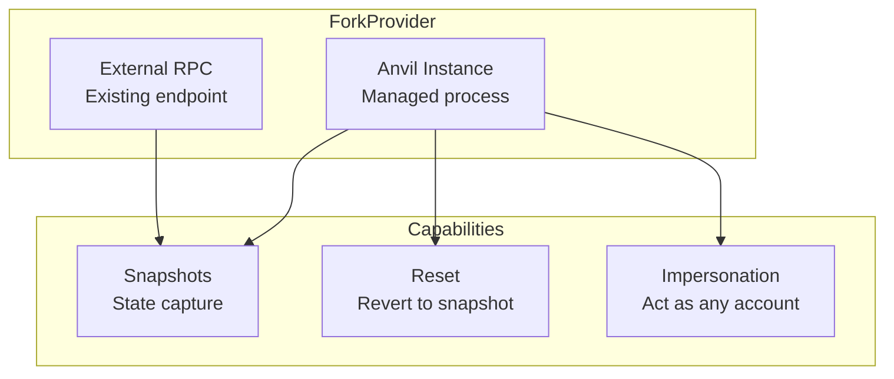
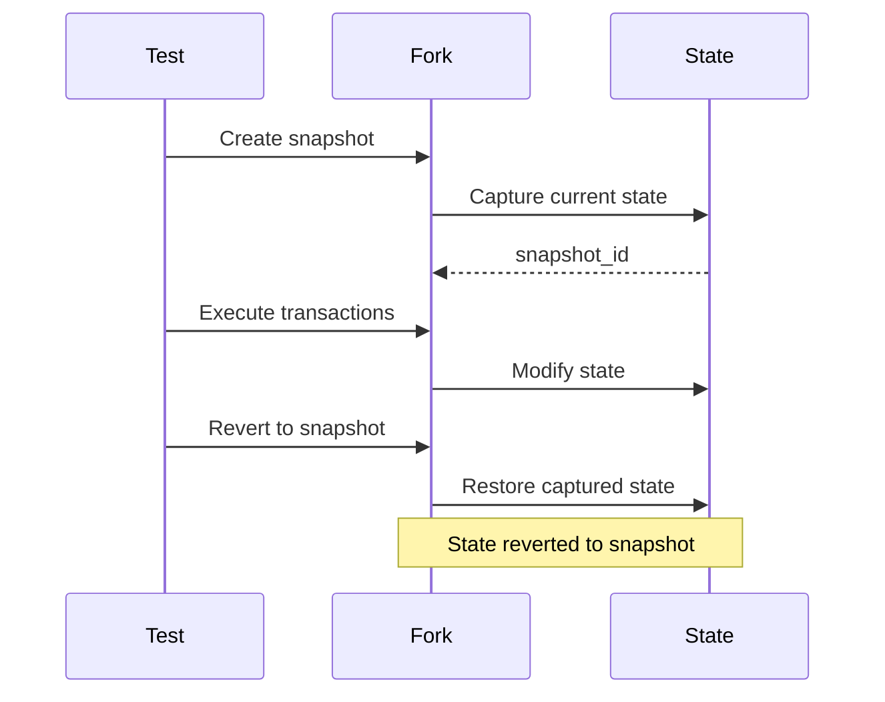
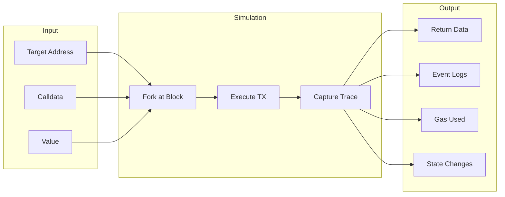
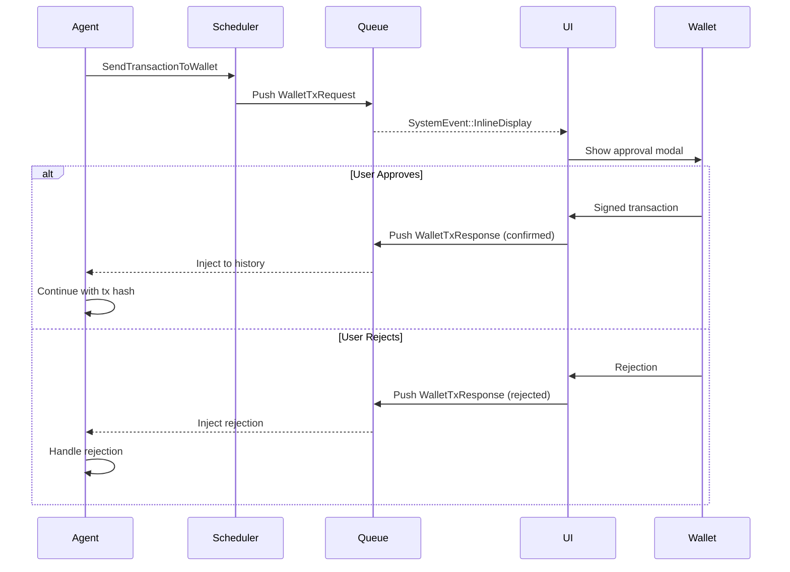
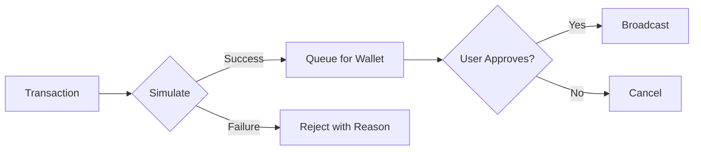

The simulation pipeline is the core safety mechanism of the Aomi platform. Every transaction is simulated on a forked network before it reaches the user's wallet.

Aomi uses a **simulation-first** approach for all on-chain transactions. Before any transaction reaches your wallet for signing, it is executed against a forked copy of the current network state. You review the exact outcome — token changes, gas, contract calls — before approving.

This is how the system prevents LLM-generated transactions from being sent without verification.

## Overview



## Fork Management

Simulation runs on Anvil forks — ephemeral instances of the network state that include pending state from the current session.

### ForkProvider

The `aomi-anvil` crate manages Anvil forks for transaction simulation:



### Provider Types

| Provider | Description |
|----------|-------------|
| `ForkProvider::Latest` | Fork from the latest block |
| `ForkProvider::Block(number)` | Fork from a specific block |
| `ForkProvider::Timestamp(ts)` | Fork from a block near the given timestamp |

### Initialization

```rust
use aomi_anvil::{
    init_fork_provider, fork_endpoint, ForkProvider,
    AnvilParams, ForksConfig,
};

// Initialize from configuration
let config = ForksConfig::from_yaml("config.yaml")?;
init_fork_providers(config).await?;

// Or initialize a single fork
let params = AnvilParams {
    fork_url: "https://eth-mainnet.g.alchemy.com/v2/YOUR_KEY".into(),
    fork_block_number: Some(18_500_000),
    chain_id: Some(1),
    port: Some(8545),
};

init_fork_provider(params).await?;

// Get the endpoint
let rpc_url = fork_endpoint()?;
println!("Fork running at: {}", rpc_url);
```

### Provider Types (Rust API)

```rust
// Managed Anvil instance (spawns a local process)
let provider = ForkProvider::spawn(params).await?;
assert!(provider.is_managed());

// External RPC (no process management)
let provider = ForkProvider::external("http://localhost:8545").await?;
assert!(!provider.is_managed());

// Common interface
println!("Endpoint: {}", provider.endpoint());
println!("Block: {}", provider.block_number());
```

### Snapshots

Snapshots capture the full network state at a point in time and allow reverting after a simulation run.



```rust
use aomi_anvil::{fork_snapshot, ForkSnapshot};

// Capture current state
let snapshot: ForkSnapshot = fork_snapshot()?;
println!("Snapshot at block: {}", snapshot.block_number());

// Execute some transactions
execute_test_transactions().await?;

// Revert to snapshot (reinitialize fork)
shutdown_and_reinit_all().await?;
```

Snapshots allow reverting to a known state after simulation, enabling multiple simulations without recreating the fork:

```rust
let snapshot_id = fork.snapshot().await?;
// run simulation
fork.revert(snapshot_id).await?;
// fork is now back to the snapshotted state
```

## Transaction Simulation

### SimulateContractCall Tool

The `SimulateContractCall` tool is the primary mechanism for pre-signing simulation:



```rust
use aomi_tools::cast::SimulateContractCall;

#[derive(Debug, Deserialize, JsonSchema)]
pub struct SimulateParams {
    /// Target contract address
    pub to: String,

    /// Encoded calldata (hex)
    pub data: String,

    /// Value to send in ETH
    #[serde(default)]
    pub value: String,

    /// Sender address to simulate from
    pub from: String,

    /// Network to simulate on
    #[serde(default = "default_network")]
    pub network: String,
}

#[tool(description = "Simulate a contract call without broadcasting")]
pub async fn simulate_contract_call(
    params: SimulateParams,
) -> Result<SimulationResult, ToolError> {
    let client = external_clients().await.cast_client(&params.network)?;

    let result = client.simulate(
        &params.from,
        &params.to,
        &params.data,
        &params.value,
    ).await?;

    Ok(SimulationResult {
        success: result.success,
        return_data: result.output,
        gas_used: result.gas_used,
        logs: result.logs,
    })
}
```

### Simulation Result

```rust
struct SimulationResult {
    success: bool,
    return_data: Value,
    gas_used: U256,
    state_changes: Vec<StateChange>,
    logs: Vec<Log>,
}
```

### Batch Simulation

Multiple transactions can be simulated in batch, returning results for each. The LLM can compare outcomes and choose the optimal path.

```rust
// Simulate multiple transactions in sequence
let fork_url = fork_endpoint()?;
let provider = ProviderBuilder::new().on_http(fork_url.parse()?);

let mut results = Vec::new();

for tx in transactions {
    // Impersonate sender
    provider.anvil_impersonate_account(tx.from).await?;

    // Execute transaction
    let result = provider.send_transaction(tx.clone()).await?;
    let receipt = result.get_receipt().await?;

    results.push(SimulationResult {
        tx_hash: receipt.transaction_hash,
        success: receipt.status(),
        gas_used: receipt.gas_used,
    });
}

// Revert all changes
shutdown_and_reinit_all().await?;
```

## Wallet Approval Flow

After simulation succeeds, the transaction is queued for wallet approval:



The flow in summary:

1. AI constructs transaction(s)
2. Simulation runs on fork
3. Results presented to user (token changes, gas, state diffs)
4. User reviews and approves
5. Transaction submitted to real network
6. Wallet signs locally

## Multi-Network Support

Simulation is supported across all configured networks:

```yaml
# config.yaml
networks:
  ethereum:
    rpc_url: "https://eth-mainnet.g.alchemy.com/v2/${ALCHEMY_KEY}"
    chain_id: 1

  base:
    rpc_url: "https://base-mainnet.g.alchemy.com/v2/${ALCHEMY_KEY}"
    chain_id: 8453

  arbitrum:
    rpc_url: "https://arb-mainnet.g.alchemy.com/v2/${ALCHEMY_KEY}"
    chain_id: 42161

  testnet:
    rpc_url: "http://localhost:8545"
    chain_id: 31337
```

## Error Handling

| Error | Cause | Recovery |
|-------|-------|----------|
| `SimulationFailed` | Contract reverted or invalid input | Fix parameters and retry |
| `ForkCreationFailed` | RPC unavailable or rate limited | Retry with backoff |
| `InsufficientBalance` | Not enough tokens for the operation | Notify user |
| `Unauthorized` | Sender lacks permission | Verify wallet/approval |
| `ForkNotInitialized` | `init_fork_provider` not called | Initialize before use |
| `SimulationReverted` | Transaction would fail on-chain | Check calldata and state |
| `InsufficientFunds` | Not enough ETH/tokens | Fund the account |
| `GasEstimationFailed` | Complex transaction | Provide manual gas limit |
| `RpcError` | Network issues | Retry or switch RPC |

## Security Best Practices



| Practice | Description |
| -------- | ----------- |
| **Always simulate** | Never skip the simulation step |
| **Show state changes** | Display balance deltas clearly |
| **Require confirmation** | Never auto-execute transactions |
| **Validate addresses** | Check checksums and formats |
| **Warn on high value** | Alert for large transfers |
| **Check approvals** | Verify token approvals before swaps |

## Next Steps

- [Non-Custodial Automation](/concepts/non-custodial-wallets) — wallet security model
- [Account Abstraction](/reference/account-abstraction) — session keys and gas sponsorship
- [Execution](/concepts/architecture) — transaction pipeline overview
{/* TODO: Restore "Wallet Integration" link once a dedicated wallet signing integration page exists. Previously pointed to /build/services/wallet-integration which does not exist in this docs structure. */}
